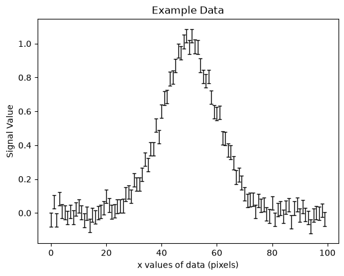
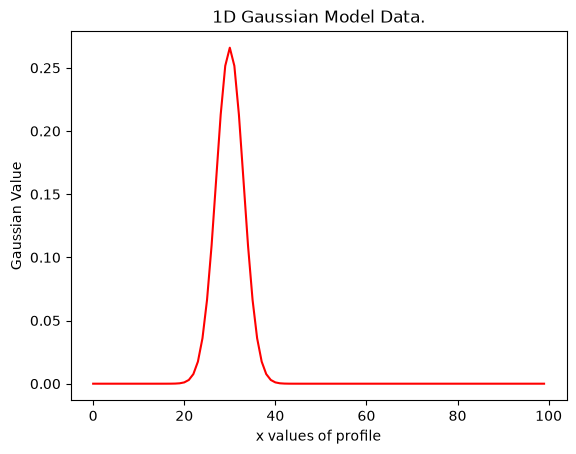
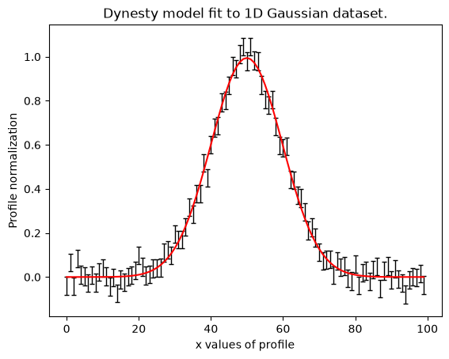
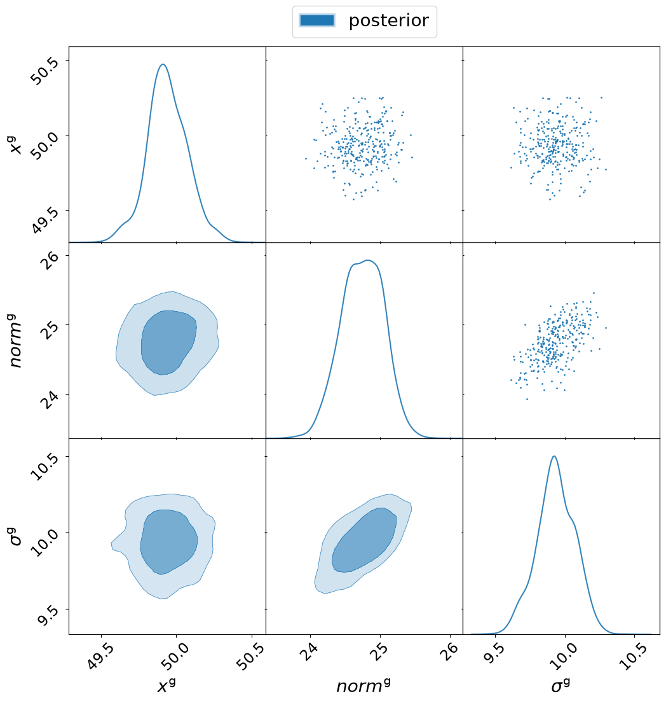
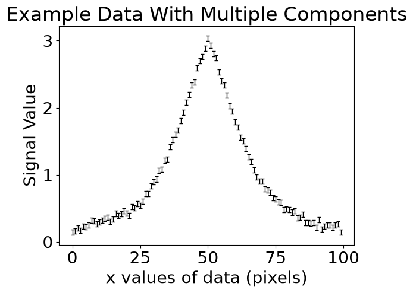
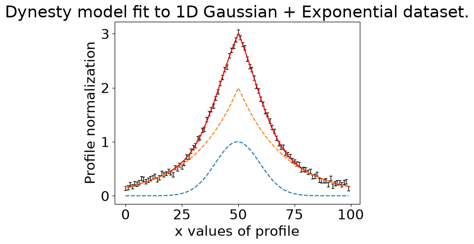

> ✏️ **This page is auto-generated from [`scripts/overview/overview_1_the_basics.py`](../../scripts/overview/overview_1_the_basics.py) — do not edit it directly.**
> It shows the example fully executed, with its real output images.
> Run it yourself via the [Python script](../../scripts/overview/overview_1_the_basics.py) or the [Jupyter notebook](../../notebooks/overview/overview_1_the_basics.ipynb).

Overview: The Basics
--------------------

**PyAutoFit** is a Python based probabilistic programming language for model fitting and Bayesian inference
of large datasets.

The basic **PyAutoFit** API allows us a user to quickly compose a probabilistic model and fit it to data via a
log likelihood function, using a range of non-linear search algorithms (e.g. MCMC, nested sampling).

This overview gives a run through of:

 - **Models**: Use Python classes to compose the model which is fitted to data.
 - **Instances**: Create instances of the model via its Python class.
 - **Analysis**: Define an ``Analysis`` class which includes the log likelihood function that fits the model to the data.
 - **Searches**: Choose an MCMC, nested sampling or maximum likelihood estimator non-linear search algorithm that fits the model to the data.
 - **Model Fit**: Fit the model to the data using the chosen non-linear search, with on-the-fly results and visualization.
 - **Results**: Use the results of the search to interpret and visualize the model fit.
 - **Samples**: Use the samples of the search to inspect the parameter samples and visualize the probability density function of the results.
 - **Multiple Datasets**: Dedicated support for simultaneously fitting multiple datasets, enabling scalable analysis of large datasets.

This overviews provides a high level of the basic API, with more advanced functionality described in the following
overviews and the **PyAutoFit** cookbooks.

__Contents__

This overview is split into the following sections:

- **Example Use Case**: Introduce the 1D Gaussian profile fitting example used throughout this overview.
- **Model**: Define a 1D Gaussian as a PyAutoFit model via a Python class.
- **Instances**: Create model instances by mapping parameter vectors to Python class instances.
- **Analysis**: Define an ``Analysis`` class with a ``log_likelihood_function`` for fitting the model to data.
- **Non Linear Search**: Select and configure a non-linear search algorithm (Dynesty nested sampling).
- **Model Fit**: Execute the non-linear search to fit the model to the data.
- **Result**: Examine the result and maximum likelihood instance from the search.
- **Samples**: Access parameter samples and posterior information to visualize results.
- **Multiple Datasets**: Fit multiple datasets simultaneously using AnalysisFactor objects.
- **Factor Graph**: Combine AnalysisFactors into a FactorGraphModel for global model fitting.
- **Wrap Up**: Summary of the basic PyAutoFit functionality.
- **Resources**: Links to cookbooks and documentation for advanced features.
- **Extending Models**: Example of composing multi-component models (Gaussian + Exponential).

To begin, lets import ``autofit`` (and ``numpy``) using the convention below:


```python

from autoconf import setup_notebook; setup_notebook()

import autofit as af
import autofit.plot as aplt

import matplotlib.pyplot as plt
import numpy as np
from os import path
```

    2026-07-10 18:07:09,607 - matplotlib.font_manager - INFO - Failed to extract font properties from /usr/share/fonts/truetype/noto/NotoColorEmoji.ttf: Non-scalable fonts are not supported


    2026-07-10 18:07:10,169 - matplotlib.font_manager - WARNING - Matplotlib is building the font cache; this may take a moment.


    2026-07-10 18:07:11,118 - matplotlib.font_manager - INFO - generated new fontManager


    Working Directory has been set to `autofit_workspace`


__Example Use Case__

To illustrate **PyAutoFit** we'll use the example modeling problem of fitting a 1D Gaussian profile to noisy data.


```python
dataset_path = path.join("dataset", "example_1d", "gaussian_x1")
```

__Dataset Auto-Simulation__

If the dataset does not already exist on your system, it will be created by running the corresponding
simulator script. This ensures that all example scripts can be run without manually simulating data first.


```python
if not path.exists(dataset_path):
    import subprocess
    import sys

    subprocess.run(
        [sys.executable, "scripts/simulators/simulators.py"],
        check=True,
    )

data = af.util.numpy_array_from_json(file_path=path.join(dataset_path, "data.json"))
noise_map = af.util.numpy_array_from_json(
    file_path=path.join(dataset_path, "noise_map.json")
)
```

We plot the data with error bars below, showing the noisy 1D signal.


```python
xvalues = range(data.shape[0])

plt.errorbar(
    x=xvalues,
    y=data,
    yerr=noise_map,
    linestyle="",
    color="k",
    ecolor="k",
    elinewidth=1,
    capsize=2,
)
plt.title("Example Data")
plt.xlabel("x values of data (pixels)")
plt.ylabel("Signal Value")
plt.show()
plt.close()
```


    

    


The 1D signal was generated using a 1D Gaussian profile of the form:

\begin{equation*}
g(x, I, \sigma) = \frac{N}{\sigma\sqrt{2\pi}} \exp{(-0.5 (x / \sigma)^2)}
\end{equation*}

Where:

 ``x``: The x-axis coordinate where the ``Gaussian`` is evaluated.

 ``N``: The overall normalization of the Gaussian.

 ``sigma``: Describes the size of the Gaussian.

Our modeling task is to fit the data with a 1D Gaussian and recover its parameters (``x``, ``N``, ``sigma``).

__Model__

We therefore need to define a 1D Gaussian as a **PyAutoFit** model.

We do this by writing it as the following Python class:


```python


class Gaussian:
    def __init__(
        self,
        centre=0.0,  # <- PyAutoFit recognises these constructor arguments
        normalization=0.1,  # <- are the Gaussian`s model parameters.
        sigma=0.01,
    ):
        """
        Represents a 1D `Gaussian` profile, which can be treated as a PyAutoFit
        model-component whose free parameters (centre, normalization and sigma)
        are fitted for by a non-linear search.

        Parameters
        ----------
        centre
            The x coordinate of the profile centre.
        normalization
            Overall normalization of the `Gaussian` profile.
        sigma
            The sigma value controlling the size of the Gaussian.
        """
        self.centre = centre
        self.normalization = normalization
        self.sigma = sigma

    def model_data_from(self, xvalues: np.ndarray, xp=np) -> np.ndarray:
        """
        Returns the 1D Gaussian profile on a line of Cartesian x coordinates.

        The input xvalues are translated to a coordinate system centred on the
        Gaussian, by subtracting its centre.

        The output is referred to as the `model_data` to signify that it is
        a representation of the data from the model.

        Parameters
        ----------
        xvalues
            The x coordinates for which the Gaussian is evaluated.
        """
        transformed_xvalues = xvalues - self.centre

        return xp.multiply(
            xp.divide(self.normalization, self.sigma * xp.sqrt(2.0 * xp.pi)),
            xp.exp(-0.5 * xp.square(xp.divide(transformed_xvalues, self.sigma))),
        )

    @property
    def fwhm(self) -> float:
        """
        The full-width half-maximum of the Gaussian profile.

        This is used to illustrate latent variables in **PyAutoFit**, which are values that can be inferred from
        the free parameters of the model which we are interested and may want to store the full samples information
        on (e.g. to create posteriors).
        """
        return 2 * np.sqrt(2 * np.log(2)) * self.sigma

```

The **PyAutoFit** model above uses the following format:

- The name of the class is the name of the model, in this case, "Gaussian".

- The input arguments of the constructor (the ``__init__`` method) are the parameters of the model, in this case ``centre``, ``normalization`` and ``sigma``.
  
- The default values of the input arguments define whether a parameter is a single-valued ``float`` or a multi-valued ``tuple``. In this case, all 3 input parameters are floats.
  
- It includes functions associated with that model component, which are used when fitting the model to data.

To compose a model using the `Gaussian` class above we use the `af.Model` object.


```python
model = af.Model(Gaussian)
print("Model `Gaussian` object: \n")
print(model)
```

    Model `Gaussian` object: 
    
    Gaussian (centre, UniformPrior [0], lower_limit = 0.0, upper_limit = 100.0), (normalization, LogUniformPrior [1], lower_limit = 1e-06, upper_limit = 1000000.0), (sigma, UniformPrior [2], lower_limit = 0.0, upper_limit = 25.0)


The model has a total of 3 parameters:


```python
print(model.total_free_parameters)
```

    3


All model information is given by printing its `info` attribute.

This shows that each model parameter has an associated prior.

[The `info` below may not display optimally on your computer screen, for example the whitespace between parameter
names on the left and parameter priors on the right may lead them to appear across multiple lines. This is a
common issue in Jupyter notebooks.

The`info_whitespace_length` parameter in the file `config/general.yaml` in the [output] section can be changed to 
increase or decrease the amount of whitespace (The Jupyter notebook kernel will need to be reset for this change to 
appear in a notebook).]


```python
print(model.info)
```

    Total Free Parameters = 3
    
    model                                                                           Gaussian (N=3)
    
    centre                                                                          UniformPrior [0], lower_limit = 0.0, upper_limit = 100.0
    normalization                                                                   LogUniformPrior [1], lower_limit = 1e-06, upper_limit = 1000000.0
    sigma                                                                           UniformPrior [2], lower_limit = 0.0, upper_limit = 25.0


The priors can be manually altered as follows, noting that these updated priors will be used below when we fit the
model to data.


```python
model.centre = af.UniformPrior(lower_limit=0.0, upper_limit=100.0)
model.normalization = af.UniformPrior(lower_limit=0.0, upper_limit=1e2)
model.sigma = af.UniformPrior(lower_limit=0.0, upper_limit=30.0)
```

Printing the `model.info` displayed these updated priors.


```python
print(model.info)
```

    Total Free Parameters = 3
    
    model                                                                           Gaussian (N=3)
    
    centre                                                                          UniformPrior [3], lower_limit = 0.0, upper_limit = 100.0
    normalization                                                                   UniformPrior [4], lower_limit = 0.0, upper_limit = 100.0
    sigma                                                                           UniformPrior [5], lower_limit = 0.0, upper_limit = 30.0


The example above uses the most basic PyAutoFit API to compose a simple model. The API is highly extensible and
can scale to models with thousands of parameters, complex hierarchies and relationships between parameters.
A complete overview is given in the `model cookbook <https://pyautofit.readthedocs.io/en/latest/cookbooks/model.html>`_.

__Instances__

Instances of a **PyAutoFit** model (created via `af.Model`) can be generated by mapping an input `vector` of parameter 
values to create an instance of the model's Python class.

To define the input `vector` correctly, we need to know the order of parameters in the model. This information is 
contained in the model's `paths` attribute.


```python
print(model.paths)
```

    [('centre',), ('normalization',), ('sigma',)]


We input values for the three free parameters of our model in the order specified by the `paths` 
attribute (i.e., `centre=30.0`, `normalization=2.0`, and `sigma=3.0`):


```python
instance = model.instance_from_vector(vector=[30.0, 2.0, 3.0])
```

This is an instance of the ``Gaussian`` class.


```python
print("Model Instance: \n")
print(instance)
```

    Model Instance: 
    
    <__main__.Gaussian object at 0x7fd203163d40>


It has the parameters of the `Gaussian` with the values input above.


```python
print("Instance Parameters \n")
print("x = ", instance.centre)
print("normalization = ", instance.normalization)
print("sigma = ", instance.sigma)
```

    Instance Parameters 
    
    x =  30.0
    normalization =  2.0
    sigma =  3.0


We can use functions associated with the class, specifically the `model_data_from` function, to 
create a realization of the `Gaussian` and plot it.


```python
xvalues = np.arange(0.0, 100.0, 1.0)

model_data = instance.model_data_from(xvalues=xvalues)

plt.plot(xvalues, model_data, color="r")
plt.title("1D Gaussian Model Data.")
plt.xlabel("x values of profile")
plt.ylabel("Gaussian Value")
plt.show()
plt.clf()
```


    

    


    <Figure size 640x480 with 0 Axes>


This "model mapping", whereby models map to an instances of their Python classes, is integral to the core **PyAutoFit**
API for model composition and fitting.

Mapping models to instance of their Python classes is an integral part of the core **PyAutoFit** API. It enables
the advanced model composition and results management tools illustrated in the following overviews and cookbooks.

__Analysis__

We now tell **PyAutoFit** how to fit the model to the data.

We define an `Analysis` class, which includes:

- An `__init__` constructor that takes `data` and `noise_map` as inputs (this can be extended with additional elements 
  necessary for fitting the model to the data).
  
- A `log_likelihood_function` that defines how to fit an `instance` of the model to the data and return a log 
  likelihood value.

Read the comments and docstrings of the `Analysis` class in detail for a full description of how the analysis works.
works.


```python


class Analysis(af.Analysis):
    def __init__(self, data: np.ndarray, noise_map: np.ndarray):
        """
        The `Analysis` class acts as an interface between the data and model in **PyAutoFit**.

        Its `log_likelihood_function` defines how the model is fitted to the data and it is called many times by
        the non-linear search fitting algorithm.

        In this example the `Analysis` `__init__` constructor only contains the `data` and `noise-map`, but it can be
        easily extended to include other quantities.

        Parameters
        ----------
        data
            A 1D numpy array containing the data (e.g. a noisy 1D signal) fitted in the workspace examples.
        noise_map
            A 1D numpy array containing the noise values of the data, used for computing the goodness of fit
            metric, the log likelihood.
        """
        super().__init__()

        self.data = data
        self.noise_map = noise_map

    def log_likelihood_function(self, instance) -> float:
        """
        Returns the log likelihood of a fit of a 1D Gaussian to the dataset.

        The data is fitted using an `instance` of the `Gaussian` class where its `model_data_from`
        is called in order to create a model data representation of the Gaussian that is fitted to the data.
        """

        """
        The `instance` that comes into this method is an instance of the `Gaussian` model above, which was created
        via `af.Model()`. 

        The parameter values are chosen by the non-linear search, based on where it thinks the high likelihood regions 
        of parameter space are.

        The lines of Python code are commented out below to prevent excessive print statements when we run the
        non-linear search, but feel free to uncomment them and run the search to see the parameters of every instance
        that it fits.
        """

        # print("Gaussian Instance:")
        # print("Centre = ", instance.centre)
        # print("Normalization = ", instance.normalization)
        # print("Sigma = ", instance.sigma)

        """
        Get the range of x-values the data is defined on, to evaluate the model of the Gaussian.
        """
        xvalues = np.arange(self.data.shape[0])

        """
        Use these xvalues to create model data of our Gaussian.
        """
        model_data = instance.model_data_from(xvalues=xvalues)

        """
        Fit the model gaussian line data to the observed data, computing the residuals, chi-squared and log likelihood.
        """
        residual_map = self.data - model_data
        chi_squared_map = (residual_map / self.noise_map) ** 2.0
        chi_squared = sum(chi_squared_map)
        noise_normalization = np.sum(np.log(2 * np.pi * self.noise_map**2.0))
        log_likelihood = -0.5 * (chi_squared + noise_normalization)

        return log_likelihood

```

Create an instance of the `Analysis` class by passing the `data` and `noise_map`.


```python
analysis = af.ex.Analysis(data=data, noise_map=noise_map)
```

The `Analysis` class shown above is the simplest example possible. The API is highly extensible and can include
model-specific output, visualization and latent variable calculations. A complete overview is given in the
analysis cookbook <https://pyautofit.readthedocs.io/en/latest/cookbooks/analysis.html>`_.

__Non Linear Search__

We now have a model ready to fit the data and an analysis class that performs this fit.

Next, we need to select a fitting algorithm, known as a "non-linear search," to fit the model to the data.

**PyAutoFit** supports various non-linear searches, which can be broadly categorized into three types: 
MCMC (Markov Chain Monte Carlo), nested sampling, and maximum likelihood estimators.

For this example, we will use the nested sampling algorithm called Dynesty.


```python
search = af.DynestyStatic(
    nlive=100,  # Example how to customize the search settings
)
```

The default settings of the non-linear search are specified in the configuration files of **PyAutoFit**, just
like the default priors of the model components above. The ensures the basic API of your code is concise and
readable, but with the flexibility to customize the search to your specific model-fitting problem.

PyAutoFit supports a wide range of non-linear searches, including detailed visualuzation, support for parallel
processing, and GPU and gradient based methods using the library JAX (https://jax.readthedocs.io/en/latest/).
A complete overview is given in the `searches cookbook <https://pyautofit.readthedocs.io/en/latest/cookbooks/search.html>`_.

__Model Fit__

We begin the non-linear search by calling its `fit` method. 

This will take a minute or so to run.


```python
print(
    """
    The non-linear search has begun running.
    This Jupyter notebook cell with progress once the search has completed - this could take a few minutes!
    """
)

result = search.fit(model=model, analysis=analysis)

print("The search has finished run - you may now continue the notebook.")
```

    
        The non-linear search has begun running.
        This Jupyter notebook cell with progress once the search has completed - this could take a few minutes!
        
    2026-07-10 18:07:14,977 - autofit.non_linear.search.abstract_search - INFO - Starting non-linear search with 1 cores.


    2026-07-10 18:07:15,001 - root - INFO - Output to hard-disk disabled, input a search name to enable.


    2026-07-10 18:07:15,003 - root - INFO - Starting new Dynesty non-linear search (no previous samples found).


    2026-07-10 18:07:15,258 - autofit.non_linear.initializer - INFO - Generating initial samples of model using JAX LH Function cores


    2026-07-10 18:07:15,307 - autofit.non_linear.initializer - INFO - Initial samples generated, starting non-linear search


    /usr/lib/python3.12/multiprocessing/popen_fork.py:66: RuntimeWarning: os.fork() was called. os.fork() is incompatible with multithreaded code, and JAX is multithreaded, so this will likely lead to a deadlock.
      self.pid = os.fork()


    0it [00:00, ?it/s]

    24it [00:00, 233.45it/s, bound: 0 | nc: 2 | ncall: 126 | eff(%): 19.048 | loglstar:   -inf < -38415.877 <    inf | logz: -38421.414 +/-  0.235 | dlogz: 39488.335 >  0.109]

    48it [00:00, 201.34it/s, bound: 0 | nc: 1 | ncall: 161 | eff(%): 29.814 | loglstar:   -inf < -17040.895 <    inf | logz: -17046.671 +/-  0.240 | dlogz: 17146.500 >  0.109]

    69it [00:00, 173.54it/s, bound: 0 | nc: 2 | ncall: 205 | eff(%): 33.659 | loglstar:   -inf < -12237.919 <    inf | logz: -12243.904 +/-  0.244 | dlogz: 12341.332 >  0.109]

    87it [00:00, 164.95it/s, bound: 0 | nc: 1 | ncall: 238 | eff(%): 36.555 | loglstar:   -inf < -8535.702 <    inf | logz: -8541.866 +/-  0.248 | dlogz: 8445.809 >  0.109]   

    104it [00:00, 137.67it/s, bound: 0 | nc: 5 | ncall: 285 | eff(%): 36.491 | loglstar:   -inf < -6478.906 <    inf | logz: -6485.239 +/-  0.251 | dlogz: 6238.962 >  0.109]

    119it [00:00, 120.53it/s, bound: 0 | nc: 1 | ncall: 337 | eff(%): 35.312 | loglstar:   -inf < -5501.844 <    inf | logz: -5508.029 +/-  0.239 | dlogz: 5235.022 >  0.109]

    132it [00:00, 112.30it/s, bound: 0 | nc: 1 | ncall: 376 | eff(%): 35.106 | loglstar:   -inf < -5317.244 <    inf | logz: -5323.856 +/-  0.256 | dlogz: 5058.653 >  0.109]

    144it [00:01, 89.48it/s, bound: 0 | nc: 24 | ncall: 447 | eff(%): 32.215 | loglstar:   -inf < -5063.137 <    inf | logz: -5069.868 +/-  0.259 | dlogz: 4811.861 >  0.109]

    154it [00:01, 82.08it/s, bound: 0 | nc: 6 | ncall: 493 | eff(%): 31.237 | loglstar:   -inf < -4904.563 <    inf | logz: -4911.388 +/-  0.260 | dlogz: 4641.982 >  0.109] 

    163it [00:01, 75.20it/s, bound: 0 | nc: 3 | ncall: 539 | eff(%): 30.241 | loglstar:   -inf < -4804.705 <    inf | logz: -4811.493 +/-  0.254 | dlogz: 4538.779 >  0.109]

    171it [00:01, 55.22it/s, bound: 0 | nc: 34 | ncall: 628 | eff(%): 27.229 | loglstar:   -inf < -4699.971 <    inf | logz: -4706.553 +/-  0.247 | dlogz: 4432.748 >  0.109]

    180it [00:01, 58.83it/s, bound: 0 | nc: 11 | ncall: 675 | eff(%): 26.667 | loglstar:   -inf < -4487.657 <    inf | logz: -4494.747 +/-  0.266 | dlogz: 4238.839 >  0.109]

    193it [00:01, 72.16it/s, bound: 0 | nc: 4 | ncall: 710 | eff(%): 27.183 | loglstar:   -inf < -4194.896 <    inf | logz: -4202.114 +/-  0.268 | dlogz: 3978.346 >  0.109] 

    202it [00:02, 74.49it/s, bound: 0 | nc: 1 | ncall: 756 | eff(%): 26.720 | loglstar:   -inf < -3892.936 <    inf | logz: -3900.244 +/-  0.270 | dlogz: 3648.971 >  0.109]

    211it [00:02, 63.23it/s, bound: 0 | nc: 4 | ncall: 816 | eff(%): 25.858 | loglstar:   -inf < -3739.553 <    inf | logz: -3746.951 +/-  0.271 | dlogz: 3532.076 >  0.109]

    219it [00:02, 58.15it/s, bound: 0 | nc: 9 | ncall: 879 | eff(%): 24.915 | loglstar:   -inf < -3648.735 <    inf | logz: -3656.212 +/-  0.273 | dlogz: 3408.855 >  0.109]

    226it [00:02, 53.18it/s, bound: 0 | nc: 2 | ncall: 948 | eff(%): 23.840 | loglstar:   -inf < -3504.466 <    inf | logz: -3512.013 +/-  0.274 | dlogz: 3246.486 >  0.109]

    233it [00:02, 46.69it/s, bound: 0 | nc: 35 | ncall: 1016 | eff(%): 22.933 | loglstar:   -inf < -3338.334 <    inf | logz: -3345.951 +/-  0.275 | dlogz: 3094.801 >  0.109]

    239it [00:03, 37.86it/s, bound: 0 | nc: 8 | ncall: 1108 | eff(%): 21.570 | loglstar:   -inf < -3245.562 <    inf | logz: -3253.239 +/-  0.276 | dlogz: 2988.141 >  0.109] 

    244it [00:03, 36.28it/s, bound: 0 | nc: 3 | ncall: 1170 | eff(%): 20.855 | loglstar:   -inf < -3194.018 <    inf | logz: -3201.744 +/-  0.277 | dlogz: 2940.617 >  0.109]

    248it [00:03, 31.08it/s, bound: 0 | nc: 50 | ncall: 1248 | eff(%): 19.872 | loglstar:   -inf < -3119.833 <    inf | logz: -3127.599 +/-  0.278 | dlogz: 2877.199 >  0.109]

    253it [00:03, 33.11it/s, bound: 0 | nc: 11 | ncall: 1303 | eff(%): 19.417 | loglstar:   -inf < -3029.237 <    inf | logz: -3037.053 +/-  0.279 | dlogz: 2772.609 >  0.109]

    259it [00:03, 34.79it/s, bound: 0 | nc: 33 | ncall: 1359 | eff(%): 19.058 | loglstar:   -inf < -2929.305 <    inf | logz: -2937.117 +/-  0.275 | dlogz: 2775.728 >  0.109]

    263it [00:03, 29.45it/s, bound: 0 | nc: 1 | ncall: 1448 | eff(%): 18.163 | loglstar:   -inf < -2878.087 <    inf | logz: -2886.002 +/-  0.281 | dlogz: 2754.316 >  0.109] 

    268it [00:04, 31.65it/s, bound: 0 | nc: 17 | ncall: 1501 | eff(%): 17.855 | loglstar:   -inf < -2840.042 <    inf | logz: -2847.947 +/-  0.277 | dlogz: 2686.519 >  0.109]

    272it [00:04, 28.47it/s, bound: 0 | nc: 18 | ncall: 1572 | eff(%): 17.303 | loglstar:   -inf < -2810.897 <    inf | logz: -2818.902 +/-  0.282 | dlogz: 2664.990 >  0.109]

    276it [00:04, 29.80it/s, bound: 0 | nc: 9 | ncall: 1618 | eff(%): 17.058 | loglstar:   -inf < -2784.451 <    inf | logz: -2792.495 +/-  0.283 | dlogz: 2635.479 >  0.109] 

    280it [00:04, 24.57it/s, bound: 0 | nc: 55 | ncall: 1722 | eff(%): 16.260 | loglstar:   -inf < -2682.193 <    inf | logz: -2690.277 +/-  0.284 | dlogz: 2557.846 >  0.109]

    283it [00:04, 23.80it/s, bound: 0 | nc: 2 | ncall: 1781 | eff(%): 15.890 | loglstar:   -inf < -2596.584 <    inf | logz: -2604.678 +/-  0.282 | dlogz: 2444.154 >  0.109] 

    288it [00:04, 28.97it/s, bound: 0 | nc: 8 | ncall: 1828 | eff(%): 15.755 | loglstar:   -inf < -2516.491 <    inf | logz: -2524.655 +/-  0.285 | dlogz: 2392.879 >  0.109]

    292it [00:04, 30.43it/s, bound: 0 | nc: 22 | ncall: 1879 | eff(%): 15.540 | loglstar:   -inf < -2479.960 <    inf | logz: -2488.164 +/-  0.286 | dlogz: 2337.088 >  0.109]

    296it [00:05, 16.95it/s, bound: 0 | nc: 17 | ncall: 2096 | eff(%): 14.122 | loglstar:   -inf < -2453.144 <    inf | logz: -2461.144 +/-  0.272 | dlogz: 2297.902 >  0.109]

    301it [00:05, 19.39it/s, bound: 0 | nc: 32 | ncall: 2180 | eff(%): 13.807 | loglstar:   -inf < -2380.345 <    inf | logz: -2388.639 +/-  0.287 | dlogz: 2233.244 >  0.109]

    307it [00:05, 24.95it/s, bound: 0 | nc: 22 | ncall: 2222 | eff(%): 13.816 | loglstar:   -inf < -2284.762 <    inf | logz: -2293.115 +/-  0.288 | dlogz: 2177.086 >  0.109]

    311it [00:06, 19.57it/s, bound: 0 | nc: 27 | ncall: 2353 | eff(%): 13.217 | loglstar:   -inf < -2267.602 <    inf | logz: -2275.993 +/-  0.289 | dlogz: 2117.450 >  0.109]

    314it [00:06, 11.69it/s, bound: 0 | nc: 115 | ncall: 2610 | eff(%): 12.031 | loglstar:   -inf < -2256.719 <    inf | logz: -2264.438 +/-  0.268 | dlogz: 2100.303 >  0.109]

    317it [00:07, 11.01it/s, bound: 0 | nc: 35 | ncall: 2738 | eff(%): 11.578 | loglstar:   -inf < -2213.758 <    inf | logz: -2222.210 +/-  0.290 | dlogz: 2091.342 >  0.109] 

    320it [00:07, 10.97it/s, bound: 0 | nc: 73 | ncall: 2845 | eff(%): 11.248 | loglstar:   -inf < -2188.434 <    inf | logz: -2196.860 +/-  0.286 | dlogz: 2034.986 >  0.109]

    325it [00:07, 15.01it/s, bound: 0 | nc: 16 | ncall: 2901 | eff(%): 11.203 | loglstar:   -inf < -2173.152 <    inf | logz: -2181.683 +/-  0.291 | dlogz: 2145.039 >  0.109]

    328it [00:07, 16.91it/s, bound: 0 | nc: 19 | ncall: 2939 | eff(%): 11.160 | loglstar:   -inf < -2149.327 <    inf | logz: -2157.856 +/-  0.289 | dlogz: 2116.535 >  0.109]

    331it [00:07, 14.10it/s, bound: 0 | nc: 47 | ncall: 3041 | eff(%): 10.885 | loglstar:   -inf < -2130.780 <    inf | logz: -2139.372 +/-  0.292 | dlogz: 2106.749 >  0.109]

    333it [00:08, 10.64it/s, bound: 0 | nc: 32 | ncall: 3177 | eff(%): 10.482 | loglstar:   -inf < -2114.760 <    inf | logz: -2122.738 +/-  0.275 | dlogz: 2078.703 >  0.109]

    336it [00:08, 12.29it/s, bound: 0 | nc: 37 | ncall: 3230 | eff(%): 10.402 | loglstar:   -inf < -2099.630 <    inf | logz: -2108.272 +/-  0.293 | dlogz: 2071.826 >  0.109]

    338it [00:08,  9.83it/s, bound: 0 | nc: 78 | ncall: 3348 | eff(%): 10.096 | loglstar:   -inf < -2080.199 <    inf | logz: -2088.861 +/-  0.294 | dlogz: 2061.563 >  0.109]

    340it [00:08, 10.64it/s, bound: 0 | nc: 29 | ncall: 3381 | eff(%): 10.056 | loglstar:   -inf < -2071.321 <    inf | logz: -2079.936 +/-  0.289 | dlogz: 2037.816 >  0.109]

    342it [00:09, 10.98it/s, bound: 0 | nc: 31 | ncall: 3432 | eff(%):  9.965 | loglstar:   -inf < -2055.887 <    inf | logz: -2064.588 +/-  0.294 | dlogz: 2028.982 >  0.109]

    344it [00:09, 12.15it/s, bound: 1 | nc: 4 | ncall: 3440 | eff(%): 10.000 | loglstar:   -inf < -2043.254 <    inf | logz: -2051.842 +/-  0.287 | dlogz: 2009.027 >  0.109] 

    356it [00:09, 32.08it/s, bound: 1 | nc: 2 | ncall: 3475 | eff(%): 10.245 | loglstar:   -inf < -1994.976 <    inf | logz: -2003.817 +/-  0.297 | dlogz: 1972.937 >  0.109]

    365it [00:09, 43.39it/s, bound: 1 | nc: 4 | ncall: 3513 | eff(%): 10.390 | loglstar:   -inf < -1899.339 <    inf | logz: -1907.375 +/-  0.274 | dlogz: 1862.617 >  0.109]

    372it [00:09, 48.20it/s, bound: 1 | nc: 15 | ncall: 3554 | eff(%): 10.467 | loglstar:   -inf < -1811.679 <    inf | logz: -1820.679 +/-  0.299 | dlogz: 1784.231 >  0.109]

    378it [00:09, 43.30it/s, bound: 2 | nc: 2 | ncall: 3584 | eff(%): 10.547 | loglstar:   -inf < -1776.158 <    inf | logz: -1785.217 +/-  0.300 | dlogz: 1750.085 >  0.109] 

    397it [00:09, 74.67it/s, bound: 2 | nc: 5 | ncall: 3619 | eff(%): 10.970 | loglstar:   -inf < -1671.825 <    inf | logz: -1681.072 +/-  0.303 | dlogz: 1642.013 >  0.109]

    416it [00:09, 98.24it/s, bound: 2 | nc: 6 | ncall: 3653 | eff(%): 11.388 | loglstar:   -inf < -1514.039 <    inf | logz: -1523.233 +/-  0.292 | dlogz: 1478.868 >  0.109]

    427it [00:10, 100.14it/s, bound: 2 | nc: 5 | ncall: 3691 | eff(%): 11.569 | loglstar:   -inf < -1458.553 <    inf | logz: -1467.202 +/-  0.290 | dlogz: 1421.995 >  0.109]

    447it [00:10, 97.01it/s, bound: 3 | nc: 9 | ncall: 3736 | eff(%): 11.965 | loglstar:   -inf < -1293.549 <    inf | logz: -1303.135 +/-  0.303 | dlogz: 1259.118 >  0.109] 

    467it [00:10, 117.18it/s, bound: 3 | nc: 5 | ncall: 3777 | eff(%): 12.364 | loglstar:   -inf < -1184.492 <    inf | logz: -1194.417 +/-  0.313 | dlogz: 1152.189 >  0.109]

    484it [00:10, 128.71it/s, bound: 3 | nc: 5 | ncall: 3817 | eff(%): 12.680 | loglstar:   -inf < -1084.253 <    inf | logz: -1094.363 +/-  0.317 | dlogz: 1053.523 >  0.109]

    503it [00:10, 143.37it/s, bound: 3 | nc: 1 | ncall: 3854 | eff(%): 13.051 | loglstar:   -inf < -981.498 <    inf | logz: -991.801 +/-  0.320 | dlogz: 965.422 >  0.109]   

    519it [00:10, 105.48it/s, bound: 4 | nc: 4 | ncall: 3906 | eff(%): 13.287 | loglstar:   -inf < -865.713 <    inf | logz: -876.084 +/-  0.316 | dlogz: 831.748 >  0.109]

    537it [00:10, 118.96it/s, bound: 4 | nc: 7 | ncall: 3940 | eff(%): 13.629 | loglstar:   -inf < -762.433 <    inf | logz: -773.032 +/-  0.322 | dlogz: 729.001 >  0.109]

    551it [00:11, 123.04it/s, bound: 4 | nc: 1 | ncall: 3976 | eff(%): 13.858 | loglstar:   -inf < -698.128 <    inf | logz: -708.652 +/-  0.317 | dlogz: 663.178 >  0.109]

    565it [00:11, 119.12it/s, bound: 4 | nc: 3 | ncall: 4024 | eff(%): 14.041 | loglstar:   -inf < -645.756 <    inf | logz: -655.636 +/-  0.308 | dlogz: 608.833 >  0.109]

    578it [00:11, 108.40it/s, bound: 5 | nc: 3 | ncall: 4051 | eff(%): 14.268 | loglstar:   -inf < -616.616 <    inf | logz: -626.425 +/-  0.308 | dlogz: 579.289 >  0.109]

    599it [00:11, 130.95it/s, bound: 5 | nc: 4 | ncall: 4092 | eff(%): 14.638 | loglstar:   -inf < -558.993 <    inf | logz: -570.252 +/-  0.335 | dlogz: 532.183 >  0.109]

    614it [00:11, 131.37it/s, bound: 5 | nc: 4 | ncall: 4134 | eff(%): 14.852 | loglstar:   -inf < -517.355 <    inf | logz: -528.308 +/-  0.323 | dlogz: 481.716 >  0.109]

    629it [00:11, 133.67it/s, bound: 5 | nc: 4 | ncall: 4173 | eff(%): 15.073 | loglstar:   -inf < -483.169 <    inf | logz: -493.319 +/-  0.309 | dlogz: 445.428 >  0.109]

    643it [00:11, 118.97it/s, bound: 6 | nc: 1 | ncall: 4199 | eff(%): 15.313 | loglstar:   -inf < -419.669 <    inf | logz: -431.280 +/-  0.336 | dlogz: 385.809 >  0.109]

    660it [00:11, 129.54it/s, bound: 6 | nc: 3 | ncall: 4240 | eff(%): 15.566 | loglstar:   -inf < -381.240 <    inf | logz: -392.336 +/-  0.322 | dlogz: 344.761 >  0.109]

    680it [00:11, 145.33it/s, bound: 6 | nc: 8 | ncall: 4285 | eff(%): 15.869 | loglstar:   -inf < -339.863 <    inf | logz: -351.902 +/-  0.344 | dlogz: 307.173 >  0.109]

    696it [00:12, 146.27it/s, bound: 6 | nc: 1 | ncall: 4329 | eff(%): 16.078 | loglstar:   -inf < -316.088 <    inf | logz: -328.164 +/-  0.341 | dlogz: 281.642 >  0.109]

    712it [00:12, 134.04it/s, bound: 7 | nc: 2 | ncall: 4360 | eff(%): 16.330 | loglstar:   -inf < -291.177 <    inf | logz: -303.528 +/-  0.348 | dlogz: 258.053 >  0.109]

    734it [00:12, 153.95it/s, bound: 7 | nc: 3 | ncall: 4403 | eff(%): 16.670 | loglstar:   -inf < -255.552 <    inf | logz: -268.020 +/-  0.346 | dlogz: 221.100 >  0.109]

    750it [00:12, 149.50it/s, bound: 7 | nc: 2 | ncall: 4459 | eff(%): 16.820 | loglstar:   -inf < -235.717 <    inf | logz: -248.252 +/-  0.345 | dlogz: 200.675 >  0.109]

    766it [00:12, 133.48it/s, bound: 8 | nc: 1 | ncall: 4500 | eff(%): 17.022 | loglstar:   -inf < -213.072 <    inf | logz: -225.352 +/-  0.337 | dlogz: 176.590 >  0.109]

    785it [00:12, 147.60it/s, bound: 8 | nc: 2 | ncall: 4537 | eff(%): 17.302 | loglstar:   -inf < -192.243 <    inf | logz: -204.431 +/-  0.335 | dlogz: 155.182 >  0.109]

    801it [00:12, 137.73it/s, bound: 8 | nc: 4 | ncall: 4586 | eff(%): 17.466 | loglstar:   -inf < -182.733 <    inf | logz: -195.413 +/-  0.340 | dlogz: 146.393 >  0.109]

    817it [00:13, 112.93it/s, bound: 9 | nc: 7 | ncall: 4634 | eff(%): 17.631 | loglstar:   -inf < -168.495 <    inf | logz: -181.060 +/-  0.342 | dlogz: 131.694 >  0.109]

    840it [00:13, 138.74it/s, bound: 9 | nc: 5 | ncall: 4677 | eff(%): 17.960 | loglstar:   -inf < -147.934 <    inf | logz: -160.162 +/-  0.340 | dlogz: 110.212 >  0.109]

    856it [00:13, 143.56it/s, bound: 9 | nc: 1 | ncall: 4713 | eff(%): 18.163 | loglstar:   -inf < -139.203 <    inf | logz: -151.200 +/-  0.334 | dlogz: 100.875 >  0.109]

    879it [00:13, 162.05it/s, bound: 9 | nc: 3 | ncall: 4755 | eff(%): 18.486 | loglstar:   -inf < -128.352 <    inf | logz: -140.697 +/-  0.338 | dlogz: 90.200 >  0.109] 

    897it [00:13, 148.60it/s, bound: 10 | nc: 2 | ncall: 4796 | eff(%): 18.703 | loglstar:   -inf < -118.274 <    inf | logz: -130.471 +/-  0.342 | dlogz: 79.670 >  0.109]

    922it [00:13, 170.86it/s, bound: 10 | nc: 6 | ncall: 4838 | eff(%): 19.057 | loglstar:   -inf < -110.294 <    inf | logz: -122.825 +/-  0.337 | dlogz: 71.729 >  0.109]

    946it [00:13, 187.56it/s, bound: 10 | nc: 2 | ncall: 4881 | eff(%): 19.381 | loglstar:   -inf < -100.244 <    inf | logz: -112.898 +/-  0.342 | dlogz: 61.609 >  0.109]

    966it [00:13, 180.70it/s, bound: 10 | nc: 3 | ncall: 4930 | eff(%): 19.594 | loglstar:   -inf < -90.860 <    inf | logz: -104.389 +/-  0.351 | dlogz: 53.025 >  0.109] 

    985it [00:13, 152.72it/s, bound: 11 | nc: 1 | ncall: 4970 | eff(%): 19.819 | loglstar:   -inf < -83.365 <    inf | logz: -96.502 +/-  0.351 | dlogz: 44.822 >  0.109] 

    1002it [00:14, 148.04it/s, bound: 11 | nc: 2 | ncall: 5015 | eff(%): 19.980 | loglstar:   -inf < -80.285 <    inf | logz: -92.982 +/-  0.345 | dlogz: 41.001 >  0.109]

    1018it [00:14, 133.40it/s, bound: 11 | nc: 1 | ncall: 5060 | eff(%): 20.119 | loglstar:   -inf < -77.548 <    inf | logz: -90.188 +/-  0.345 | dlogz: 38.022 >  0.109]

    1032it [00:14, 106.43it/s, bound: 12 | nc: 2 | ncall: 5089 | eff(%): 20.279 | loglstar:   -inf < -74.085 <    inf | logz: -87.822 +/-  0.349 | dlogz: 35.673 >  0.109]

    1046it [00:14, 111.32it/s, bound: 12 | nc: 4 | ncall: 5116 | eff(%): 20.446 | loglstar:   -inf < -71.159 <    inf | logz: -84.455 +/-  0.352 | dlogz: 33.029 >  0.109]

    1059it [00:14, 111.80it/s, bound: 12 | nc: 1 | ncall: 5146 | eff(%): 20.579 | loglstar:   -inf < -68.772 <    inf | logz: -82.039 +/-  0.352 | dlogz: 30.468 >  0.109]

    1071it [00:14, 109.20it/s, bound: 12 | nc: 6 | ncall: 5182 | eff(%): 20.668 | loglstar:   -inf < -66.289 <    inf | logz: -79.773 +/-  0.354 | dlogz: 28.095 >  0.109]

    1083it [00:15, 89.17it/s, bound: 12 | nc: 1 | ncall: 5224 | eff(%): 20.731 | loglstar:   -inf < -63.991 <    inf | logz: -77.644 +/-  0.355 | dlogz: 25.855 >  0.109] 

    1093it [00:15, 81.04it/s, bound: 13 | nc: 4 | ncall: 5244 | eff(%): 20.843 | loglstar:   -inf < -62.054 <    inf | logz: -75.898 +/-  0.356 | dlogz: 24.027 >  0.109]

    1114it [00:15, 107.27it/s, bound: 13 | nc: 4 | ncall: 5276 | eff(%): 21.114 | loglstar:   -inf < -59.435 <    inf | logz: -72.981 +/-  0.354 | dlogz: 20.815 >  0.109]

    1130it [00:15, 118.80it/s, bound: 13 | nc: 3 | ncall: 5304 | eff(%): 21.305 | loglstar:   -inf < -57.864 <    inf | logz: -71.281 +/-  0.353 | dlogz: 18.928 >  0.109]

    1144it [00:15, 118.27it/s, bound: 13 | nc: 3 | ncall: 5342 | eff(%): 21.415 | loglstar:   -inf < -56.626 <    inf | logz: -70.011 +/-  0.353 | dlogz: 17.505 >  0.109]

    1159it [00:15, 124.81it/s, bound: 13 | nc: 4 | ncall: 5377 | eff(%): 21.555 | loglstar:   -inf < -54.803 <    inf | logz: -68.708 +/-  0.355 | dlogz: 16.325 >  0.109]

    1173it [00:15, 98.40it/s, bound: 14 | nc: 3 | ncall: 5414 | eff(%): 21.666 | loglstar:   -inf < -52.574 <    inf | logz: -66.869 +/-  0.362 | dlogz: 14.857 >  0.109] 

    1192it [00:15, 117.88it/s, bound: 14 | nc: 2 | ncall: 5452 | eff(%): 21.864 | loglstar:   -inf < -51.489 <    inf | logz: -65.299 +/-  0.358 | dlogz: 13.033 >  0.109]

    1210it [00:16, 131.52it/s, bound: 14 | nc: 3 | ncall: 5480 | eff(%): 22.080 | loglstar:   -inf < -50.281 <    inf | logz: -64.074 +/-  0.358 | dlogz: 11.615 >  0.109]

    1225it [00:16, 134.09it/s, bound: 14 | nc: 1 | ncall: 5518 | eff(%): 22.200 | loglstar:   -inf < -49.430 <    inf | logz: -63.232 +/-  0.358 | dlogz: 10.615 >  0.109]

    1240it [00:16, 112.83it/s, bound: 15 | nc: 2 | ncall: 5548 | eff(%): 22.350 | loglstar:   -inf < -48.409 <    inf | logz: -62.458 +/-  0.358 | dlogz:  9.695 >  0.109]

    1254it [00:16, 118.09it/s, bound: 15 | nc: 2 | ncall: 5577 | eff(%): 22.485 | loglstar:   -inf < -47.706 <    inf | logz: -61.762 +/-  0.359 | dlogz:  8.853 >  0.109]

    1267it [00:16, 119.23it/s, bound: 15 | nc: 2 | ncall: 5605 | eff(%): 22.605 | loglstar:   -inf < -47.106 <    inf | logz: -61.174 +/-  0.360 | dlogz:  8.132 >  0.109]

    1280it [00:16, 120.86it/s, bound: 15 | nc: 2 | ncall: 5640 | eff(%): 22.695 | loglstar:   -inf < -46.534 <    inf | logz: -60.606 +/-  0.361 | dlogz:  7.431 >  0.109]

    1293it [00:16, 89.96it/s, bound: 16 | nc: 1 | ncall: 5685 | eff(%): 22.744 | loglstar:   -inf < -45.963 <    inf | logz: -60.102 +/-  0.361 | dlogz:  6.795 >  0.109] 

    1315it [00:17, 118.10it/s, bound: 16 | nc: 1 | ncall: 5717 | eff(%): 23.002 | loglstar:   -inf < -44.975 <    inf | logz: -59.312 +/-  0.362 | dlogz:  5.787 >  0.109]

    1332it [00:17, 126.80it/s, bound: 16 | nc: 6 | ncall: 5752 | eff(%): 23.157 | loglstar:   -inf < -44.471 <    inf | logz: -58.769 +/-  0.363 | dlogz:  5.071 >  0.109]

    1352it [00:17, 143.86it/s, bound: 16 | nc: 2 | ncall: 5791 | eff(%): 23.347 | loglstar:   -inf < -43.974 <    inf | logz: -58.266 +/-  0.363 | dlogz:  4.371 >  0.109]

    1368it [00:17, 110.36it/s, bound: 17 | nc: 1 | ncall: 5834 | eff(%): 23.449 | loglstar:   -inf < -43.584 <    inf | logz: -57.919 +/-  0.363 | dlogz:  3.878 >  0.109]

    1389it [00:17, 130.72it/s, bound: 17 | nc: 5 | ncall: 5874 | eff(%): 23.647 | loglstar:   -inf < -43.190 <    inf | logz: -57.523 +/-  0.364 | dlogz:  3.287 >  0.109]

    1413it [00:17, 156.36it/s, bound: 17 | nc: 1 | ncall: 5910 | eff(%): 23.909 | loglstar:   -inf < -42.684 <    inf | logz: -57.154 +/-  0.364 | dlogz:  2.709 >  0.109]

    1431it [00:17, 142.54it/s, bound: 17 | nc: 1 | ncall: 5961 | eff(%): 24.006 | loglstar:   -inf < -42.345 <    inf | logz: -56.893 +/-  0.365 | dlogz:  2.404 >  0.109]

    1447it [00:18, 116.62it/s, bound: 18 | nc: 1 | ncall: 5995 | eff(%): 24.137 | loglstar:   -inf < -42.181 <    inf | logz: -56.695 +/-  0.365 | dlogz:  2.083 >  0.109]

    1463it [00:18, 121.68it/s, bound: 18 | nc: 4 | ncall: 6024 | eff(%): 24.286 | loglstar:   -inf < -41.985 <    inf | logz: -56.529 +/-  0.365 | dlogz:  1.804 >  0.109]

    1482it [00:18, 136.59it/s, bound: 18 | nc: 1 | ncall: 6058 | eff(%): 24.464 | loglstar:   -inf < -41.776 <    inf | logz: -56.358 +/-  0.366 | dlogz:  1.511 >  0.109]

    1501it [00:18, 147.43it/s, bound: 18 | nc: 2 | ncall: 6096 | eff(%): 24.623 | loglstar:   -inf < -41.544 <    inf | logz: -56.206 +/-  0.366 | dlogz:  1.256 >  0.109]

    1517it [00:18, 121.77it/s, bound: 19 | nc: 1 | ncall: 6134 | eff(%): 24.731 | loglstar:   -inf < -41.464 <    inf | logz: -56.095 +/-  0.366 | dlogz:  1.069 >  0.109]

    1540it [00:18, 146.20it/s, bound: 19 | nc: 1 | ncall: 6165 | eff(%): 24.980 | loglstar:   -inf < -41.289 <    inf | logz: -55.963 +/-  0.367 | dlogz:  0.847 >  0.109]

    1559it [00:18, 156.57it/s, bound: 19 | nc: 3 | ncall: 6196 | eff(%): 25.161 | loglstar:   -inf < -41.145 <    inf | logz: -55.871 +/-  0.367 | dlogz:  0.703 >  0.109]

    1577it [00:18, 159.45it/s, bound: 19 | nc: 4 | ncall: 6228 | eff(%): 25.321 | loglstar:   -inf < -41.058 <    inf | logz: -55.796 +/-  0.367 | dlogz:  0.582 >  0.109]

    1594it [00:18, 159.26it/s, bound: 19 | nc: 1 | ncall: 6262 | eff(%): 25.455 | loglstar:   -inf < -40.972 <    inf | logz: -55.735 +/-  0.367 | dlogz:  0.487 >  0.109]

    1611it [00:19, 123.56it/s, bound: 20 | nc: 1 | ncall: 6294 | eff(%): 25.596 | loglstar:   -inf < -40.907 <    inf | logz: -55.683 +/-  0.367 | dlogz:  0.414 >  0.109]

    1627it [00:19, 125.34it/s, bound: 20 | nc: 10 | ncall: 6336 | eff(%): 25.679 | loglstar:   -inf < -40.846 <    inf | logz: -55.640 +/-  0.367 | dlogz:  0.357 >  0.109]

    1643it [00:19, 133.13it/s, bound: 20 | nc: 2 | ncall: 6370 | eff(%): 25.793 | loglstar:   -inf < -40.814 <    inf | logz: -55.604 +/-  0.368 | dlogz:  0.303 >  0.109] 

    1660it [00:19, 139.98it/s, bound: 20 | nc: 7 | ncall: 6413 | eff(%): 25.885 | loglstar:   -inf < -40.746 <    inf | logz: -55.571 +/-  0.368 | dlogz:  0.254 >  0.109]

    1675it [00:19, 110.08it/s, bound: 21 | nc: 2 | ncall: 6458 | eff(%): 25.937 | loglstar:   -inf < -40.701 <    inf | logz: -55.545 +/-  0.368 | dlogz:  0.217 >  0.109]

    1688it [00:19, 107.93it/s, bound: 21 | nc: 1 | ncall: 6490 | eff(%): 26.009 | loglstar:   -inf < -40.671 <    inf | logz: -55.525 +/-  0.368 | dlogz:  0.190 >  0.109]

    1703it [00:19, 116.15it/s, bound: 21 | nc: 2 | ncall: 6522 | eff(%): 26.112 | loglstar:   -inf < -40.630 <    inf | logz: -55.505 +/-  0.368 | dlogz:  0.163 >  0.109]

    1717it [00:20, 119.49it/s, bound: 21 | nc: 3 | ncall: 6557 | eff(%): 26.186 | loglstar:   -inf < -40.593 <    inf | logz: -55.489 +/-  0.368 | dlogz:  0.141 >  0.109]

    1730it [00:20, 95.23it/s, bound: 22 | nc: 1 | ncall: 6592 | eff(%): 26.244 | loglstar:   -inf < -40.567 <    inf | logz: -55.475 +/-  0.368 | dlogz:  0.124 >  0.109] 

    1742it [00:20, 85.66it/s, +100 | bound: 22 | nc: 1 | ncall: 6706 | eff(%): 27.884 | loglstar:   -inf < -40.301 <    inf | logz: -55.371 +/-  0.370 | dlogz:  0.001 >  0.109]

    


    2026-07-10 18:07:35,823 - autofit.non_linear.search.updater - INFO - Creating latent samples by drawing 100 from the PDF.


    Time to compute latent variables: 0.006861448287963867 seconds for 100 samples.
    2026-07-10 18:07:35,978 - root - INFO - Removing search internal folder.


    2026-07-10 18:07:36,174 - root - INFO - Search complete, returning result


    The search has finished run - you may now continue the notebook.


__Result__

The result object returned by the fit provides information on the results of the non-linear search. 

The `info` attribute shows the result in a readable format.

[Above, we discussed that the `info_whitespace_length` parameter in the config files could b changed to make 
the `model.info` attribute display optimally on your computer. This attribute also controls the whitespace of the
`result.info` attribute.]


```python
print(result.info)
```

    Bayesian Evidence                                                               -55.37069538
    Maximum Log Likelihood                                                          -40.30070648
    
    model                                                                           Gaussian (N=3)
    
    Maximum Log Likelihood Model:
    
    centre                                                                          49.936
    normalization                                                                   24.701
    sigma                                                                           9.909
    
    
    Summary (3.0 sigma limits):
    
    centre                                                                          49.93 (49.54, 50.34)
    normalization                                                                   24.76 (23.86, 25.57)
    sigma                                                                           9.93 (9.57, 10.30)
    
    
    Summary (1.0 sigma limits):
    
    centre                                                                          49.93 (49.83, 50.08)
    normalization                                                                   24.76 (24.46, 25.04)
    sigma                                                                           9.93 (9.81, 10.08)
    
    instances
    
    


Results are returned as instances of the model, as we illustrated above in the model mapping section.

For example, we can print the result's maximum likelihood instance.


```python
print(result.max_log_likelihood_instance)

print("\n Model-fit Max Log-likelihood Parameter Estimates: \n")
print("Centre = ", result.max_log_likelihood_instance.centre)
print("Normalization = ", result.max_log_likelihood_instance.normalization)
print("Sigma = ", result.max_log_likelihood_instance.sigma)
```

    <__main__.Gaussian object at 0x7fd164c32ae0>
    
     Model-fit Max Log-likelihood Parameter Estimates: 
    
    Centre =  49.93630561051459
    Normalization =  24.700615386226
    Sigma =  9.90935627316958


A benefit of the result being an instance is that we can use any of its methods to inspect the results.

Below, we use the maximum likelihood instance to compare the maximum likelihood `Gaussian` to the data.


```python
model_data = result.max_log_likelihood_instance.model_data_from(
    xvalues=np.arange(data.shape[0])
)

plt.errorbar(
    x=xvalues,
    y=data,
    yerr=noise_map,
    linestyle="",
    color="k",
    ecolor="k",
    elinewidth=1,
    capsize=2,
)
plt.plot(xvalues, model_data, color="r")
plt.title("Dynesty model fit to 1D Gaussian dataset.")
plt.xlabel("x values of profile")
plt.ylabel("Profile normalization")
plt.show()
plt.close()
```


    

    


__Samples__

The results object also contains a ``Samples`` object, which contains all information on the non-linear search.

This includes parameter samples, log likelihood values, posterior information and results internal to the specific
algorithm (e.g. the internal dynesty samples).

Below we use the samples to plot the probability density function cornerplot of the results.


```python
aplt.corner_anesthetic(samples=result.samples)
```


    

    


The `results cookbook <https://pyautofit.readthedocs.io/en/latest/cookbooks/result.html>`_ also provides 
a run through of the samples object API.

__Multiple Datasets__

Many model-fitting problems require multiple datasets to be fitted simultaneously in order to provide the best
constraints on the model.

In **PyAutoFit**, all you have to do to fit multiple datasets is combine them with the model via `AnalysisFactor` 
objects.


```python
# For illustration purposes, we'll input the same data and noise-map as the example, but for a realistic example
# you would input different datasets and noise-maps to each analysis.

analysis_0 = Analysis(data=data, noise_map=noise_map)
analysis_1 = Analysis(data=data, noise_map=noise_map)

analysis_list = [analysis_0, analysis_1]

analysis_factor_list = []

for analysis in analysis_list:

    # The model can be customized here so that different model parameters are tied to each analysis.
    model_analysis = model.copy()

    analysis_factor = af.AnalysisFactor(prior_model=model_analysis, analysis=analysis)

    analysis_factor_list.append(analysis_factor)
```

__Factor Graph__

All `AnalysisFactor` objects are combined into a `FactorGraphModel`, which represents a global model fit to 
multiple datasets using a graphical model structure.

The key outcomes of this setup are:

 - The individual log likelihoods from each `Analysis` object are summed to form the total log likelihood 
   evaluated during the model-fitting process.

 - Results from all datasets are output to a unified directory, with subdirectories for visualizations 
   from each analysis object, as defined by their `visualize` methods.

This is a basic use of **PyAutoFit**'s graphical modeling capabilities, which support advanced hierarchical 
and probabilistic modeling for large, multi-dataset analyses.


```python
factor_graph = af.FactorGraphModel(*analysis_factor_list)
```

To inspect the model, we print `factor_graph.global_prior_model.info`.


```python
print(factor_graph.global_prior_model.info)
```

    Total Free Parameters = 3
    
    model                                                                           GlobalPriorModel (N=3)
        0 - 1                                                                       Gaussian (N=3)
    
    0 - 1
        centre                                                                      UniformPrior [3], lower_limit = 0.0, upper_limit = 100.0
        normalization                                                               UniformPrior [4], lower_limit = 0.0, upper_limit = 100.0
        sigma                                                                       UniformPrior [5], lower_limit = 0.0, upper_limit = 30.0


To fit multiple datasets, we pass the `FactorGraphModel` to a non-linear search.

Unlike single-dataset fitting, we now pass the `factor_graph.global_prior_model` as the model and 
the `factor_graph` itself as the analysis object.

This structure enables simultaneous fitting of multiple datasets in a consistent and scalable way.


```python
search = af.DynestyStatic(
    nlive=100,
)

result_list = search.fit(model=factor_graph.global_prior_model, analysis=factor_graph)
```

    2026-07-10 18:07:40,839 - autofit.non_linear.search.abstract_search - INFO - Starting non-linear search with 1 cores.


    2026-07-10 18:07:40,865 - root - INFO - Output to hard-disk disabled, input a search name to enable.


    2026-07-10 18:07:40,867 - root - INFO - Starting new Dynesty non-linear search (no previous samples found).


    2026-07-10 18:07:40,886 - autofit.non_linear.initializer - INFO - Generating initial samples of model using JAX LH Function cores


    2026-07-10 18:07:40,961 - autofit.non_linear.initializer - INFO - Initial samples generated, starting non-linear search


    /usr/lib/python3.12/multiprocessing/popen_fork.py:66: RuntimeWarning: os.fork() was called. os.fork() is incompatible with multithreaded code, and JAX is multithreaded, so this will likely lead to a deadlock.
      self.pid = os.fork()


    0it [00:00, ?it/s]

    25it [00:00, 236.26it/s, bound: 0 | nc: 2 | ncall: 128 | eff(%): 19.531 | loglstar:   -inf < -66335.300 <    inf | logz: -66340.847 +/-  0.235 | dlogz: 68061.493 >  0.109]

    49it [00:00, 213.46it/s, bound: 0 | nc: 1 | ncall: 166 | eff(%): 29.518 | loglstar:   -inf < -31973.114 <    inf | logz: -31978.900 +/-  0.240 | dlogz: 31519.649 >  0.109]

    71it [00:00, 192.11it/s, bound: 0 | nc: 1 | ncall: 205 | eff(%): 34.634 | loglstar:   -inf < -21501.242 <    inf | logz: -21507.247 +/-  0.244 | dlogz: 21140.653 >  0.109]

    91it [00:00, 164.66it/s, bound: 0 | nc: 5 | ncall: 251 | eff(%): 36.255 | loglstar:   -inf < -14204.230 <    inf | logz: -14210.434 +/-  0.248 | dlogz: 13328.640 >  0.109]

    108it [00:00, 126.96it/s, bound: 0 | nc: 4 | ncall: 315 | eff(%): 34.286 | loglstar:   -inf < -10921.370 <    inf | logz: -10927.743 +/-  0.252 | dlogz: 10606.962 >  0.109]

    122it [00:01, 88.38it/s, bound: 0 | nc: 8 | ncall: 381 | eff(%): 32.021 | loglstar:   -inf < -10280.685 <    inf | logz: -10287.197 +/-  0.255 | dlogz: 9767.181 >  0.109]  

    133it [00:01, 51.85it/s, bound: 0 | nc: 3 | ncall: 423 | eff(%): 31.442 | loglstar:   -inf < -9862.195 <    inf | logz: -9868.433 +/-  0.240 | dlogz: 9341.081 >  0.109]  

    141it [00:01, 46.32it/s, bound: 0 | nc: 2 | ncall: 449 | eff(%): 31.403 | loglstar:   -inf < -9654.725 <    inf | logz: -9661.426 +/-  0.258 | dlogz: 9192.536 >  0.109]

    148it [00:01, 42.52it/s, bound: 0 | nc: 11 | ncall: 493 | eff(%): 30.020 | loglstar:   -inf < -9502.780 <    inf | logz: -9509.551 +/-  0.260 | dlogz: 9025.736 >  0.109]

    154it [00:02, 21.75it/s, bound: 0 | nc: 9 | ncall: 521 | eff(%): 29.559 | loglstar:   -inf < -9346.347 <    inf | logz: -9353.178 +/-  0.261 | dlogz: 8859.386 >  0.109] 

    158it [00:03, 19.92it/s, bound: 0 | nc: 22 | ncall: 549 | eff(%): 28.780 | loglstar:   -inf < -8874.472 <    inf | logz: -8881.342 +/-  0.261 | dlogz: 8507.560 >  0.109]

    162it [00:03, 20.93it/s, bound: 0 | nc: 6 | ncall: 562 | eff(%): 28.826 | loglstar:   -inf < -8762.130 <    inf | logz: -8769.040 +/-  0.262 | dlogz: 8291.931 >  0.109] 

    166it [00:03, 20.56it/s, bound: 0 | nc: 12 | ncall: 582 | eff(%): 28.522 | loglstar:   -inf < -8547.447 <    inf | logz: -8554.397 +/-  0.263 | dlogz: 8048.213 >  0.109]

    169it [00:03, 19.44it/s, bound: 0 | nc: 4 | ncall: 615 | eff(%): 27.480 | loglstar:   -inf < -8357.562 <    inf | logz: -8364.542 +/-  0.264 | dlogz: 7876.142 >  0.109] 

    174it [00:03, 23.26it/s, bound: 0 | nc: 8 | ncall: 648 | eff(%): 26.852 | loglstar:   -inf < -8283.674 <    inf | logz: -8289.915 +/-  0.244 | dlogz: 7761.618 >  0.109]

    181it [00:03, 29.83it/s, bound: 0 | nc: 12 | ncall: 689 | eff(%): 26.270 | loglstar:   -inf < -7799.439 <    inf | logz: -7806.538 +/-  0.266 | dlogz: 7358.919 >  0.109]

    185it [00:04, 30.82it/s, bound: 0 | nc: 27 | ncall: 730 | eff(%): 25.342 | loglstar:   -inf < -7672.649 <    inf | logz: -7679.789 +/-  0.267 | dlogz: 7233.192 >  0.109]

    189it [00:04, 24.32it/s, bound: 0 | nc: 29 | ncall: 810 | eff(%): 23.333 | loglstar:   -inf < -7607.527 <    inf | logz: -7614.705 +/-  0.267 | dlogz: 7099.273 >  0.109]

    196it [00:04, 29.93it/s, bound: 0 | nc: 25 | ncall: 858 | eff(%): 22.844 | loglstar:   -inf < -7359.214 <    inf | logz: -7366.463 +/-  0.269 | dlogz: 6855.321 >  0.109]

    202it [00:04, 34.57it/s, bound: 0 | nc: 13 | ncall: 893 | eff(%): 22.620 | loglstar:   -inf < -7118.758 <    inf | logz: -7126.066 +/-  0.270 | dlogz: 6607.693 >  0.109]

    207it [00:04, 33.59it/s, bound: 0 | nc: 2 | ncall: 942 | eff(%): 21.975 | loglstar:   -inf < -6978.059 <    inf | logz: -6985.417 +/-  0.271 | dlogz: 6465.227 >  0.109] 

    214it [00:04, 39.54it/s, bound: 0 | nc: 12 | ncall: 988 | eff(%): 21.660 | loglstar:   -inf < -6839.580 <    inf | logz: -6846.990 +/-  0.270 | dlogz: 6321.744 >  0.109]

    219it [00:04, 41.44it/s, bound: 0 | nc: 2 | ncall: 1026 | eff(%): 21.345 | loglstar:   -inf < -6788.354 <    inf | logz: -6795.831 +/-  0.273 | dlogz: 6290.984 >  0.109]

    224it [00:05, 43.48it/s, bound: 0 | nc: 2 | ncall: 1065 | eff(%): 21.033 | loglstar:   -inf < -6733.273 <    inf | logz: -6740.800 +/-  0.274 | dlogz: 6238.880 >  0.109]

    229it [00:05, 37.34it/s, bound: 0 | nc: 10 | ncall: 1126 | eff(%): 20.337 | loglstar:   -inf < -6531.983 <    inf | logz: -6539.560 +/-  0.275 | dlogz: 6049.380 >  0.109]

    234it [00:05, 28.51it/s, bound: 0 | nc: 4 | ncall: 1195 | eff(%): 19.582 | loglstar:   -inf < -6208.311 <    inf | logz: -6215.938 +/-  0.275 | dlogz: 5851.912 >  0.109] 

    238it [00:05, 25.46it/s, bound: 0 | nc: 13 | ncall: 1253 | eff(%): 18.994 | loglstar:   -inf < -6153.997 <    inf | logz: -6161.664 +/-  0.276 | dlogz: 5658.450 >  0.109]

    241it [00:05, 22.81it/s, bound: 0 | nc: 21 | ncall: 1302 | eff(%): 18.510 | loglstar:   -inf < -6040.370 <    inf | logz: -6048.067 +/-  0.277 | dlogz: 5589.077 >  0.109]

    244it [00:06, 22.71it/s, bound: 0 | nc: 1 | ncall: 1340 | eff(%): 18.209 | loglstar:   -inf < -5941.364 <    inf | logz: -5949.090 +/-  0.277 | dlogz: 5451.085 >  0.109] 

    249it [00:06, 27.60it/s, bound: 0 | nc: 15 | ncall: 1368 | eff(%): 18.202 | loglstar:   -inf < -5878.728 <    inf | logz: -5886.504 +/-  0.278 | dlogz: 5376.498 >  0.109]

    253it [00:06, 30.12it/s, bound: 0 | nc: 10 | ncall: 1400 | eff(%): 18.071 | loglstar:   -inf < -5814.430 <    inf | logz: -5822.125 +/-  0.271 | dlogz: 5294.607 >  0.109]

    257it [00:06, 29.60it/s, bound: 0 | nc: 16 | ncall: 1446 | eff(%): 17.773 | loglstar:   -inf < -5729.537 <    inf | logz: -5737.393 +/-  0.280 | dlogz: 5232.577 >  0.109]

    261it [00:06, 31.31it/s, bound: 0 | nc: 1 | ncall: 1482 | eff(%): 17.611 | loglstar:   -inf < -5662.667 <    inf | logz: -5670.563 +/-  0.280 | dlogz: 5174.151 >  0.109] 

    265it [00:06, 27.48it/s, bound: 0 | nc: 5 | ncall: 1520 | eff(%): 17.434 | loglstar:   -inf < -5547.352 <    inf | logz: -5555.287 +/-  0.281 | dlogz: 5065.187 >  0.109]

    268it [00:06, 25.47it/s, bound: 0 | nc: 21 | ncall: 1554 | eff(%): 17.246 | loglstar:   -inf < -5421.906 <    inf | logz: -5429.871 +/-  0.282 | dlogz: 5836.884 >  0.109]

    271it [00:07, 17.76it/s, bound: 0 | nc: 51 | ncall: 1629 | eff(%): 16.636 | loglstar:   -inf < -5357.984 <    inf | logz: -5365.979 +/-  0.282 | dlogz: 5752.719 >  0.109]

    274it [00:07, 15.61it/s, bound: 0 | nc: 21 | ncall: 1705 | eff(%): 16.070 | loglstar:   -inf < -5284.415 <    inf | logz: -5292.439 +/-  0.283 | dlogz: 5683.716 >  0.109]

    277it [00:07, 16.21it/s, bound: 0 | nc: 32 | ncall: 1754 | eff(%): 15.792 | loglstar:   -inf < -5253.554 <    inf | logz: -5261.609 +/-  0.283 | dlogz: 5620.833 >  0.109]

    280it [00:07, 16.39it/s, bound: 0 | nc: 42 | ncall: 1810 | eff(%): 15.470 | loglstar:   -inf < -5157.641 <    inf | logz: -5165.726 +/-  0.284 | dlogz: 5545.208 >  0.109]

    282it [00:07, 16.47it/s, bound: 0 | nc: 34 | ncall: 1850 | eff(%): 15.243 | loglstar:   -inf < -5053.901 <    inf | logz: -5062.005 +/-  0.284 | dlogz: 5419.050 >  0.109]

    285it [00:08, 17.51it/s, bound: 0 | nc: 16 | ncall: 1892 | eff(%): 15.063 | loglstar:   -inf < -4882.857 <    inf | logz: -4890.992 +/-  0.284 | dlogz: 5300.291 >  0.109]

    290it [00:08, 23.52it/s, bound: 0 | nc: 8 | ncall: 1928 | eff(%): 15.041 | loglstar:   -inf < -4754.667 <    inf | logz: -4762.851 +/-  0.285 | dlogz: 5136.967 >  0.109] 

    293it [00:08, 19.79it/s, bound: 0 | nc: 42 | ncall: 1985 | eff(%): 14.761 | loglstar:   -inf < -4621.511 <    inf | logz: -4629.724 +/-  0.286 | dlogz: 4986.722 >  0.109]

    296it [00:08, 21.71it/s, bound: 0 | nc: 6 | ncall: 2021 | eff(%): 14.646 | loglstar:   -inf < -4594.571 <    inf | logz: -4602.814 +/-  0.286 | dlogz: 4959.774 >  0.109] 

    299it [00:08, 17.98it/s, bound: 0 | nc: 54 | ncall: 2101 | eff(%): 14.231 | loglstar:   -inf < -4477.422 <    inf | logz: -4485.695 +/-  0.287 | dlogz: 4874.070 >  0.109]

    303it [00:08, 22.06it/s, bound: 0 | nc: 5 | ncall: 2136 | eff(%): 14.185 | loglstar:   -inf < -4440.163 <    inf | logz: -4448.476 +/-  0.288 | dlogz: 4804.152 >  0.109] 

    306it [00:08, 21.70it/s, bound: 0 | nc: 22 | ncall: 2184 | eff(%): 14.011 | loglstar:   -inf < -4335.570 <    inf | logz: -4343.913 +/-  0.288 | dlogz: 4739.081 >  0.109]

    309it [00:09, 17.15it/s, bound: 0 | nc: 9 | ncall: 2269 | eff(%): 13.618 | loglstar:   -inf < -4306.220 <    inf | logz: -4314.364 +/-  0.277 | dlogz: 4663.413 >  0.109] 

    312it [00:09, 15.16it/s, bound: 0 | nc: 30 | ncall: 2352 | eff(%): 13.265 | loglstar:   -inf < -4249.264 <    inf | logz: -4257.667 +/-  0.289 | dlogz: 4647.086 >  0.109]

    314it [00:09, 12.95it/s, bound: 0 | nc: 49 | ncall: 2435 | eff(%): 12.895 | loglstar:   -inf < -4220.800 <    inf | logz: -4228.353 +/-  0.270 | dlogz: 4576.304 >  0.109]

    316it [00:09, 12.23it/s, bound: 0 | nc: 44 | ncall: 2503 | eff(%): 12.625 | loglstar:   -inf < -4186.442 <    inf | logz: -4194.884 +/-  0.290 | dlogz: 4549.880 >  0.109]

    318it [00:10, 11.71it/s, bound: 0 | nc: 52 | ncall: 2559 | eff(%): 12.427 | loglstar:   -inf < -4127.512 <    inf | logz: -4135.509 +/-  0.274 | dlogz: 4483.867 >  0.109]

    320it [00:10,  9.73it/s, bound: 0 | nc: 4 | ncall: 2662 | eff(%): 12.021 | loglstar:   -inf < -4125.992 <    inf | logz: -4133.257 +/-  0.262 | dlogz: 4480.743 >  0.109] 

    323it [00:10, 12.49it/s, bound: 0 | nc: 20 | ncall: 2712 | eff(%): 11.910 | loglstar:   -inf < -4104.000 <    inf | logz: -4112.317 +/-  0.279 | dlogz: 4460.990 >  0.109]

    326it [00:10, 15.31it/s, bound: 0 | nc: 7 | ncall: 2757 | eff(%): 11.824 | loglstar:   -inf < -4078.257 <    inf | logz: -4086.798 +/-  0.291 | dlogz: 4440.583 >  0.109] 

    328it [00:11, 10.33it/s, bound: 0 | nc: 109 | ncall: 2908 | eff(%): 11.279 | loglstar:   -inf < -4070.996 <    inf | logz: -4079.299 +/-  0.280 | dlogz: 4428.039 >  0.109]

    330it [00:11,  9.62it/s, bound: 0 | nc: 30 | ncall: 2979 | eff(%): 11.078 | loglstar:   -inf < -3999.397 <    inf | logz: -4007.979 +/-  0.292 | dlogz: 4395.889 >  0.109] 

    332it [00:11, 11.00it/s, bound: 0 | nc: 32 | ncall: 3014 | eff(%): 11.015 | loglstar:   -inf < -3987.380 <    inf | logz: -3995.982 +/-  0.293 | dlogz: 4351.777 >  0.109]

    334it [00:11, 12.44it/s, bound: 0 | nc: 26 | ncall: 3052 | eff(%): 10.944 | loglstar:   -inf < -3934.085 <    inf | logz: -3942.707 +/-  0.293 | dlogz: 4303.584 >  0.109]

    336it [00:11, 10.93it/s, bound: 0 | nc: 65 | ncall: 3141 | eff(%): 10.697 | loglstar:   -inf < -3899.956 <    inf | logz: -3908.598 +/-  0.293 | dlogz: 4279.220 >  0.109]

    338it [00:11, 11.35it/s, bound: 0 | nc: 25 | ncall: 3202 | eff(%): 10.556 | loglstar:   -inf < -3855.974 <    inf | logz: -3864.635 +/-  0.294 | dlogz: 4236.488 >  0.109]

    340it [00:12,  8.62it/s, bound: 0 | nc: 114 | ncall: 3329 | eff(%): 10.213 | loglstar:   -inf < -3821.893 <    inf | logz: -3830.539 +/-  0.291 | dlogz: 4181.032 >  0.109]

    342it [00:12,  7.42it/s, bound: 0 | nc: 90 | ncall: 3454 | eff(%):  9.902 | loglstar:   -inf < -3799.100 <    inf | logz: -3807.801 +/-  0.294 | dlogz: 4166.295 >  0.109] 

    343it [00:12,  7.67it/s, bound: 1 | nc: 4 | ncall: 3458 | eff(%):  9.919 | loglstar:   -inf < -3798.852 <    inf | logz: -3806.620 +/-  0.275 | dlogz: 4154.234 >  0.109] 

    366it [00:12, 42.98it/s, bound: 1 | nc: 2 | ncall: 3490 | eff(%): 10.487 | loglstar:   -inf < -3444.224 <    inf | logz: -3453.164 +/-  0.298 | dlogz: 3812.079 >  0.109]

    379it [00:12, 58.12it/s, bound: 1 | nc: 4 | ncall: 3523 | eff(%): 10.758 | loglstar:   -inf < -3277.672 <    inf | logz: -3286.737 +/-  0.300 | dlogz: 3639.005 >  0.109]

    390it [00:13, 68.69it/s, bound: 1 | nc: 3 | ncall: 3551 | eff(%): 10.983 | loglstar:   -inf < -3051.270 <    inf | logz: -3060.039 +/-  0.287 | dlogz: 3407.781 >  0.109]

    402it [00:13, 79.38it/s, bound: 1 | nc: 2 | ncall: 3579 | eff(%): 11.232 | loglstar:   -inf < -2980.722 <    inf | logz: -2989.976 +/-  0.301 | dlogz: 3339.620 >  0.109]

    414it [00:13, 73.80it/s, bound: 2 | nc: 1 | ncall: 3605 | eff(%): 11.484 | loglstar:   -inf < -2792.668 <    inf | logz: -2802.086 +/-  0.306 | dlogz: 3193.361 >  0.109]

    423it [00:13, 75.03it/s, bound: 2 | nc: 4 | ncall: 3625 | eff(%): 11.669 | loglstar:   -inf < -2606.347 <    inf | logz: -2615.854 +/-  0.308 | dlogz: 2974.288 >  0.109]

    436it [00:13, 87.07it/s, bound: 2 | nc: 1 | ncall: 3645 | eff(%): 11.962 | loglstar:   -inf < -2499.329 <    inf | logz: -2508.966 +/-  0.310 | dlogz: 2882.497 >  0.109]

    446it [00:13, 80.54it/s, bound: 2 | nc: 1 | ncall: 3663 | eff(%): 12.176 | loglstar:   -inf < -2267.583 <    inf | logz: -2277.319 +/-  0.311 | dlogz: 2644.083 >  0.109]

    455it [00:13, 81.87it/s, bound: 2 | nc: 1 | ncall: 3683 | eff(%): 12.354 | loglstar:   -inf < -2148.608 <    inf | logz: -2158.434 +/-  0.313 | dlogz: 2521.848 >  0.109]

    464it [00:13, 83.04it/s, bound: 2 | nc: 3 | ncall: 3702 | eff(%): 12.534 | loglstar:   -inf < -2027.376 <    inf | logz: -2037.291 +/-  0.314 | dlogz: 2399.822 >  0.109]

    473it [00:13, 82.99it/s, bound: 2 | nc: 3 | ncall: 3726 | eff(%): 12.695 | loglstar:   -inf < -1915.039 <    inf | logz: -1925.044 +/-  0.316 | dlogz: 2284.327 >  0.109]

    482it [00:14, 51.32it/s, bound: 3 | nc: 4 | ncall: 3755 | eff(%): 12.836 | loglstar:   -inf < -1804.284 <    inf | logz: -1814.375 +/-  0.317 | dlogz: 2166.043 >  0.109]

    497it [00:14, 69.63it/s, bound: 3 | nc: 1 | ncall: 3772 | eff(%): 13.176 | loglstar:   -inf < -1610.095 <    inf | logz: -1620.339 +/-  0.319 | dlogz: 1978.706 >  0.109]

    510it [00:14, 82.20it/s, bound: 3 | nc: 1 | ncall: 3790 | eff(%): 13.456 | loglstar:   -inf < -1434.625 <    inf | logz: -1444.174 +/-  0.301 | dlogz: 1790.104 >  0.109]

    521it [00:14, 84.95it/s, bound: 3 | nc: 1 | ncall: 3814 | eff(%): 13.660 | loglstar:   -inf < -1352.942 <    inf | logz: -1362.758 +/-  0.305 | dlogz: 1708.777 >  0.109]

    531it [00:14, 84.74it/s, bound: 3 | nc: 2 | ncall: 3839 | eff(%): 13.832 | loglstar:   -inf < -1208.442 <    inf | logz: -1219.024 +/-  0.324 | dlogz: 1576.693 >  0.109]

    541it [00:14, 85.97it/s, bound: 3 | nc: 2 | ncall: 3865 | eff(%): 13.997 | loglstar:   -inf < -1148.876 <    inf | logz: -1159.557 +/-  0.326 | dlogz: 1514.691 >  0.109]

    551it [00:15, 72.84it/s, bound: 3 | nc: 3 | ncall: 3895 | eff(%): 14.146 | loglstar:   -inf < -1050.483 <    inf | logz: -1061.156 +/-  0.321 | dlogz: 1408.479 >  0.109]

    560it [00:15, 50.45it/s, bound: 4 | nc: 3 | ncall: 3928 | eff(%): 14.257 | loglstar:   -inf < -956.074 <    inf | logz: -966.943 +/-  0.329 | dlogz: 1318.753 >  0.109]  

    571it [00:15, 58.67it/s, bound: 4 | nc: 12 | ncall: 3959 | eff(%): 14.423 | loglstar:   -inf < -866.484 <    inf | logz: -877.464 +/-  0.330 | dlogz: 1229.589 >  0.109]

    583it [00:15, 70.21it/s, bound: 4 | nc: 1 | ncall: 3984 | eff(%): 14.634 | loglstar:   -inf < -814.968 <    inf | logz: -826.067 +/-  0.332 | dlogz: 1186.483 >  0.109] 

    592it [00:15, 74.38it/s, bound: 4 | nc: 7 | ncall: 4009 | eff(%): 14.767 | loglstar:   -inf < -747.516 <    inf | logz: -758.703 +/-  0.333 | dlogz: 1109.827 >  0.109]

    601it [00:15, 76.77it/s, bound: 4 | nc: 7 | ncall: 4037 | eff(%): 14.887 | loglstar:   -inf < -648.462 <    inf | logz: -659.740 +/-  0.335 | dlogz: 1036.144 >  0.109]

    610it [00:16, 66.46it/s, bound: 5 | nc: 1 | ncall: 4060 | eff(%): 15.025 | loglstar:   -inf < -606.950 <    inf | logz: -618.318 +/-  0.336 | dlogz: 973.867 >  0.109] 

    630it [00:16, 96.44it/s, bound: 5 | nc: 1 | ncall: 4086 | eff(%): 15.419 | loglstar:   -inf < -509.797 <    inf | logz: -521.185 +/-  0.331 | dlogz: 867.259 >  0.109]

    648it [00:16, 115.09it/s, bound: 5 | nc: 3 | ncall: 4115 | eff(%): 15.747 | loglstar:   -inf < -419.773 <    inf | logz: -430.723 +/-  0.326 | dlogz: 775.404 >  0.109]

    664it [00:16, 125.02it/s, bound: 5 | nc: 3 | ncall: 4149 | eff(%): 16.004 | loglstar:   -inf < -351.284 <    inf | logz: -362.961 +/-  0.335 | dlogz: 708.479 >  0.109]

    680it [00:16, 132.53it/s, bound: 5 | nc: 5 | ncall: 4182 | eff(%): 16.260 | loglstar:   -inf < -268.847 <    inf | logz: -280.576 +/-  0.335 | dlogz: 625.590 >  0.109]

    695it [00:16, 115.51it/s, bound: 6 | nc: 6 | ncall: 4217 | eff(%): 16.481 | loglstar:   -inf < -210.432 <    inf | logz: -222.597 +/-  0.345 | dlogz: 568.897 >  0.109]

    708it [00:16, 115.50it/s, bound: 6 | nc: 2 | ncall: 4256 | eff(%): 16.635 | loglstar:   -inf < -177.872 <    inf | logz: -189.813 +/-  0.338 | dlogz: 534.392 >  0.109]

    721it [00:16, 116.15it/s, bound: 6 | nc: 2 | ncall: 4292 | eff(%): 16.799 | loglstar:   -inf < -126.365 <    inf | logz: -138.214 +/-  0.333 | dlogz: 490.442 >  0.109]

    734it [00:16, 115.36it/s, bound: 6 | nc: 4 | ncall: 4332 | eff(%): 16.944 | loglstar:   -inf < -82.648 <    inf | logz: -95.250 +/-  0.354 | dlogz: 454.261 >  0.109]  

    746it [00:17, 87.82it/s, bound: 7 | nc: 1 | ncall: 4365 | eff(%): 17.090 | loglstar:   -inf < -45.751 <    inf | logz: -58.457 +/-  0.354 | dlogz: 413.754 >  0.109] 

    768it [00:17, 117.03it/s, bound: 7 | nc: 2 | ncall: 4404 | eff(%): 17.439 | loglstar:   -inf <  5.711 <    inf | logz: -7.190 +/-  0.356 | dlogz: 361.548 >  0.109] 

    782it [00:17, 121.23it/s, bound: 7 | nc: 1 | ncall: 4439 | eff(%): 17.617 | loglstar:   -inf < 49.434 <    inf | logz: 36.634 +/-  0.350 | dlogz: 315.837 >  0.109]

    796it [00:17, 120.64it/s, bound: 7 | nc: 1 | ncall: 4477 | eff(%): 17.780 | loglstar:   -inf < 88.372 <    inf | logz: 76.207 +/-  0.346 | dlogz: 275.126 >  0.109]

    810it [00:17, 97.27it/s, bound: 8 | nc: 1 | ncall: 4514 | eff(%): 17.944 | loglstar:   -inf < 113.287 <    inf | logz: 100.585 +/-  0.342 | dlogz: 268.684 >  0.109]

    824it [00:17, 105.05it/s, bound: 8 | nc: 3 | ncall: 4545 | eff(%): 18.130 | loglstar:   -inf < 129.250 <    inf | logz: 117.111 +/-  0.345 | dlogz: 251.678 >  0.109]

    838it [00:17, 112.36it/s, bound: 8 | nc: 2 | ncall: 4578 | eff(%): 18.305 | loglstar:   -inf < 150.799 <    inf | logz: 138.245 +/-  0.349 | dlogz: 230.674 >  0.109]

    852it [00:18, 118.79it/s, bound: 8 | nc: 1 | ncall: 4611 | eff(%): 18.478 | loglstar:   -inf < 180.391 <    inf | logz: 166.724 +/-  0.363 | dlogz: 203.626 >  0.109]

    865it [00:18, 96.13it/s, bound: 9 | nc: 3 | ncall: 4663 | eff(%): 18.550 | loglstar:   -inf < 198.408 <    inf | logz: 184.798 +/-  0.357 | dlogz: 184.564 >  0.109] 

    884it [00:18, 116.01it/s, bound: 9 | nc: 4 | ncall: 4698 | eff(%): 18.817 | loglstar:   -inf < 214.788 <    inf | logz: 202.618 +/-  0.337 | dlogz: 165.156 >  0.109]

    905it [00:18, 137.87it/s, bound: 9 | nc: 2 | ncall: 4739 | eff(%): 19.097 | loglstar:   -inf < 232.333 <    inf | logz: 219.058 +/-  0.358 | dlogz: 149.216 >  0.109]

    921it [00:18, 137.40it/s, bound: 9 | nc: 4 | ncall: 4779 | eff(%): 19.272 | loglstar:   -inf < 247.014 <    inf | logz: 233.901 +/-  0.349 | dlogz: 133.721 >  0.109]

    936it [00:18, 117.47it/s, bound: 10 | nc: 4 | ncall: 4814 | eff(%): 19.443 | loglstar:   -inf < 258.298 <    inf | logz: 245.586 +/-  0.348 | dlogz: 123.666 >  0.109]

    958it [00:18, 141.00it/s, bound: 10 | nc: 3 | ncall: 4848 | eff(%): 19.761 | loglstar:   -inf < 276.763 <    inf | logz: 263.434 +/-  0.352 | dlogz: 105.781 >  0.109]

    974it [00:18, 143.36it/s, bound: 10 | nc: 1 | ncall: 4883 | eff(%): 19.947 | loglstar:   -inf < 289.473 <    inf | logz: 275.396 +/-  0.370 | dlogz: 94.306 >  0.109] 

    990it [00:19, 133.44it/s, bound: 10 | nc: 3 | ncall: 4932 | eff(%): 20.073 | loglstar:   -inf < 298.825 <    inf | logz: 284.964 +/-  0.365 | dlogz: 84.200 >  0.109]

    1005it [00:19, 110.99it/s, bound: 11 | nc: 3 | ncall: 4966 | eff(%): 20.238 | loglstar:   -inf < 305.932 <    inf | logz: 292.135 +/-  0.363 | dlogz: 76.635 >  0.109]

    1028it [00:19, 137.16it/s, bound: 11 | nc: 1 | ncall: 4998 | eff(%): 20.568 | loglstar:   -inf < 316.189 <    inf | logz: 302.244 +/-  0.363 | dlogz: 66.287 >  0.109]

    1047it [00:19, 146.60it/s, bound: 11 | nc: 4 | ncall: 5038 | eff(%): 20.782 | loglstar:   -inf < 325.399 <    inf | logz: 311.319 +/-  0.362 | dlogz: 56.872 >  0.109]

    1063it [00:19, 148.03it/s, bound: 11 | nc: 1 | ncall: 5079 | eff(%): 20.929 | loglstar:   -inf < 334.566 <    inf | logz: 319.612 +/-  0.372 | dlogz: 49.384 >  0.109]

    1079it [00:19, 128.09it/s, bound: 12 | nc: 1 | ncall: 5112 | eff(%): 21.107 | loglstar:   -inf < 338.478 <    inf | logz: 324.723 +/-  0.361 | dlogz: 43.589 >  0.109]

    1098it [00:19, 142.12it/s, bound: 12 | nc: 3 | ncall: 5150 | eff(%): 21.320 | loglstar:   -inf < 343.070 <    inf | logz: 328.592 +/-  0.364 | dlogz: 39.643 >  0.109]

    1120it [00:19, 160.96it/s, bound: 12 | nc: 5 | ncall: 5187 | eff(%): 21.592 | loglstar:   -inf < 348.722 <    inf | logz: 334.485 +/-  0.364 | dlogz: 33.691 >  0.109]

    1141it [00:20, 172.66it/s, bound: 12 | nc: 1 | ncall: 5224 | eff(%): 21.842 | loglstar:   -inf < 352.397 <    inf | logz: 338.226 +/-  0.362 | dlogz: 29.689 >  0.109]

    1160it [00:20, 135.40it/s, bound: 13 | nc: 1 | ncall: 5273 | eff(%): 21.999 | loglstar:   -inf < 356.521 <    inf | logz: 341.733 +/-  0.367 | dlogz: 26.096 >  0.109]

    1176it [00:20, 130.87it/s, bound: 13 | nc: 4 | ncall: 5324 | eff(%): 22.089 | loglstar:   -inf < 358.568 <    inf | logz: 344.217 +/-  0.364 | dlogz: 23.303 >  0.109]

    1191it [00:20, 133.58it/s, bound: 13 | nc: 4 | ncall: 5370 | eff(%): 22.179 | loglstar:   -inf < 361.173 <    inf | logz: 346.515 +/-  0.366 | dlogz: 20.898 >  0.109]

    1206it [00:20, 116.65it/s, bound: 14 | nc: 5 | ncall: 5414 | eff(%): 22.276 | loglstar:   -inf < 362.733 <    inf | logz: 348.272 +/-  0.365 | dlogz: 18.936 >  0.109]

    1234it [00:20, 153.13it/s, bound: 14 | nc: 3 | ncall: 5456 | eff(%): 22.617 | loglstar:   -inf < 365.479 <    inf | logz: 351.120 +/-  0.365 | dlogz: 15.778 >  0.109]

    1251it [00:20, 152.31it/s, bound: 14 | nc: 7 | ncall: 5501 | eff(%): 22.741 | loglstar:   -inf < 366.658 <    inf | logz: 352.374 +/-  0.365 | dlogz: 14.339 >  0.109]

    1271it [00:21, 162.19it/s, bound: 14 | nc: 2 | ncall: 5545 | eff(%): 22.922 | loglstar:   -inf < 367.970 <    inf | logz: 353.585 +/-  0.365 | dlogz: 12.922 >  0.109]

    1289it [00:21, 142.42it/s, bound: 15 | nc: 2 | ncall: 5578 | eff(%): 23.109 | loglstar:   -inf < 369.555 <    inf | logz: 354.867 +/-  0.369 | dlogz: 11.470 >  0.109]

    1311it [00:21, 150.90it/s, bound: 15 | nc: 13 | ncall: 5631 | eff(%): 23.282 | loglstar:   -inf < 370.979 <    inf | logz: 356.184 +/-  0.369 | dlogz: 10.053 >  0.109]

    1327it [00:21, 150.90it/s, bound: 15 | nc: 4 | ncall: 5675 | eff(%): 23.383 | loglstar:   -inf < 372.005 <    inf | logz: 357.100 +/-  0.371 | dlogz:  8.978 >  0.109] 

    1343it [00:21, 140.79it/s, bound: 16 | nc: 1 | ncall: 5706 | eff(%): 23.537 | loglstar:   -inf < 372.803 <    inf | logz: 357.968 +/-  0.372 | dlogz:  7.941 >  0.109]

    1365it [00:21, 158.77it/s, bound: 16 | nc: 4 | ncall: 5755 | eff(%): 23.719 | loglstar:   -inf < 373.969 <    inf | logz: 358.875 +/-  0.372 | dlogz:  6.817 >  0.109]

    1382it [00:21, 154.05it/s, bound: 16 | nc: 5 | ncall: 5799 | eff(%): 23.832 | loglstar:   -inf < 374.449 <    inf | logz: 359.535 +/-  0.373 | dlogz:  5.975 >  0.109]

    1398it [00:21, 146.89it/s, bound: 16 | nc: 6 | ncall: 5849 | eff(%): 23.902 | loglstar:   -inf < 375.135 <    inf | logz: 360.071 +/-  0.373 | dlogz:  5.282 >  0.109]

    1413it [00:22, 134.56it/s, bound: 17 | nc: 3 | ncall: 5879 | eff(%): 24.035 | loglstar:   -inf < 375.658 <    inf | logz: 360.546 +/-  0.374 | dlogz:  4.659 >  0.109]

    1429it [00:22, 136.72it/s, bound: 17 | nc: 10 | ncall: 5921 | eff(%): 24.134 | loglstar:   -inf < 376.164 <    inf | logz: 360.977 +/-  0.374 | dlogz:  4.194 >  0.109]

    1443it [00:22, 135.32it/s, bound: 17 | nc: 5 | ncall: 5961 | eff(%): 24.207 | loglstar:   -inf < 376.345 <    inf | logz: 361.296 +/-  0.374 | dlogz:  3.737 >  0.109] 

    1457it [00:22, 131.40it/s, bound: 17 | nc: 2 | ncall: 6003 | eff(%): 24.271 | loglstar:   -inf < 376.825 <    inf | logz: 361.597 +/-  0.375 | dlogz:  3.312 >  0.109]

    1471it [00:22, 114.39it/s, bound: 18 | nc: 8 | ncall: 6040 | eff(%): 24.354 | loglstar:   -inf < 376.965 <    inf | logz: 361.851 +/-  0.375 | dlogz:  2.931 >  0.109]

    1489it [00:22, 128.77it/s, bound: 18 | nc: 11 | ncall: 6086 | eff(%): 24.466 | loglstar:   -inf < 377.356 <    inf | logz: 362.139 +/-  0.375 | dlogz:  2.494 >  0.109]

    1503it [00:22, 130.85it/s, bound: 18 | nc: 1 | ncall: 6125 | eff(%): 24.539 | loglstar:   -inf < 377.495 <    inf | logz: 362.329 +/-  0.375 | dlogz:  2.195 >  0.109] 

    1518it [00:22, 119.51it/s, bound: 19 | nc: 3 | ncall: 6156 | eff(%): 24.659 | loglstar:   -inf < 377.676 <    inf | logz: 362.500 +/-  0.375 | dlogz:  1.956 >  0.109]

    1541it [00:22, 147.16it/s, bound: 19 | nc: 1 | ncall: 6192 | eff(%): 24.887 | loglstar:   -inf < 377.873 <    inf | logz: 362.720 +/-  0.375 | dlogz:  1.582 >  0.109]

    1559it [00:23, 152.02it/s, bound: 19 | nc: 5 | ncall: 6230 | eff(%): 25.024 | loglstar:   -inf < 378.114 <    inf | logz: 362.865 +/-  0.375 | dlogz:  1.334 >  0.109]

    1575it [00:23, 128.71it/s, bound: 19 | nc: 1 | ncall: 6288 | eff(%): 25.048 | loglstar:   -inf < 378.266 <    inf | logz: 362.980 +/-  0.376 | dlogz:  1.138 >  0.109]

    1589it [00:23, 113.55it/s, bound: 20 | nc: 1 | ncall: 6320 | eff(%): 25.142 | loglstar:   -inf < 378.353 <    inf | logz: 363.069 +/-  0.376 | dlogz:  0.989 >  0.109]

    1607it [00:23, 128.60it/s, bound: 20 | nc: 3 | ncall: 6354 | eff(%): 25.291 | loglstar:   -inf < 378.483 <    inf | logz: 363.168 +/-  0.376 | dlogz:  0.823 >  0.109]

    1625it [00:23, 141.04it/s, bound: 20 | nc: 1 | ncall: 6392 | eff(%): 25.422 | loglstar:   -inf < 378.536 <    inf | logz: 363.250 +/-  0.376 | dlogz:  0.684 >  0.109]

    1641it [00:23, 141.43it/s, bound: 20 | nc: 2 | ncall: 6429 | eff(%): 25.525 | loglstar:   -inf < 378.627 <    inf | logz: 363.311 +/-  0.376 | dlogz:  0.581 >  0.109]

    1656it [00:23, 124.08it/s, bound: 21 | nc: 2 | ncall: 6459 | eff(%): 25.639 | loglstar:   -inf < 378.712 <    inf | logz: 363.363 +/-  0.376 | dlogz:  0.502 >  0.109]

    1677it [00:24, 144.96it/s, bound: 21 | nc: 4 | ncall: 6490 | eff(%): 25.840 | loglstar:   -inf < 378.786 <    inf | logz: 363.425 +/-  0.376 | dlogz:  0.403 >  0.109]

    1697it [00:24, 158.63it/s, bound: 21 | nc: 1 | ncall: 6521 | eff(%): 26.024 | loglstar:   -inf < 378.853 <    inf | logz: 363.473 +/-  0.376 | dlogz:  0.328 >  0.109]

    1714it [00:24, 160.57it/s, bound: 21 | nc: 1 | ncall: 6558 | eff(%): 26.136 | loglstar:   -inf < 378.920 <    inf | logz: 363.508 +/-  0.376 | dlogz:  0.275 >  0.109]

    1731it [00:24, 163.10it/s, bound: 21 | nc: 2 | ncall: 6598 | eff(%): 26.235 | loglstar:   -inf < 378.971 <    inf | logz: 363.539 +/-  0.376 | dlogz:  0.230 >  0.109]

    1748it [00:24, 134.74it/s, bound: 22 | nc: 1 | ncall: 6634 | eff(%): 26.349 | loglstar:   -inf < 379.006 <    inf | logz: 363.565 +/-  0.377 | dlogz:  0.193 >  0.109]

    1763it [00:24, 136.87it/s, bound: 22 | nc: 2 | ncall: 6674 | eff(%): 26.416 | loglstar:   -inf < 379.044 <    inf | logz: 363.584 +/-  0.377 | dlogz:  0.165 >  0.109]

    1778it [00:24, 138.01it/s, bound: 22 | nc: 1 | ncall: 6717 | eff(%): 26.470 | loglstar:   -inf < 379.083 <    inf | logz: 363.602 +/-  0.377 | dlogz:  0.142 >  0.109]

    1793it [00:24, 120.14it/s, bound: 23 | nc: 2 | ncall: 6758 | eff(%): 26.532 | loglstar:   -inf < 379.106 <    inf | logz: 363.617 +/-  0.377 | dlogz:  0.121 >  0.109]

    1803it [00:24, 72.31it/s, +100 | bound: 23 | nc: 1 | ncall: 6877 | eff(%): 28.080 | loglstar:   -inf < 379.400 <    inf | logz: 363.718 +/-  0.379 | dlogz:  0.001 >  0.109]

    2026-07-10 18:08:06,025 - autofit.non_linear.search.updater - INFO - Creating latent samples by drawing 100 from the PDF.


    


    2026-07-10 18:08:06,122 - root - INFO - Removing search internal folder.


    2026-07-10 18:08:06,277 - root - INFO - Search complete, returning result


The `multiple datasets cookbook <https://pyautofit.readthedocs.io/en/latest/cookbooks/multiple_datasets.html>`_ also 
provides a run through of the samples object API.

__Wrap Up__

This overview covers the basic functionality of **PyAutoFit** using a simple model, dataset, and model-fitting problem, 
demonstrating the fundamental aspects of its API.

By now, you should have a clear understanding of how to define and compose your own models, fit them to data using 
a non-linear search, and interpret the results.

The **PyAutoFit** API introduced here is highly extensible and customizable, making it adaptable to a wide range 
of model-fitting problems.

The next overview will delve into setting up a scientific workflow with **PyAutoFit**, utilizing its API to 
optimize model-fitting efficiency and scalability for large datasets. This approach ensures that detailed scientific 
interpretation of the results remains feasible and insightful.

__Resources__

The `autofit_workspace: <https://github.com/PyAutoLabs/autofit_workspace/>`_ repository on GitHub provides numerous 
examples demonstrating more complex model-fitting tasks.

This includes cookbooks, which provide a concise reference guide to the **PyAutoFit** API for advanced model-fitting:

- [Model Cookbook](https://pyautofit.readthedocs.io/en/latest/cookbooks/model.html): Learn how to compose complex models using multiple Python classes, lists, dictionaries, NumPy arrays and customize their parameterization. 

- [Analysis Cookbook](https://pyautofit.readthedocs.io/en/latest/cookbooks/search.html): Customize the analysis with model-specific output and visualization to gain deeper insights into your model fits. 

- [Searches Cookbook](https://pyautofit.readthedocs.io/en/latest/cookbooks/analysis.html): Choose from a variety of non-linear searches and customize their behavior. This includes options like outputting results to hard disk and parallelizing the search process. 

- [Results Cookbook](https://pyautofit.readthedocs.io/en/latest/cookbooks/result.html): Explore the various results available from a fit, such as parameter estimates, error estimates, model comparison metrics, and customizable visualizations. 

- [Configs Cookbook](https://pyautofit.readthedocs.io/en/latest/cookbooks/configs.html): Customize default settings using configuration files. This allows you to set priors, search settings, visualization preferences, and more. 

- [Multiple Dataset Cookbook](https://pyautofit.readthedocs.io/en/latest/cookbooks/multiple_datasets.html): Learn how to fit multiple datasets simultaneously by combining their analysis classes so that their log likelihoods are summed. 

These cookbooks provide detailed guides and examples to help you leverage the **PyAutoFit** API effectively for a wide range of model-fitting tasks.

__Extending Models__

The main overview is now complete, howeveer below we provide an example of how to compose and fit a model
consisting of multiple components, which is a common requirement in many model-fitting problems.

The model composition API is designed to  make composing complex models, consisting of multiple components with many 
free parameters, straightforward and scalable.

To illustrate this, we will extend our model to include a second component, representing a symmetric 1D Exponential
profile, and fit it to data generated with both profiles.

Lets begin by loading and plotting this data.


```python
dataset_path = path.join("dataset", "example_1d", "gaussian_x1__exponential_x1")
data = af.util.numpy_array_from_json(file_path=path.join(dataset_path, "data.json"))
noise_map = af.util.numpy_array_from_json(
    file_path=path.join(dataset_path, "noise_map.json")
)
xvalues = range(data.shape[0])
plt.errorbar(
    x=xvalues,
    y=data,
    yerr=noise_map,
    linestyle="",
    color="k",
    ecolor="k",
    elinewidth=1,
    capsize=2,
)
plt.title("Example Data With Multiple Components")
plt.xlabel("x values of data (pixels)")
plt.ylabel("Signal Value")
plt.show()
plt.close()
```


    

    


We define a Python class for the `Exponential` model component, exactly as we did for the `Gaussian` above.


```python


class Exponential:
    def __init__(
        self,
        centre=30.0,  # <- **PyAutoFit** recognises these constructor arguments
        normalization=1.0,  # <- are the Exponentials`s model parameters.
        rate=0.01,
    ):
        """
        Represents a symmetric 1D Exponential profile.

        Parameters
        ----------
        centre
            The x coordinate of the profile centre.
        normalization
            Overall normalization of the profile.
        ratw
            The decay rate controlling has fast the Exponential declines.
        """
        self.centre = centre
        self.normalization = normalization
        self.rate = rate

    def model_data_from(self, xvalues: np.ndarray, xp=np):
        """
        Returns the symmetric 1D Exponential on an input list of Cartesian x coordinates.

        The input xvalues are translated to a coordinate system centred on the Gaussian, via its `centre`.

        The output is referred to as the `model_data` to signify that it is a representation of the data from the
        model.

        Parameters
        ----------
        xvalues
            The x coordinates in the original reference frame of the data.
        """
        transformed_xvalues = xp.subtract(xvalues, self.centre)
        return self.normalization * xp.multiply(
            self.rate, xp.exp(-1.0 * self.rate * abs(transformed_xvalues))
        )

```

We can easily compose a model consisting of 1 `Gaussian` object and 1 `Exponential` object using the `af.Collection`
object:


```python
model = af.Collection(gaussian=af.Model(Gaussian), exponential=af.Model(Exponential))
```

A `Collection` behaves analogous to a `Model`, but it contains a multiple model components.

We can see this by printing its `paths` attribute, where paths to all 6 free parameters via both model components
are shown.

The paths have the entries `.gaussian.` and `.exponential.`, which correspond to the names we input into  
the `af.Collection` above. 


```python
print(model.paths)
```

    [('gaussian', 'centre'), ('gaussian', 'normalization'), ('gaussian', 'sigma'), ('exponential', 'centre'), ('exponential', 'normalization'), ('exponential', 'rate')]


We can use the paths to customize the priors of each parameter.


```python
model.gaussian.centre = af.UniformPrior(lower_limit=0.0, upper_limit=100.0)
model.gaussian.normalization = af.UniformPrior(lower_limit=0.0, upper_limit=1e2)
model.gaussian.sigma = af.UniformPrior(lower_limit=0.0, upper_limit=30.0)
model.exponential.centre = af.UniformPrior(lower_limit=0.0, upper_limit=100.0)
model.exponential.normalization = af.UniformPrior(lower_limit=0.0, upper_limit=1e2)
model.exponential.rate = af.UniformPrior(lower_limit=0.0, upper_limit=10.0)
```

All of the information about the model created via the collection can be printed at once using its `info` attribute:


```python
print(model.info)
```

    Total Free Parameters = 6
    
    model                                                                           Collection (N=6)
        gaussian                                                                    Gaussian (N=3)
        exponential                                                                 Exponential (N=3)
    
    gaussian
        centre                                                                      UniformPrior [13], lower_limit = 0.0, upper_limit = 100.0
        normalization                                                               UniformPrior [14], lower_limit = 0.0, upper_limit = 100.0
        sigma                                                                       UniformPrior [15], lower_limit = 0.0, upper_limit = 30.0
    exponential
        centre                                                                      UniformPrior [16], lower_limit = 0.0, upper_limit = 100.0
        normalization                                                               UniformPrior [17], lower_limit = 0.0, upper_limit = 100.0
        rate                                                                        UniformPrior [18], lower_limit = 0.0, upper_limit = 10.0


A model instance can again be created by mapping an input `vector`, which now has 6 entries.


```python
instance = model.instance_from_vector(vector=[0.1, 0.2, 0.3, 0.4, 0.5, 0.01])
```

This `instance` contains each of the model components we defined above. 

The argument names input into the `Collection` define the attribute names of the `instance`:


```python
print("Instance Parameters \n")
print("x (Gaussian) = ", instance.gaussian.centre)
print("normalization (Gaussian) = ", instance.gaussian.normalization)
print("sigma (Gaussian) = ", instance.gaussian.sigma)
print("x (Exponential) = ", instance.exponential.centre)
print("normalization (Exponential) = ", instance.exponential.normalization)
print("sigma (Exponential) = ", instance.exponential.rate)
```

    Instance Parameters 
    
    x (Gaussian) =  0.1
    normalization (Gaussian) =  0.2
    sigma (Gaussian) =  0.3
    x (Exponential) =  0.4
    normalization (Exponential) =  0.5
    sigma (Exponential) =  0.01


The `Analysis` class above assumed the `instance` contained only a single model-component.

We update its `log_likelihood_function` to use both model components in the `instance` to fit the data.


```python


class Analysis(af.Analysis):
    def __init__(self, data: np.ndarray, noise_map: np.ndarray):
        """
        The `Analysis` class acts as an interface between the data and model in **PyAutoFit**.

        Its `log_likelihood_function` defines how the model is fitted to the data and it is called many times by
        the non-linear search fitting algorithm.

        In this example the `Analysis` `__init__` constructor only contains the `data` and `noise-map`, but it can be
        easily extended to include other quantities.

        Parameters
        ----------
        data
            A 1D numpy array containing the data (e.g. a noisy 1D signal) fitted in the workspace examples.
        noise_map
            A 1D numpy array containing the noise values of the data, used for computing the goodness of fit
            metric, the log likelihood.
        """
        super().__init__()

        self.data = data
        self.noise_map = noise_map

    def log_likelihood_function(self, instance) -> float:
        """
        Returns the log likelihood of a fit of a 1D Gaussian to the dataset.

        The data is fitted using an `instance` of multiple 1D profiles (e.g. a `Gaussian`, `Exponential`) where
        their `model_data_from` methods are called and sumed in order to create a model data
        representation that is fitted to the data.
        """

        """
        The `instance` that comes into this method is an instance of the `Gaussian` and `Exponential` models above, 
        which were created via `af.Collection()`. 
        
        It contains instances of every class we instantiated it with, where each instance is named following the names
        given to the Collection, which in this example is a `Gaussian` (with name `gaussian) and Exponential (with 
        name `exponential`).
        
        The parameter values are again chosen by the non-linear search, based on where it thinks the high likelihood 
        regions of parameter space are. The lines of Python code are commented out below to prevent excessive print 
        statements. 
        """

        # print("Gaussian Instance:")
        # print("Centre = ", instance.gaussian.centre)
        # print("Normalization = ", instance.gaussian.normalization)
        # print("Sigma = ", instance.gaussian.sigma)

        # print("Exponential Instance:")
        # print("Centre = ", instance.exponential.centre)
        # print("Normalization = ", instance.exponential.normalization)
        # print("Rate = ", instance.exponential.rate)

        """
        Get the range of x-values the data is defined on, to evaluate the model of the Gaussian.
        """
        xvalues = np.arange(self.data.shape[0])

        """
        Internally, the `instance` variable is a list of all model components pass to the `Collection` above.
        
        we can therefore iterate over them and use their `model_data_from` methods to create the
        summed overall model data.
        """
        model_data = sum(
            [profile_1d.model_data_from(xvalues=xvalues) for profile_1d in instance]
        )

        """
        Fit the model gaussian line data to the observed data, computing the residuals, chi-squared and log likelihood.
        """
        residual_map = self.data - model_data
        chi_squared_map = (residual_map / self.noise_map) ** 2.0
        chi_squared = sum(chi_squared_map)
        noise_normalization = np.sum(np.log(2 * np.pi * noise_map**2.0))
        log_likelihood = -0.5 * (chi_squared + noise_normalization)

        return log_likelihood

```

We can now fit this model to the data using the same API we did before.


```python
analysis = Analysis(data=data, noise_map=noise_map)

search = af.DynestyStatic(
    nlive=100,
    sample="rwalk",
    number_of_cores=1,
)

result = search.fit(model=model, analysis=analysis)
```

    2026-07-10 18:08:06,524 - autofit.non_linear.search.abstract_search - INFO - Starting non-linear search with 1 cores.


    2026-07-10 18:08:06,542 - root - INFO - Output to hard-disk disabled, input a search name to enable.


    2026-07-10 18:08:06,544 - root - INFO - Starting new Dynesty non-linear search (no previous samples found).


    2026-07-10 18:08:06,560 - autofit.non_linear.initializer - INFO - Generating initial samples of model using JAX LH Function cores


    2026-07-10 18:08:06,623 - autofit.non_linear.initializer - INFO - Initial samples generated, starting non-linear search


    /usr/lib/python3.12/multiprocessing/popen_fork.py:66: RuntimeWarning: os.fork() was called. os.fork() is incompatible with multithreaded code, and JAX is multithreaded, so this will likely lead to a deadlock.
      self.pid = os.fork()
    ~/venv/PyAuto/lib/python3.12/site-packages/dynesty/dynesty.py:194: UserWarning: Specifying slice option while using rwalk sampler does not make sense
      warnings.warn('Specifying slice option while using rwalk sampler'


    0it [00:00, ?it/s]

    28it [00:00, 278.72it/s, bound: 0 | nc: 1 | ncall: 131 | eff(%): 21.374 | loglstar:   -inf <   -inf <    inf | logz:   -inf +/-  0.236 | dlogz:    inf >  0.109]

    56it [00:00, 234.41it/s, bound: 0 | nc: 1 | ncall: 171 | eff(%): 32.749 | loglstar:   -inf <   -inf <    inf | logz:   -inf +/-  0.241 | dlogz:    inf >  0.109]

    80it [00:00, 206.14it/s, bound: 0 | nc: 1 | ncall: 216 | eff(%): 37.037 | loglstar:   -inf < -654592.004 <    inf | logz: -654598.098 +/-  0.246 | dlogz: 647234.659 >  0.109]

    102it [00:00, 161.82it/s, bound: 0 | nc: 3 | ncall: 285 | eff(%): 35.789 | loglstar:   -inf < -453452.102 <    inf | logz: -453458.415 +/-  0.251 | dlogz: 443546.252 >  0.109]

    120it [00:00, 153.69it/s, bound: 0 | nc: 1 | ncall: 336 | eff(%): 35.714 | loglstar:   -inf < -308925.316 <    inf | logz: -308931.809 +/-  0.254 | dlogz: 299722.357 >  0.109]

    137it [00:00, 151.99it/s, bound: 0 | nc: 9 | ncall: 391 | eff(%): 35.038 | loglstar:   -inf < -226812.182 <    inf | logz: -226818.783 +/-  0.252 | dlogz: 215311.342 >  0.109]

    153it [00:00, 146.06it/s, bound: 0 | nc: 3 | ncall: 453 | eff(%): 33.775 | loglstar:   -inf < -149617.966 <    inf | logz: -149624.786 +/-  0.261 | dlogz: 146226.555 >  0.109]

    168it [00:01, 122.87it/s, bound: 0 | nc: 2 | ncall: 525 | eff(%): 32.000 | loglstar:   -inf < -127660.385 <    inf | logz: -127667.355 +/-  0.263 | dlogz: 116642.644 >  0.109]

    181it [00:01, 95.80it/s, bound: 0 | nc: 2 | ncall: 594 | eff(%): 30.471 | loglstar:   -inf < -107504.105 <    inf | logz: -107511.204 +/-  0.266 | dlogz: 103132.446 >  0.109] 

    192it [00:01, 78.55it/s, bound: 0 | nc: 1 | ncall: 666 | eff(%): 28.829 | loglstar:   -inf < -90549.480 <    inf | logz: -90556.689 +/-  0.268 | dlogz: 85669.006 >  0.109]   

    201it [00:01, 69.60it/s, bound: 0 | nc: 20 | ncall: 739 | eff(%): 27.199 | loglstar:   -inf < -81558.733 <    inf | logz: -81566.031 +/-  0.269 | dlogz: 77040.187 >  0.109]

    209it [00:02, 52.91it/s, bound: 0 | nc: 11 | ncall: 862 | eff(%): 24.246 | loglstar:   -inf < -75225.765 <    inf | logz: -75233.143 +/-  0.271 | dlogz: 71460.607 >  0.109]

    217it [00:02, 52.23it/s, bound: 0 | nc: 25 | ncall: 926 | eff(%): 23.434 | loglstar:   -inf < -68848.831 <    inf | logz: -68856.289 +/-  0.272 | dlogz: 64132.051 >  0.109]

    223it [00:02, 50.35it/s, bound: 0 | nc: 4 | ncall: 984 | eff(%): 22.663 | loglstar:   -inf < -66956.345 <    inf | logz: -66963.862 +/-  0.273 | dlogz: 62542.165 >  0.109] 

    229it [00:02, 51.69it/s, bound: 0 | nc: 4 | ncall: 1023 | eff(%): 22.385 | loglstar:   -inf < -63323.882 <    inf | logz: -63331.458 +/-  0.275 | dlogz: 58654.021 >  0.109]

    235it [00:02, 44.28it/s, bound: 0 | nc: 10 | ncall: 1071 | eff(%): 21.942 | loglstar:   -inf < -60299.763 <    inf | logz: -60307.399 +/-  0.276 | dlogz: 56140.212 >  0.109]

    240it [00:02, 39.63it/s, bound: 0 | nc: 13 | ncall: 1115 | eff(%): 21.525 | loglstar:   -inf < -57316.280 <    inf | logz: -57323.966 +/-  0.277 | dlogz: 52908.725 >  0.109]

    245it [00:02, 34.29it/s, bound: 0 | nc: 1 | ncall: 1155 | eff(%): 21.212 | loglstar:   -inf < -55667.326 <    inf | logz: -55675.062 +/-  0.277 | dlogz: 51042.343 >  0.109] 

    249it [00:03, 24.06it/s, bound: 0 | nc: 3 | ncall: 1241 | eff(%): 20.064 | loglstar:   -inf < -53796.032 <    inf | logz: -53803.808 +/-  0.278 | dlogz: 49519.244 >  0.109]

    252it [00:03, 20.34it/s, bound: 0 | nc: 10 | ncall: 1287 | eff(%): 19.580 | loglstar:   -inf < -53476.363 <    inf | logz: -53484.169 +/-  0.279 | dlogz: 48505.979 >  0.109]

    255it [00:03, 21.18it/s, bound: 0 | nc: 9 | ncall: 1313 | eff(%): 19.421 | loglstar:   -inf < -52113.321 <    inf | logz: -52121.156 +/-  0.279 | dlogz: 47496.626 >  0.109] 

    258it [00:03, 21.20it/s, bound: 0 | nc: 17 | ncall: 1347 | eff(%): 19.154 | loglstar:   -inf < -51418.530 <    inf | logz: -51426.396 +/-  0.280 | dlogz: 46748.578 >  0.109]

    261it [00:03, 21.76it/s, bound: 0 | nc: 7 | ncall: 1376 | eff(%): 18.968 | loglstar:   -inf < -50595.159 <    inf | logz: -50603.055 +/-  0.280 | dlogz: 45842.851 >  0.109] 

    264it [00:04, 18.59it/s, bound: 0 | nc: 17 | ncall: 1426 | eff(%): 18.513 | loglstar:   -inf < -49934.060 <    inf | logz: -49941.986 +/-  0.281 | dlogz: 45298.474 >  0.109]

    267it [00:04, 16.79it/s, bound: 0 | nc: 4 | ncall: 1462 | eff(%): 18.263 | loglstar:   -inf < -49466.253 <    inf | logz: -49474.208 +/-  0.281 | dlogz: 44671.643 >  0.109] 

    269it [00:04, 10.60it/s, bound: 0 | nc: 28 | ncall: 1548 | eff(%): 17.377 | loglstar:   -inf < -49346.945 <    inf | logz: -49354.920 +/-  0.282 | dlogz: 44453.959 >  0.109]

    271it [00:05,  8.83it/s, bound: 0 | nc: 73 | ncall: 1623 | eff(%): 16.697 | loglstar:   -inf < -49141.336 <    inf | logz: -49149.331 +/-  0.282 | dlogz: 44306.176 >  0.109]

    274it [00:05,  7.81it/s, bound: 0 | nc: 36 | ncall: 1675 | eff(%): 16.358 | loglstar:   -inf < -48917.466 <    inf | logz: -48925.491 +/-  0.283 | dlogz: 44085.260 >  0.109]

    275it [00:05,  7.26it/s, bound: 0 | nc: 3 | ncall: 1678 | eff(%): 16.389 | loglstar:   -inf < -48827.069 <    inf | logz: -48835.103 +/-  0.283 | dlogz: 43919.051 >  0.109] 

    276it [00:06,  5.54it/s, bound: 0 | nc: 17 | ncall: 1695 | eff(%): 16.283 | loglstar:   -inf < -48797.671 <    inf | logz: -48805.716 +/-  0.283 | dlogz: 43828.653 >  0.109]

    278it [00:06,  5.85it/s, bound: 0 | nc: 10 | ncall: 1707 | eff(%): 16.286 | loglstar:   -inf < -48383.035 <    inf | logz: -48391.100 +/-  0.283 | dlogz: 43501.813 >  0.109]

    279it [00:08,  2.17it/s, bound: 0 | nc: 37 | ncall: 1744 | eff(%): 15.998 | loglstar:   -inf < -48308.133 <    inf | logz: -48316.208 +/-  0.283 | dlogz: 43384.620 >  0.109]

    280it [00:08,  2.50it/s, bound: 0 | nc: 9 | ncall: 1753 | eff(%): 15.973 | loglstar:   -inf < -48108.741 <    inf | logz: -48116.825 +/-  0.284 | dlogz: 43309.718 >  0.109] 

    281it [00:08,  2.75it/s, bound: 0 | nc: 12 | ncall: 1765 | eff(%): 15.921 | loglstar:   -inf < -48038.036 <    inf | logz: -48046.130 +/-  0.284 | dlogz: 43110.326 >  0.109]

    283it [00:09,  3.39it/s, bound: 0 | nc: 16 | ncall: 1784 | eff(%): 15.863 | loglstar:   -inf < -47475.058 <    inf | logz: -47483.172 +/-  0.284 | dlogz: 42720.411 >  0.109]

    285it [00:09,  4.46it/s, bound: 0 | nc: 12 | ncall: 1809 | eff(%): 15.755 | loglstar:   -inf < -46311.250 <    inf | logz: -46319.384 +/-  0.284 | dlogz: 41660.949 >  0.109]

    286it [00:09,  4.33it/s, bound: 0 | nc: 53 | ncall: 1862 | eff(%): 15.360 | loglstar:   -inf < -46260.565 <    inf | logz: -46268.709 +/-  0.285 | dlogz: 41312.835 >  0.109]

    292it [00:09,  8.77it/s, bound: 0 | nc: 42 | ncall: 1919 | eff(%): 15.216 | loglstar:   -inf < -45659.924 <    inf | logz: -45668.128 +/-  0.286 | dlogz: 40731.663 >  0.109]

    294it [00:10,  8.74it/s, bound: 0 | nc: 27 | ncall: 1969 | eff(%): 14.931 | loglstar:   -inf < -45320.051 <    inf | logz: -45328.275 +/-  0.286 | dlogz: 40401.434 >  0.109]

    297it [00:10, 11.38it/s, bound: 0 | nc: 3 | ncall: 1992 | eff(%): 14.910 | loglstar:   -inf < -43967.794 <    inf | logz: -43976.048 +/-  0.287 | dlogz: 39850.090 >  0.109] 

    299it [00:10, 12.10it/s, bound: 0 | nc: 7 | ncall: 2017 | eff(%): 14.824 | loglstar:   -inf < -43628.998 <    inf | logz: -43637.271 +/-  0.287 | dlogz: 38754.845 >  0.109]

    301it [00:10, 11.68it/s, bound: 0 | nc: 5 | ncall: 2055 | eff(%): 14.647 | loglstar:   -inf < -43362.735 <    inf | logz: -43371.028 +/-  0.287 | dlogz: 38509.503 >  0.109]

    304it [00:10, 14.08it/s, bound: 0 | nc: 12 | ncall: 2083 | eff(%): 14.594 | loglstar:   -inf < -42974.923 <    inf | logz: -42983.246 +/-  0.288 | dlogz: 38144.740 >  0.109]

    306it [00:10, 12.53it/s, bound: 0 | nc: 18 | ncall: 2128 | eff(%): 14.380 | loglstar:   -inf < -42655.157 <    inf | logz: -42663.501 +/-  0.288 | dlogz: 37866.925 >  0.109]

    308it [00:11,  9.32it/s, bound: 0 | nc: 62 | ncall: 2218 | eff(%): 13.886 | loglstar:   -inf < -42321.730 <    inf | logz: -42330.093 +/-  0.288 | dlogz: 37652.856 >  0.109]

    310it [00:11, 10.10it/s, bound: 0 | nc: 7 | ncall: 2259 | eff(%): 13.723 | loglstar:   -inf < -41930.011 <    inf | logz: -41938.394 +/-  0.289 | dlogz: 37197.406 >  0.109] 

    312it [00:11,  9.96it/s, bound: 0 | nc: 19 | ncall: 2323 | eff(%): 13.431 | loglstar:   -inf < -40336.604 <    inf | logz: -40345.007 +/-  0.289 | dlogz: 35494.414 >  0.109]

    316it [00:11, 12.23it/s, bound: 0 | nc: 49 | ncall: 2384 | eff(%): 13.255 | loglstar:   -inf < -39647.213 <    inf | logz: -39655.654 +/-  0.290 | dlogz: 34655.799 >  0.109]

    319it [00:12, 12.01it/s, bound: 0 | nc: 59 | ncall: 2455 | eff(%): 12.994 | loglstar:   -inf < -39450.989 <    inf | logz: -39459.461 +/-  0.290 | dlogz: 34542.230 >  0.109]

    321it [00:12, 11.71it/s, bound: 0 | nc: 42 | ncall: 2515 | eff(%): 12.763 | loglstar:   -inf < -39205.667 <    inf | logz: -39214.160 +/-  0.291 | dlogz: 34257.400 >  0.109]

    325it [00:12, 14.65it/s, bound: 0 | nc: 28 | ncall: 2555 | eff(%): 12.720 | loglstar:   -inf < -39053.289 <    inf | logz: -39061.821 +/-  0.291 | dlogz: 34135.918 >  0.109]

    327it [00:12, 15.58it/s, bound: 0 | nc: 16 | ncall: 2586 | eff(%): 12.645 | loglstar:   -inf < -38784.875 <    inf | logz: -38793.427 +/-  0.292 | dlogz: 33959.623 >  0.109]

    331it [00:12, 20.10it/s, bound: 0 | nc: 5 | ncall: 2612 | eff(%): 12.672 | loglstar:   -inf < -38239.573 <    inf | logz: -38248.165 +/-  0.292 | dlogz: 33621.512 >  0.109] 

    334it [00:12, 19.63it/s, bound: 0 | nc: 21 | ncall: 2671 | eff(%): 12.505 | loglstar:   -inf < -37965.027 <    inf | logz: -37973.649 +/-  0.293 | dlogz: 34401.560 >  0.109]

    337it [00:14,  6.21it/s, bound: 0 | nc: 9 | ncall: 2986 | eff(%): 11.286 | loglstar:   -inf < -37432.670 <    inf | logz: -37441.322 +/-  0.293 | dlogz: 33877.074 >  0.109] 

    339it [00:14,  6.92it/s, bound: 0 | nc: 20 | ncall: 3031 | eff(%): 11.184 | loglstar:   -inf < -37240.970 <    inf | logz: -37249.641 +/-  0.294 | dlogz: 33738.287 >  0.109]

    341it [00:14,  6.63it/s, bound: 0 | nc: 54 | ncall: 3099 | eff(%): 11.004 | loglstar:   -inf < -36607.393 <    inf | logz: -36616.085 +/-  0.294 | dlogz: 33044.597 >  0.109]

    343it [00:14,  7.43it/s, bound: 0 | nc: 9 | ncall: 3140 | eff(%): 10.924 | loglstar:   -inf < -36097.139 <    inf | logz: -36105.850 +/-  0.294 | dlogz: 32937.690 >  0.109] 

    345it [00:15,  6.82it/s, bound: 0 | nc: 13 | ncall: 3239 | eff(%): 10.651 | loglstar:   -inf < -35645.175 <    inf | logz: -35653.907 +/-  0.295 | dlogz: 32217.800 >  0.109]

    347it [00:15,  7.68it/s, bound: 0 | nc: 26 | ncall: 3287 | eff(%): 10.557 | loglstar:   -inf < -35175.191 <    inf | logz: -35183.942 +/-  0.295 | dlogz: 31898.906 >  0.109]

    349it [00:15,  9.14it/s, bound: 0 | nc: 5 | ncall: 3317 | eff(%): 10.522 | loglstar:   -inf < -35011.266 <    inf | logz: -35020.037 +/-  0.295 | dlogz: 31414.952 >  0.109] 

    351it [00:15, 10.61it/s, bound: 0 | nc: 14 | ncall: 3349 | eff(%): 10.481 | loglstar:   -inf < -34901.050 <    inf | logz: -34909.841 +/-  0.296 | dlogz: 31341.840 >  0.109]

    353it [00:15, 11.04it/s, bound: 0 | nc: 47 | ncall: 3402 | eff(%): 10.376 | loglstar:   -inf < -34609.830 <    inf | logz: -34618.641 +/-  0.296 | dlogz: 31230.064 >  0.109]

    357it [00:15, 13.98it/s, bound: 0 | nc: 39 | ncall: 3458 | eff(%): 10.324 | loglstar:   -inf < -33610.314 <    inf | logz: -33619.165 +/-  0.297 | dlogz: 30268.822 >  0.109]

    359it [00:16, 11.55it/s, bound: 0 | nc: 4 | ncall: 3543 | eff(%): 10.133 | loglstar:   -inf < -33393.711 <    inf | logz: -33402.581 +/-  0.297 | dlogz: 29929.727 >  0.109] 

    361it [00:16,  8.90it/s, bound: 1 | nc: 6 | ncall: 3632 | eff(%):  9.939 | loglstar:   -inf < -32935.310 <    inf | logz: -32944.201 +/-  0.297 | dlogz: 29685.701 >  0.109]

    375it [00:16, 27.33it/s, bound: 2 | nc: 5 | ncall: 3702 | eff(%): 10.130 | loglstar:   -inf < -30731.469 <    inf | logz: -30740.499 +/-  0.300 | dlogz: 27240.645 >  0.109]

    390it [00:16, 45.77it/s, bound: 3 | nc: 5 | ncall: 3777 | eff(%): 10.326 | loglstar:   -inf < -28619.788 <    inf | logz: -28628.967 +/-  0.302 | dlogz: 25047.964 >  0.109]

    400it [00:16, 55.14it/s, bound: 3 | nc: 5 | ncall: 3827 | eff(%): 10.452 | loglstar:   -inf < -27437.588 <    inf | logz: -27446.867 +/-  0.303 | dlogz: 23876.167 >  0.109]

    413it [00:16, 70.07it/s, bound: 4 | nc: 5 | ncall: 3892 | eff(%): 10.612 | loglstar:   -inf < -26746.218 <    inf | logz: -26755.627 +/-  0.305 | dlogz: 23185.599 >  0.109]

    423it [00:17, 75.52it/s, bound: 5 | nc: 5 | ncall: 3942 | eff(%): 10.731 | loglstar:   -inf < -25373.444 <    inf | logz: -25382.953 +/-  0.306 | dlogz: 21772.469 >  0.109]

    435it [00:17, 81.45it/s, bound: 6 | nc: 5 | ncall: 4002 | eff(%): 10.870 | loglstar:   -inf < -23823.293 <    inf | logz: -23832.922 +/-  0.307 | dlogz: 20385.028 >  0.109]

    445it [00:17, 81.53it/s, bound: 6 | nc: 5 | ncall: 4052 | eff(%): 10.982 | loglstar:   -inf < -21967.879 <    inf | logz: -21977.608 +/-  0.309 | dlogz: 18490.320 >  0.109]

    454it [00:17, 73.64it/s, bound: 7 | nc: 5 | ncall: 4097 | eff(%): 11.081 | loglstar:   -inf < -20954.013 <    inf | logz: -20962.723 +/-  0.291 | dlogz: 17344.224 >  0.109]

    463it [00:17, 64.12it/s, bound: 7 | nc: 5 | ncall: 4142 | eff(%): 11.178 | loglstar:   -inf < -19707.674 <    inf | logz: -19717.582 +/-  0.311 | dlogz: 16106.910 >  0.109]

    476it [00:17, 77.11it/s, bound: 8 | nc: 5 | ncall: 4207 | eff(%): 11.314 | loglstar:   -inf < -18356.192 <    inf | logz: -18366.229 +/-  0.312 | dlogz: 17214.696 >  0.109]

    485it [00:17, 78.20it/s, bound: 9 | nc: 5 | ncall: 4252 | eff(%): 11.406 | loglstar:   -inf < -17546.055 <    inf | logz: -17554.207 +/-  0.280 | dlogz: 16237.856 >  0.109]

    495it [00:18, 78.20it/s, bound: 10 | nc: 5 | ncall: 4302 | eff(%): 11.506 | loglstar:   -inf < -16971.355 <    inf | logz: -16981.584 +/-  0.314 | dlogz: 15793.136 >  0.109]

    508it [00:18, 88.98it/s, bound: 10 | nc: 5 | ncall: 4367 | eff(%): 11.633 | loglstar:   -inf < -15766.422 <    inf | logz: -15774.804 +/-  0.283 | dlogz: 14458.222 >  0.109]

    518it [00:18, 84.27it/s, bound: 11 | nc: 5 | ncall: 4417 | eff(%): 11.727 | loglstar:   -inf < -14841.284 <    inf | logz: -14851.745 +/-  0.316 | dlogz: 13884.788 >  0.109]

    527it [00:18, 77.40it/s, bound: 12 | nc: 5 | ncall: 4462 | eff(%): 11.811 | loglstar:   -inf < -14129.458 <    inf | logz: -14138.379 +/-  0.290 | dlogz: 12821.779 >  0.109]

    540it [00:18, 86.20it/s, bound: 13 | nc: 5 | ncall: 4527 | eff(%): 11.928 | loglstar:   -inf < -12899.551 <    inf | logz: -12910.232 +/-  0.318 | dlogz: 11614.490 >  0.109]

    549it [00:18, 82.95it/s, bound: 13 | nc: 5 | ncall: 4572 | eff(%): 12.008 | loglstar:   -inf < -11595.905 <    inf | logz: -11605.568 +/-  0.301 | dlogz: 10289.335 >  0.109]

    558it [00:18, 82.51it/s, bound: 14 | nc: 5 | ncall: 4617 | eff(%): 12.086 | loglstar:   -inf < -11289.231 <    inf | logz: -11298.984 +/-  0.302 | dlogz: 9982.661 >  0.109] 

    572it [00:18, 93.04it/s, bound: 15 | nc: 5 | ncall: 4687 | eff(%): 12.204 | loglstar:   -inf < -9998.400 <    inf | logz: -10007.771 +/-  0.295 | dlogz: 8690.721 >  0.109] 

    584it [00:18, 99.89it/s, bound: 15 | nc: 5 | ncall: 4747 | eff(%): 12.303 | loglstar:   -inf < -9255.901 <    inf | logz: -9267.022 +/-  0.323 | dlogz: 7968.039 >  0.109] 

    595it [00:19, 100.85it/s, bound: 16 | nc: 5 | ncall: 4802 | eff(%): 12.391 | loglstar:   -inf < -8811.081 <    inf | logz: -8822.312 +/-  0.324 | dlogz: 7563.432 >  0.109]

    610it [00:19, 113.79it/s, bound: 17 | nc: 5 | ncall: 4877 | eff(%): 12.508 | loglstar:   -inf < -8454.820 <    inf | logz: -8463.423 +/-  0.279 | dlogz: 7145.623 >  0.109]

    622it [00:19, 114.52it/s, bound: 18 | nc: 5 | ncall: 4937 | eff(%): 12.599 | loglstar:   -inf < -8454.820 <    inf | logz: -8462.468 +/-  0.259 | dlogz: 7144.441 >  0.109]

    637it [00:19, 123.79it/s, bound: 19 | nc: 5 | ncall: 5012 | eff(%): 12.709 | loglstar:   -inf < -8305.497 <    inf | logz: -8314.560 +/-  0.283 | dlogz: 6996.477 >  0.109]

    650it [00:19, 123.67it/s, bound: 20 | nc: 5 | ncall: 5077 | eff(%): 12.803 | loglstar:   -inf < -8299.506 <    inf | logz: -8309.689 +/-  0.298 | dlogz: 6991.794 >  0.109]

    663it [00:19, 120.96it/s, bound: 21 | nc: 5 | ncall: 5142 | eff(%): 12.894 | loglstar:   -inf < -8047.603 <    inf | logz: -8059.566 +/-  0.327 | dlogz: 6760.075 >  0.109]

    676it [00:19, 119.56it/s, bound: 22 | nc: 5 | ncall: 5207 | eff(%): 12.983 | loglstar:   -inf < -7602.484 <    inf | logz: -7612.948 +/-  0.303 | dlogz: 6294.805 >  0.109]

    690it [00:19, 124.62it/s, bound: 23 | nc: 5 | ncall: 5277 | eff(%): 13.076 | loglstar:   -inf < -7220.744 <    inf | logz: -7232.976 +/-  0.330 | dlogz: 5921.240 >  0.109]

    706it [00:19, 133.78it/s, bound: 24 | nc: 5 | ncall: 5357 | eff(%): 13.179 | loglstar:   -inf < -6701.244 <    inf | logz: -6713.637 +/-  0.332 | dlogz: 5415.299 >  0.109]

    720it [00:20, 131.85it/s, bound: 25 | nc: 5 | ncall: 5427 | eff(%): 13.267 | loglstar:   -inf < -6472.447 <    inf | logz: -6481.735 +/-  0.279 | dlogz: 5162.727 >  0.109]

    734it [00:20, 131.27it/s, bound: 26 | nc: 5 | ncall: 5497 | eff(%): 13.353 | loglstar:   -inf < -5978.106 <    inf | logz: -5990.792 +/-  0.333 | dlogz: 4704.324 >  0.109]

    748it [00:20, 125.96it/s, bound: 27 | nc: 5 | ncall: 5567 | eff(%): 13.436 | loglstar:   -inf < -5417.540 <    inf | logz: -5430.366 +/-  0.335 | dlogz: 4295.418 >  0.109]

    761it [00:20, 121.94it/s, bound: 28 | nc: 5 | ncall: 5632 | eff(%): 13.512 | loglstar:   -inf < -5129.446 <    inf | logz: -5142.401 +/-  0.336 | dlogz: 3906.875 >  0.109]

    774it [00:20, 120.31it/s, bound: 29 | nc: 5 | ncall: 5697 | eff(%): 13.586 | loglstar:   -inf < -4726.468 <    inf | logz: -4739.554 +/-  0.337 | dlogz: 3508.631 >  0.109]

    787it [00:20, 122.81it/s, bound: 29 | nc: 5 | ncall: 5762 | eff(%): 13.658 | loglstar:   -inf < -4325.620 <    inf | logz: -4337.727 +/-  0.321 | dlogz: 3298.934 >  0.109]

    800it [00:20, 118.12it/s, bound: 30 | nc: 5 | ncall: 5827 | eff(%): 13.729 | loglstar:   -inf < -4045.412 <    inf | logz: -4057.134 +/-  0.313 | dlogz: 3017.618 >  0.109]

    816it [00:20, 128.45it/s, bound: 31 | nc: 5 | ncall: 5907 | eff(%): 13.814 | loglstar:   -inf < -3615.087 <    inf | logz: -3628.599 +/-  0.340 | dlogz: 2609.231 >  0.109]

    831it [00:20, 134.21it/s, bound: 32 | nc: 5 | ncall: 5982 | eff(%): 13.892 | loglstar:   -inf < -3507.507 <    inf | logz: -3521.179 +/-  0.340 | dlogz: 2584.883 >  0.109]

    846it [00:21, 138.53it/s, bound: 33 | nc: 5 | ncall: 6057 | eff(%): 13.967 | loglstar:   -inf < -3259.796 <    inf | logz: -3272.510 +/-  0.324 | dlogz: 2233.110 >  0.109]

    862it [00:21, 143.55it/s, bound: 34 | nc: 5 | ncall: 6137 | eff(%): 14.046 | loglstar:   -inf < -2996.358 <    inf | logz: -3010.340 +/-  0.343 | dlogz: 1986.410 >  0.109]

    878it [00:21, 145.49it/s, bound: 36 | nc: 5 | ncall: 6217 | eff(%): 14.123 | loglstar:   -inf < -2668.907 <    inf | logz: -2683.049 +/-  0.344 | dlogz: 1768.464 >  0.109]

    895it [00:21, 152.31it/s, bound: 37 | nc: 5 | ncall: 6302 | eff(%): 14.202 | loglstar:   -inf < -2488.890 <    inf | logz: -2503.204 +/-  0.346 | dlogz: 1568.915 >  0.109]

    911it [00:21, 153.67it/s, bound: 38 | nc: 5 | ncall: 6382 | eff(%): 14.275 | loglstar:   -inf < -2198.838 <    inf | logz: -2213.310 +/-  0.347 | dlogz: 1265.419 >  0.109]

    927it [00:21, 148.57it/s, bound: 39 | nc: 5 | ncall: 6462 | eff(%): 14.345 | loglstar:   -inf < -1979.320 <    inf | logz: -1993.952 +/-  0.350 | dlogz: 1054.220 >  0.109]

    942it [00:21, 144.10it/s, bound: 40 | nc: 5 | ncall: 6537 | eff(%): 14.410 | loglstar:   -inf < -1880.153 <    inf | logz: -1891.690 +/-  0.300 | dlogz: 936.176 >  0.109] 

    957it [00:21, 141.80it/s, bound: 41 | nc: 5 | ncall: 6612 | eff(%): 14.474 | loglstar:   -inf < -1822.702 <    inf | logz: -1837.628 +/-  0.349 | dlogz: 886.239 >  0.109]

    972it [00:21, 123.70it/s, bound: 42 | nc: 5 | ncall: 6687 | eff(%): 14.536 | loglstar:   -inf < -1665.724 <    inf | logz: -1680.824 +/-  0.353 | dlogz: 734.076 >  0.109]

    987it [00:22, 130.33it/s, bound: 43 | nc: 5 | ncall: 6762 | eff(%): 14.596 | loglstar:   -inf < -1623.501 <    inf | logz: -1638.028 +/-  0.339 | dlogz: 683.310 >  0.109]

    1005it [00:22, 139.51it/s, bound: 45 | nc: 5 | ncall: 6852 | eff(%): 14.667 | loglstar:   -inf < -1470.695 <    inf | logz: -1486.127 +/-  0.356 | dlogz: 583.958 >  0.109]

    1020it [00:22, 140.18it/s, bound: 46 | nc: 5 | ncall: 6927 | eff(%): 14.725 | loglstar:   -inf < -1413.207 <    inf | logz: -1428.773 +/-  0.356 | dlogz: 570.131 >  0.109]

    1035it [00:22, 134.38it/s, bound: 47 | nc: 5 | ncall: 7002 | eff(%): 14.781 | loglstar:   -inf < -1328.848 <    inf | logz: -1343.377 +/-  0.339 | dlogz: 481.083 >  0.109]

    1051it [00:22, 139.50it/s, bound: 48 | nc: 5 | ncall: 7082 | eff(%): 14.840 | loglstar:   -inf < -1279.068 <    inf | logz: -1294.730 +/-  0.351 | dlogz: 517.578 >  0.109]

    1066it [00:22, 140.76it/s, bound: 49 | nc: 5 | ncall: 7157 | eff(%): 14.895 | loglstar:   -inf < -1242.341 <    inf | logz: -1256.402 +/-  0.332 | dlogz: 477.175 >  0.109]

    1081it [00:22, 140.91it/s, bound: 50 | nc: 5 | ncall: 7232 | eff(%): 14.947 | loglstar:   -inf < -1235.531 <    inf | logz: -1248.299 +/-  0.310 | dlogz: 468.657 >  0.109]

    1097it [00:22, 144.15it/s, bound: 51 | nc: 5 | ncall: 7312 | eff(%): 15.003 | loglstar:   -inf < -1235.531 <    inf | logz: -1247.517 +/-  0.294 | dlogz: 467.632 >  0.109]

    1112it [00:22, 142.55it/s, bound: 52 | nc: 5 | ncall: 7387 | eff(%): 15.053 | loglstar:   -inf < -1195.875 <    inf | logz: -1212.471 +/-  0.362 | dlogz: 442.624 >  0.109]

    1127it [00:23, 138.56it/s, bound: 53 | nc: 5 | ncall: 7462 | eff(%): 15.103 | loglstar:   -inf < -1133.704 <    inf | logz: -1150.297 +/-  0.356 | dlogz: 372.277 >  0.109]

    1142it [00:23, 140.46it/s, bound: 54 | nc: 5 | ncall: 7537 | eff(%): 15.152 | loglstar:   -inf < -1111.836 <    inf | logz: -1125.830 +/-  0.322 | dlogz: 419.357 >  0.109]

    1158it [00:23, 144.36it/s, bound: 55 | nc: 5 | ncall: 7617 | eff(%): 15.203 | loglstar:   -inf < -1031.984 <    inf | logz: -1049.031 +/-  0.366 | dlogz: 347.334 >  0.109]

    1174it [00:23, 147.48it/s, bound: 56 | nc: 5 | ncall: 7697 | eff(%): 15.253 | loglstar:   -inf < -1031.984 <    inf | logz: -1045.546 +/-  0.313 | dlogz: 426.187 >  0.109]

    1189it [00:23, 144.45it/s, bound: 58 | nc: 5 | ncall: 7772 | eff(%): 15.299 | loglstar:   -inf < -1031.984 <    inf | logz: -1044.899 +/-  0.300 | dlogz: 425.317 >  0.109]

    1206it [00:23, 150.93it/s, bound: 59 | nc: 5 | ncall: 7857 | eff(%): 15.349 | loglstar:   -inf < -1031.984 <    inf | logz: -1044.468 +/-  0.288 | dlogz: 424.595 >  0.109]

    1222it [00:23, 148.36it/s, bound: 60 | nc: 5 | ncall: 7937 | eff(%): 15.396 | loglstar:   -inf < -980.122 <    inf | logz: -996.880 +/-  0.353 | dlogz: 377.906 >  0.109]  

    1237it [00:23, 147.80it/s, bound: 61 | nc: 5 | ncall: 8012 | eff(%): 15.439 | loglstar:   -inf < -946.161 <    inf | logz: -963.011 +/-  0.352 | dlogz: 343.784 >  0.109]

    1252it [00:23, 148.24it/s, bound: 62 | nc: 5 | ncall: 8087 | eff(%): 15.482 | loglstar:   -inf < -946.126 <    inf | logz: -960.658 +/-  0.318 | dlogz: 340.349 >  0.109]

    1268it [00:23, 151.16it/s, bound: 63 | nc: 5 | ncall: 8167 | eff(%): 15.526 | loglstar:   -inf < -946.126 <    inf | logz: -959.982 +/-  0.304 | dlogz: 339.439 >  0.109]

    1284it [00:24, 151.41it/s, bound: 64 | nc: 5 | ncall: 8247 | eff(%): 15.569 | loglstar:   -inf < -942.939 <    inf | logz: -959.214 +/-  0.306 | dlogz: 338.624 >  0.109]

    1300it [00:24, 145.08it/s, bound: 65 | nc: 5 | ncall: 8327 | eff(%): 15.612 | loglstar:   -inf < -921.181 <    inf | logz: -938.575 +/-  0.346 | dlogz: 318.251 >  0.109]

    1315it [00:24, 141.00it/s, bound: 66 | nc: 5 | ncall: 8402 | eff(%): 15.651 | loglstar:   -inf < -914.341 <    inf | logz: -931.243 +/-  0.331 | dlogz: 310.366 >  0.109]

    1330it [00:24, 132.94it/s, bound: 67 | nc: 5 | ncall: 8477 | eff(%): 15.690 | loglstar:   -inf < -902.587 <    inf | logz: -919.739 +/-  0.343 | dlogz: 298.819 >  0.109]

    1344it [00:24, 115.91it/s, bound: 68 | nc: 5 | ncall: 8547 | eff(%): 15.725 | loglstar:   -inf < -874.861 <    inf | logz: -893.967 +/-  0.371 | dlogz: 287.940 >  0.109]

    1357it [00:24, 98.29it/s, bound: 70 | nc: 5 | ncall: 8612 | eff(%): 15.757 | loglstar:   -inf < -861.661 <    inf | logz: -879.457 +/-  0.357 | dlogz: 271.440 >  0.109] 

    1368it [00:24, 93.48it/s, bound: 71 | nc: 5 | ncall: 8667 | eff(%): 15.784 | loglstar:   -inf < -843.572 <    inf | logz: -861.063 +/-  0.350 | dlogz: 252.734 >  0.109]

    1381it [00:25, 99.13it/s, bound: 72 | nc: 5 | ncall: 8732 | eff(%): 15.815 | loglstar:   -inf < -833.818 <    inf | logz: -851.488 +/-  0.350 | dlogz: 243.053 >  0.109]

    1396it [00:25, 106.69it/s, bound: 73 | nc: 5 | ncall: 8807 | eff(%): 15.851 | loglstar:   -inf < -819.561 <    inf | logz: -837.342 +/-  0.355 | dlogz: 228.738 >  0.109]

    1411it [00:25, 115.29it/s, bound: 74 | nc: 5 | ncall: 8882 | eff(%): 15.886 | loglstar:   -inf < -807.711 <    inf | logz: -826.643 +/-  0.369 | dlogz: 218.663 >  0.109]

    1426it [00:25, 123.26it/s, bound: 75 | nc: 5 | ncall: 8957 | eff(%): 15.921 | loglstar:   -inf < -792.535 <    inf | logz: -811.328 +/-  0.366 | dlogz: 202.958 >  0.109]

    1441it [00:25, 124.74it/s, bound: 76 | nc: 5 | ncall: 9032 | eff(%): 15.954 | loglstar:   -inf < -785.619 <    inf | logz: -803.672 +/-  0.348 | dlogz: 194.514 >  0.109]

    1454it [00:25, 121.95it/s, bound: 76 | nc: 5 | ncall: 9097 | eff(%): 15.983 | loglstar:   -inf < -759.873 <    inf | logz: -779.421 +/-  0.374 | dlogz: 205.284 >  0.109]

    1467it [00:25, 116.14it/s, bound: 77 | nc: 5 | ncall: 9162 | eff(%): 16.012 | loglstar:   -inf < -750.964 <    inf | logz: -768.734 +/-  0.355 | dlogz: 193.401 >  0.109]

    1479it [00:25, 116.63it/s, bound: 78 | nc: 5 | ncall: 9222 | eff(%): 16.038 | loglstar:   -inf < -750.964 <    inf | logz: -767.723 +/-  0.340 | dlogz: 192.152 >  0.109]

    1491it [00:25, 114.22it/s, bound: 79 | nc: 5 | ncall: 9282 | eff(%): 16.063 | loglstar:   -inf < -741.931 <    inf | logz: -761.598 +/-  0.373 | dlogz: 186.751 >  0.109]

    1503it [00:26, 110.77it/s, bound: 80 | nc: 5 | ncall: 9342 | eff(%): 16.089 | loglstar:   -inf < -726.529 <    inf | logz: -746.322 +/-  0.372 | dlogz: 228.528 >  0.109]

    1516it [00:26, 112.90it/s, bound: 81 | nc: 5 | ncall: 9407 | eff(%): 16.116 | loglstar:   -inf < -718.727 <    inf | logz: -738.280 +/-  0.372 | dlogz: 220.154 >  0.109]

    1530it [00:26, 120.05it/s, bound: 81 | nc: 5 | ncall: 9477 | eff(%): 16.144 | loglstar:   -inf < -698.485 <    inf | logz: -717.988 +/-  0.374 | dlogz: 199.567 >  0.109]

    1543it [00:26, 118.49it/s, bound: 82 | nc: 5 | ncall: 9542 | eff(%): 16.171 | loglstar:   -inf < -695.010 <    inf | logz: -713.248 +/-  0.356 | dlogz: 194.283 >  0.109]

    1556it [00:26, 121.35it/s, bound: 83 | nc: 5 | ncall: 9607 | eff(%): 16.197 | loglstar:   -inf < -684.707 <    inf | logz: -705.389 +/-  0.387 | dlogz: 187.552 >  0.109]

    1569it [00:26, 118.93it/s, bound: 84 | nc: 5 | ncall: 9672 | eff(%): 16.222 | loglstar:   -inf < -676.066 <    inf | logz: -695.850 +/-  0.376 | dlogz: 176.959 >  0.109]

    1581it [00:26, 118.32it/s, bound: 85 | nc: 5 | ncall: 9732 | eff(%): 16.245 | loglstar:   -inf < -661.285 <    inf | logz: -682.232 +/-  0.386 | dlogz: 168.202 >  0.109]

    1594it [00:26, 120.93it/s, bound: 86 | nc: 5 | ncall: 9797 | eff(%): 16.270 | loglstar:   -inf < -661.103 <    inf | logz: -679.498 +/-  0.358 | dlogz: 276.378 >  0.109]

    1607it [00:26, 116.06it/s, bound: 87 | nc: 5 | ncall: 9862 | eff(%): 16.295 | loglstar:   -inf < -649.798 <    inf | logz: -670.207 +/-  0.375 | dlogz: 267.271 >  0.109]

    1621it [00:27, 121.45it/s, bound: 88 | nc: 5 | ncall: 9932 | eff(%): 16.321 | loglstar:   -inf < -644.466 <    inf | logz: -665.120 +/-  0.375 | dlogz: 262.130 >  0.109]

    1635it [00:27, 124.71it/s, bound: 89 | nc: 5 | ncall: 10002 | eff(%): 16.347 | loglstar:   -inf < -636.882 <    inf | logz: -657.583 +/-  0.381 | dlogz: 254.599 >  0.109]

    1649it [00:27, 127.67it/s, bound: 90 | nc: 5 | ncall: 10072 | eff(%): 16.372 | loglstar:   -inf < -622.608 <    inf | logz: -643.732 +/-  0.392 | dlogz: 240.943 >  0.109]

    1663it [00:27, 129.52it/s, bound: 91 | nc: 5 | ncall: 10142 | eff(%): 16.397 | loglstar:   -inf < -607.498 <    inf | logz: -628.897 +/-  0.390 | dlogz: 225.708 >  0.109]

    1677it [00:27, 129.44it/s, bound: 92 | nc: 5 | ncall: 10212 | eff(%): 16.422 | loglstar:   -inf < -607.498 <    inf | logz: -626.518 +/-  0.365 | dlogz: 225.995 >  0.109]

    1691it [00:27, 132.11it/s, bound: 92 | nc: 5 | ncall: 10282 | eff(%): 16.446 | loglstar:   -inf < -607.498 <    inf | logz: -625.872 +/-  0.354 | dlogz: 225.141 >  0.109]

    1705it [00:27, 128.33it/s, bound: 93 | nc: 5 | ncall: 10352 | eff(%): 16.470 | loglstar:   -inf < -603.766 <    inf | logz: -625.198 +/-  0.356 | dlogz: 224.508 >  0.109]

    1719it [00:27, 131.05it/s, bound: 94 | nc: 5 | ncall: 10422 | eff(%): 16.494 | loglstar:   -inf < -594.511 <    inf | logz: -615.660 +/-  0.385 | dlogz: 214.898 >  0.109]

    1733it [00:27, 130.04it/s, bound: 95 | nc: 5 | ncall: 10492 | eff(%): 16.517 | loglstar:   -inf < -587.816 <    inf | logz: -609.336 +/-  0.391 | dlogz: 217.454 >  0.109]

    1747it [00:27, 123.10it/s, bound: 96 | nc: 5 | ncall: 10562 | eff(%): 16.540 | loglstar:   -inf < -583.263 <    inf | logz: -603.760 +/-  0.377 | dlogz: 211.417 >  0.109]

    1760it [00:28, 123.84it/s, bound: 97 | nc: 5 | ncall: 10627 | eff(%): 16.562 | loglstar:   -inf < -575.017 <    inf | logz: -596.639 +/-  0.384 | dlogz: 470.979 >  0.109]

    1773it [00:28, 124.73it/s, bound: 98 | nc: 5 | ncall: 10692 | eff(%): 16.582 | loglstar:   -inf < -568.306 <    inf | logz: -589.774 +/-  0.389 | dlogz: 463.990 >  0.109]

    1786it [00:28, 123.63it/s, bound: 99 | nc: 5 | ncall: 10757 | eff(%): 16.603 | loglstar:   -inf < -561.123 <    inf | logz: -583.396 +/-  0.396 | dlogz: 457.712 >  0.109]

    1800it [00:28, 127.57it/s, bound: 100 | nc: 5 | ncall: 10827 | eff(%): 16.625 | loglstar:   -inf < -560.349 <    inf | logz: -580.803 +/-  0.376 | dlogz: 454.551 >  0.109]

    1815it [00:28, 133.07it/s, bound: 101 | nc: 5 | ncall: 10902 | eff(%): 16.648 | loglstar:   -inf < -558.449 <    inf | logz: -580.004 +/-  0.369 | dlogz: 453.621 >  0.109]

    1829it [00:28, 130.47it/s, bound: 102 | nc: 5 | ncall: 10972 | eff(%): 16.670 | loglstar:   -inf < -548.464 <    inf | logz: -572.285 +/-  0.407 | dlogz: 446.855 >  0.109]

    1843it [00:28, 132.56it/s, bound: 103 | nc: 5 | ncall: 11042 | eff(%): 16.691 | loglstar:   -inf < -541.630 <    inf | logz: -564.684 +/-  0.393 | dlogz: 438.316 >  0.109]

    1858it [00:28, 136.98it/s, bound: 104 | nc: 5 | ncall: 11117 | eff(%): 16.713 | loglstar:   -inf < -536.945 <    inf | logz: -559.596 +/-  0.400 | dlogz: 433.046 >  0.109]

    1872it [00:28, 132.72it/s, bound: 105 | nc: 5 | ncall: 11187 | eff(%): 16.734 | loglstar:   -inf < -520.441 <    inf | logz: -545.080 +/-  0.426 | dlogz: 421.617 >  0.109]

    1886it [00:29, 123.39it/s, bound: 107 | nc: 5 | ncall: 11257 | eff(%): 16.754 | loglstar:   -inf < -504.489 <    inf | logz: -527.640 +/-  0.402 | dlogz: 400.897 >  0.109]

    1902it [00:29, 131.01it/s, bound: 108 | nc: 5 | ncall: 11337 | eff(%): 16.777 | loglstar:   -inf < -497.357 <    inf | logz: -520.921 +/-  0.404 | dlogz: 394.015 >  0.109]

    1916it [00:29, 131.67it/s, bound: 109 | nc: 5 | ncall: 11407 | eff(%): 16.797 | loglstar:   -inf < -482.841 <    inf | logz: -506.648 +/-  0.414 | dlogz: 379.932 >  0.109]

    1930it [00:29, 124.54it/s, bound: 111 | nc: 5 | ncall: 11477 | eff(%): 16.816 | loglstar:   -inf < -461.977 <    inf | logz: -486.419 +/-  0.419 | dlogz: 378.938 >  0.109]

    1943it [00:29, 121.30it/s, bound: 112 | nc: 5 | ncall: 11542 | eff(%): 16.834 | loglstar:   -inf < -456.044 <    inf | logz: -480.169 +/-  0.406 | dlogz: 371.826 >  0.109]

    1956it [00:29, 118.07it/s, bound: 113 | nc: 5 | ncall: 11607 | eff(%): 16.852 | loglstar:   -inf < -434.969 <    inf | logz: -459.464 +/-  0.421 | dlogz: 351.575 >  0.109]

    1968it [00:29, 114.42it/s, bound: 114 | nc: 5 | ncall: 11667 | eff(%): 16.868 | loglstar:   -inf < -409.506 <    inf | logz: -433.048 +/-  0.412 | dlogz: 324.289 >  0.109]

    1980it [00:29, 112.52it/s, bound: 115 | nc: 5 | ncall: 11727 | eff(%): 16.884 | loglstar:   -inf < -390.686 <    inf | logz: -415.492 +/-  0.424 | dlogz: 392.485 >  0.109]

    1994it [00:29, 120.00it/s, bound: 115 | nc: 5 | ncall: 11797 | eff(%): 16.903 | loglstar:   -inf < -383.300 <    inf | logz: -407.476 +/-  0.410 | dlogz: 383.707 >  0.109]

    2007it [00:30, 118.18it/s, bound: 116 | nc: 5 | ncall: 11862 | eff(%): 16.920 | loglstar:   -inf < -376.280 <    inf | logz: -401.361 +/-  0.419 | dlogz: 377.731 >  0.109]

    2019it [00:30, 110.36it/s, bound: 117 | nc: 5 | ncall: 11922 | eff(%): 16.935 | loglstar:   -inf < -346.943 <    inf | logz: -371.979 +/-  0.430 | dlogz: 348.607 >  0.109]

    2031it [00:30, 97.08it/s, bound: 118 | nc: 5 | ncall: 11982 | eff(%): 16.950 | loglstar:   -inf < -338.710 <    inf | logz: -364.890 +/-  0.437 | dlogz: 392.641 >  0.109] 

    2042it [00:30, 86.35it/s, bound: 119 | nc: 5 | ncall: 12037 | eff(%): 16.964 | loglstar:   -inf < -328.934 <    inf | logz: -353.566 +/-  0.422 | dlogz: 398.760 >  0.109]

    2052it [00:30, 85.17it/s, bound: 119 | nc: 5 | ncall: 12087 | eff(%): 16.977 | loglstar:   -inf < -317.233 <    inf | logz: -342.157 +/-  0.421 | dlogz: 387.369 >  0.109]

    2061it [00:30, 82.20it/s, bound: 120 | nc: 5 | ncall: 12132 | eff(%): 16.988 | loglstar:   -inf < -313.550 <    inf | logz: -337.821 +/-  0.415 | dlogz: 382.617 >  0.109]

    2070it [00:30, 82.26it/s, bound: 121 | nc: 5 | ncall: 12177 | eff(%): 16.999 | loglstar:   -inf < -308.626 <    inf | logz: -333.137 +/-  0.419 | dlogz: 377.886 >  0.109]

    2081it [00:30, 88.79it/s, bound: 121 | nc: 5 | ncall: 12232 | eff(%): 17.013 | loglstar:   -inf < -293.106 <    inf | logz: -318.761 +/-  0.434 | dlogz: 364.205 >  0.109]

    2091it [00:31, 88.74it/s, bound: 122 | nc: 5 | ncall: 12282 | eff(%): 17.025 | loglstar:   -inf < -273.033 <    inf | logz: -299.804 +/-  0.443 | dlogz: 346.843 >  0.109]

    2104it [00:31, 99.30it/s, bound: 123 | nc: 5 | ncall: 12347 | eff(%): 17.041 | loglstar:   -inf < -252.388 <    inf | logz: -278.341 +/-  0.432 | dlogz: 323.398 >  0.109]

    2115it [00:31, 101.78it/s, bound: 124 | nc: 5 | ncall: 12402 | eff(%): 17.054 | loglstar:   -inf < -237.677 <    inf | logz: -262.471 +/-  0.422 | dlogz: 306.714 >  0.109]

    2129it [00:31, 109.05it/s, bound: 125 | nc: 5 | ncall: 12472 | eff(%): 17.070 | loglstar:   -inf < -203.288 <    inf | logz: -229.629 +/-  0.439 | dlogz: 274.691 >  0.109]

    2144it [00:31, 118.14it/s, bound: 126 | nc: 5 | ncall: 12547 | eff(%): 17.088 | loglstar:   -inf < -185.550 <    inf | logz: -211.132 +/-  0.429 | dlogz: 255.266 >  0.109]

    2159it [00:31, 122.40it/s, bound: 127 | nc: 5 | ncall: 12622 | eff(%): 17.105 | loglstar:   -inf < -173.490 <    inf | logz: -200.479 +/-  0.438 | dlogz: 247.428 >  0.109]

    2172it [00:31, 121.59it/s, bound: 127 | nc: 5 | ncall: 12687 | eff(%): 17.120 | loglstar:   -inf < -154.861 <    inf | logz: -182.474 +/-  0.451 | dlogz: 230.977 >  0.109]

    2185it [00:31, 121.57it/s, bound: 128 | nc: 5 | ncall: 12752 | eff(%): 17.135 | loglstar:   -inf < -144.746 <    inf | logz: -171.901 +/-  0.439 | dlogz: 218.343 >  0.109]

    2199it [00:31, 124.19it/s, bound: 129 | nc: 5 | ncall: 12822 | eff(%): 17.150 | loglstar:   -inf < -130.927 <    inf | logz: -157.676 +/-  0.441 | dlogz: 203.802 >  0.109]

    2212it [00:32, 123.93it/s, bound: 130 | nc: 5 | ncall: 12887 | eff(%): 17.165 | loglstar:   -inf < -116.988 <    inf | logz: -143.949 +/-  0.443 | dlogz: 190.063 >  0.109]

    2225it [00:32, 122.33it/s, bound: 131 | nc: 5 | ncall: 12952 | eff(%): 17.179 | loglstar:   -inf < -115.670 <    inf | logz: -141.017 +/-  0.422 | dlogz: 186.158 >  0.109]

    2239it [00:32, 124.84it/s, bound: 132 | nc: 5 | ncall: 13022 | eff(%): 17.194 | loglstar:   -inf < -107.701 <    inf | logz: -133.435 +/-  0.429 | dlogz: 178.473 >  0.109]

    2252it [00:32, 124.09it/s, bound: 133 | nc: 5 | ncall: 13087 | eff(%): 17.208 | loglstar:   -inf < -90.408 <    inf | logz: -117.576 +/-  0.443 | dlogz: 163.104 >  0.109] 

    2265it [00:32, 112.92it/s, bound: 134 | nc: 5 | ncall: 13152 | eff(%): 17.222 | loglstar:   -inf < -73.698 <    inf | logz: -101.410 +/-  0.450 | dlogz: 147.147 >  0.109]

    2279it [00:32, 112.85it/s, bound: 135 | nc: 5 | ncall: 13222 | eff(%): 17.236 | loglstar:   -inf < -60.297 <    inf | logz: -86.781 +/-  0.438 | dlogz: 131.497 >  0.109] 

    2294it [00:32, 116.77it/s, bound: 136 | nc: 5 | ncall: 13297 | eff(%): 17.252 | loglstar:   -inf < -44.616 <    inf | logz: -73.366 +/-  0.459 | dlogz: 120.082 >  0.109]

    2309it [00:32, 119.32it/s, bound: 137 | nc: 5 | ncall: 13372 | eff(%): 17.267 | loglstar:   -inf < -35.356 <    inf | logz: -62.565 +/-  0.439 | dlogz: 107.035 >  0.109]

    2324it [00:33, 122.50it/s, bound: 138 | nc: 5 | ncall: 13447 | eff(%): 17.283 | loglstar:   -inf < -29.048 <    inf | logz: -55.648 +/-  0.438 | dlogz: 99.842 >  0.109] 

    2339it [00:33, 127.58it/s, bound: 139 | nc: 5 | ncall: 13522 | eff(%): 17.298 | loglstar:   -inf < -19.732 <    inf | logz: -47.473 +/-  0.448 | dlogz: 91.848 >  0.109]

    2355it [00:33, 135.35it/s, bound: 140 | nc: 5 | ncall: 13602 | eff(%): 17.314 | loglstar:   -inf < -15.601 <    inf | logz: -43.006 +/-  0.441 | dlogz: 90.473 >  0.109]

    2370it [00:33, 137.77it/s, bound: 141 | nc: 5 | ncall: 13677 | eff(%): 17.328 | loglstar:   -inf < -5.013 <    inf | logz: -33.276 +/-  0.448 | dlogz: 85.120 >  0.109] 

    2384it [00:33, 131.76it/s, bound: 142 | nc: 5 | ncall: 13747 | eff(%): 17.342 | loglstar:   -inf <  2.424 <    inf | logz: -25.323 +/-  0.445 | dlogz: 76.837 >  0.109]

    2398it [00:33, 119.34it/s, bound: 142 | nc: 5 | ncall: 13817 | eff(%): 17.355 | loglstar:   -inf <  9.347 <    inf | logz: -18.460 +/-  0.445 | dlogz: 75.409 >  0.109]

    2411it [00:33, 108.15it/s, bound: 143 | nc: 5 | ncall: 13882 | eff(%): 17.368 | loglstar:   -inf < 13.257 <    inf | logz: -14.027 +/-  0.444 | dlogz: 70.733 >  0.109]

    2423it [00:33, 108.24it/s, bound: 144 | nc: 5 | ncall: 13942 | eff(%): 17.379 | loglstar:   -inf < 20.677 <    inf | logz: -7.748 +/-  0.455 | dlogz: 74.231 >  0.109] 

    2435it [00:33, 105.87it/s, bound: 145 | nc: 5 | ncall: 14002 | eff(%): 17.390 | loglstar:   -inf < 22.961 <    inf | logz: -4.380 +/-  0.445 | dlogz: 70.434 >  0.109]

    2447it [00:34, 107.92it/s, bound: 146 | nc: 5 | ncall: 14062 | eff(%): 17.402 | loglstar:   -inf < 27.482 <    inf | logz: -1.198 +/-  0.451 | dlogz: 67.427 >  0.109]

    2459it [00:34, 106.08it/s, bound: 147 | nc: 5 | ncall: 14122 | eff(%): 17.413 | loglstar:   -inf < 31.881 <    inf | logz:  2.870 +/-  0.452 | dlogz: 93.763 >  0.109]

    2472it [00:34, 108.69it/s, bound: 147 | nc: 5 | ncall: 14187 | eff(%): 17.424 | loglstar:   -inf < 39.086 <    inf | logz:  9.973 +/-  0.457 | dlogz: 86.595 >  0.109]

    2483it [00:34, 104.42it/s, bound: 148 | nc: 5 | ncall: 14242 | eff(%): 17.434 | loglstar:   -inf < 41.508 <    inf | logz: 12.410 +/-  0.452 | dlogz: 83.944 >  0.109]

    2494it [00:34, 102.64it/s, bound: 149 | nc: 5 | ncall: 14297 | eff(%): 17.444 | loglstar:   -inf < 43.868 <    inf | logz: 15.161 +/-  0.453 | dlogz: 81.024 >  0.109]

    2505it [00:34, 100.36it/s, bound: 150 | nc: 5 | ncall: 14352 | eff(%): 17.454 | loglstar:   -inf < 47.700 <    inf | logz: 18.909 +/-  0.457 | dlogz: 77.168 >  0.109]

    2516it [00:34, 93.95it/s, bound: 151 | nc: 5 | ncall: 14407 | eff(%): 17.464 | loglstar:   -inf < 50.836 <    inf | logz: 21.579 +/-  0.457 | dlogz: 74.515 >  0.109] 

    2527it [00:34, 97.96it/s, bound: 151 | nc: 5 | ncall: 14462 | eff(%): 17.473 | loglstar:   -inf < 57.513 <    inf | logz: 28.211 +/-  0.465 | dlogz: 71.614 >  0.109]

    2538it [00:34, 97.53it/s, bound: 152 | nc: 5 | ncall: 14517 | eff(%): 17.483 | loglstar:   -inf < 60.825 <    inf | logz: 30.931 +/-  0.465 | dlogz: 69.048 >  0.109]

    2548it [00:35, 89.62it/s, bound: 153 | nc: 5 | ncall: 14567 | eff(%): 17.492 | loglstar:   -inf < 62.485 <    inf | logz: 33.260 +/-  0.458 | dlogz: 66.233 >  0.109]

    2558it [00:35, 88.78it/s, bound: 153 | nc: 5 | ncall: 14617 | eff(%): 17.500 | loglstar:   -inf < 63.317 <    inf | logz: 34.651 +/-  0.454 | dlogz: 64.631 >  0.109]

    2567it [00:35, 81.28it/s, bound: 154 | nc: 5 | ncall: 14662 | eff(%): 17.508 | loglstar:   -inf < 65.823 <    inf | logz: 36.700 +/-  0.458 | dlogz: 62.553 >  0.109]

    2577it [00:35, 83.24it/s, bound: 155 | nc: 5 | ncall: 14712 | eff(%): 17.516 | loglstar:   -inf < 66.228 <    inf | logz: 37.682 +/-  0.453 | dlogz: 61.356 >  0.109]

    2587it [00:35, 86.22it/s, bound: 155 | nc: 5 | ncall: 14762 | eff(%): 17.525 | loglstar:   -inf < 67.824 <    inf | logz: 38.879 +/-  0.454 | dlogz: 60.100 >  0.109]

    2596it [00:35, 75.25it/s, bound: 156 | nc: 5 | ncall: 14807 | eff(%): 17.532 | loglstar:   -inf < 67.920 <    inf | logz: 39.588 +/-  0.452 | dlogz: 59.246 >  0.109]

    2605it [00:35, 77.01it/s, bound: 157 | nc: 5 | ncall: 14852 | eff(%): 17.540 | loglstar:   -inf < 68.678 <    inf | logz: 40.121 +/-  0.451 | dlogz: 58.630 >  0.109]

    2614it [00:35, 80.10it/s, bound: 157 | nc: 5 | ncall: 14897 | eff(%): 17.547 | loglstar:   -inf < 69.844 <    inf | logz: 40.750 +/-  0.451 | dlogz: 57.931 >  0.109]

    2623it [00:36, 82.04it/s, bound: 158 | nc: 5 | ncall: 14942 | eff(%): 17.555 | loglstar:   -inf < 70.430 <    inf | logz: 41.564 +/-  0.453 | dlogz: 57.014 >  0.109]

    2633it [00:36, 84.72it/s, bound: 159 | nc: 5 | ncall: 14992 | eff(%): 17.563 | loglstar:   -inf < 71.835 <    inf | logz: 42.509 +/-  0.455 | dlogz: 55.983 >  0.109]

    2645it [00:36, 92.64it/s, bound: 159 | nc: 5 | ncall: 15052 | eff(%): 17.572 | loglstar:   -inf < 73.450 <    inf | logz: 43.577 +/-  0.457 | dlogz: 54.827 >  0.109]

    2655it [00:36, 86.38it/s, bound: 160 | nc: 5 | ncall: 15102 | eff(%): 17.580 | loglstar:   -inf < 74.952 <    inf | logz: 45.290 +/-  0.463 | dlogz: 53.005 >  0.109]

    2664it [00:36, 78.47it/s, bound: 161 | nc: 5 | ncall: 15147 | eff(%): 17.588 | loglstar:   -inf < 76.048 <    inf | logz: 46.406 +/-  0.463 | dlogz: 51.781 >  0.109]

    2673it [00:36, 77.69it/s, bound: 161 | nc: 5 | ncall: 15192 | eff(%): 17.595 | loglstar:   -inf < 76.883 <    inf | logz: 47.274 +/-  0.462 | dlogz: 50.820 >  0.109]

    2681it [00:36, 77.02it/s, bound: 162 | nc: 5 | ncall: 15232 | eff(%): 17.601 | loglstar:   -inf < 77.321 <    inf | logz: 47.945 +/-  0.461 | dlogz: 50.045 >  0.109]

    2692it [00:36, 81.50it/s, bound: 163 | nc: 5 | ncall: 15287 | eff(%): 17.610 | loglstar:   -inf < 78.055 <    inf | logz: 48.620 +/-  0.460 | dlogz: 49.259 >  0.109]

    2703it [00:37, 87.16it/s, bound: 163 | nc: 5 | ncall: 15342 | eff(%): 17.618 | loglstar:   -inf < 79.328 <    inf | logz: 49.361 +/-  0.461 | dlogz: 48.443 >  0.109]

    2712it [00:37, 87.47it/s, bound: 164 | nc: 5 | ncall: 15387 | eff(%): 17.625 | loglstar:   -inf < 80.971 <    inf | logz: 50.410 +/-  0.465 | dlogz: 47.332 >  0.109]

    2721it [00:37, 87.02it/s, bound: 164 | nc: 5 | ncall: 15432 | eff(%): 17.632 | loglstar:   -inf < 81.419 <    inf | logz: 51.454 +/-  0.467 | dlogz: 46.152 >  0.109]

    2730it [00:37, 77.88it/s, bound: 165 | nc: 5 | ncall: 15477 | eff(%): 17.639 | loglstar:   -inf < 82.012 <    inf | logz: 52.180 +/-  0.466 | dlogz: 45.321 >  0.109]

    2738it [00:37, 59.68it/s, bound: 166 | nc: 5 | ncall: 15517 | eff(%): 17.645 | loglstar:   -inf < 82.556 <    inf | logz: 52.683 +/-  0.465 | dlogz: 44.727 >  0.109]

    2745it [00:37, 46.51it/s, bound: 166 | nc: 5 | ncall: 15552 | eff(%): 17.650 | loglstar:   -inf < 83.362 <    inf | logz: 53.129 +/-  0.465 | dlogz: 44.229 >  0.109]

    2751it [00:37, 45.89it/s, bound: 166 | nc: 5 | ncall: 15582 | eff(%): 17.655 | loglstar:   -inf < 84.145 <    inf | logz: 53.633 +/-  0.466 | dlogz: 43.680 >  0.109]

    2757it [00:38, 45.80it/s, bound: 167 | nc: 5 | ncall: 15612 | eff(%): 17.659 | loglstar:   -inf < 85.010 <    inf | logz: 54.380 +/-  0.470 | dlogz: 42.896 >  0.109]

    2763it [00:38, 48.30it/s, bound: 167 | nc: 5 | ncall: 15642 | eff(%): 17.664 | loglstar:   -inf < 86.053 <    inf | logz: 55.251 +/-  0.473 | dlogz: 41.978 >  0.109]

    2773it [00:38, 60.21it/s, bound: 168 | nc: 5 | ncall: 15692 | eff(%): 17.671 | loglstar:   -inf < 88.311 <    inf | logz: 56.672 +/-  0.477 | dlogz: 40.588 >  0.109]

    2782it [00:38, 66.39it/s, bound: 169 | nc: 5 | ncall: 15737 | eff(%): 17.678 | loglstar:   -inf < 89.286 <    inf | logz: 58.280 +/-  0.478 | dlogz: 38.762 >  0.109]

    2793it [00:38, 76.80it/s, bound: 169 | nc: 5 | ncall: 15792 | eff(%): 17.686 | loglstar:   -inf < 91.947 <    inf | logz: 60.513 +/-  0.481 | dlogz: 36.458 >  0.109]

    2802it [00:38, 73.83it/s, bound: 170 | nc: 5 | ncall: 15837 | eff(%): 17.693 | loglstar:   -inf < 92.566 <    inf | logz: 61.647 +/-  0.479 | dlogz: 35.158 >  0.109]

    2810it [00:38, 75.26it/s, bound: 170 | nc: 5 | ncall: 15877 | eff(%): 17.699 | loglstar:   -inf < 93.191 <    inf | logz: 62.344 +/-  0.477 | dlogz: 34.366 >  0.109]

    2818it [00:38, 75.82it/s, bound: 171 | nc: 5 | ncall: 15917 | eff(%): 17.704 | loglstar:   -inf < 93.840 <    inf | logz: 62.947 +/-  0.475 | dlogz: 33.684 >  0.109]

    2826it [00:38, 76.31it/s, bound: 171 | nc: 5 | ncall: 15957 | eff(%): 17.710 | loglstar:   -inf < 94.494 <    inf | logz: 63.518 +/-  0.475 | dlogz: 33.031 >  0.109]

    2834it [00:39, 71.29it/s, bound: 172 | nc: 5 | ncall: 15997 | eff(%): 17.716 | loglstar:   -inf < 95.634 <    inf | logz: 64.367 +/-  0.477 | dlogz: 32.122 >  0.109]

    2843it [00:39, 75.56it/s, bound: 173 | nc: 5 | ncall: 16042 | eff(%): 17.722 | loglstar:   -inf < 96.487 <    inf | logz: 65.252 +/-  0.478 | dlogz: 31.129 >  0.109]

    2852it [00:39, 79.21it/s, bound: 173 | nc: 5 | ncall: 16087 | eff(%): 17.729 | loglstar:   -inf < 96.654 <    inf | logz: 65.809 +/-  0.477 | dlogz: 30.548 >  0.109]

    2861it [00:39, 79.50it/s, bound: 174 | nc: 5 | ncall: 16132 | eff(%): 17.735 | loglstar:   -inf < 96.926 <    inf | logz: 66.260 +/-  0.476 | dlogz: 29.999 >  0.109]

    2871it [00:39, 84.31it/s, bound: 174 | nc: 5 | ncall: 16182 | eff(%): 17.742 | loglstar:   -inf < 99.740 <    inf | logz: 67.438 +/-  0.483 | dlogz: 40.100 >  0.109]

    2881it [00:39, 86.82it/s, bound: 175 | nc: 5 | ncall: 16232 | eff(%): 17.749 | loglstar:   -inf < 100.294 <    inf | logz: 68.610 +/-  0.484 | dlogz: 41.420 >  0.109]

    2890it [00:39, 82.87it/s, bound: 176 | nc: 5 | ncall: 16277 | eff(%): 17.755 | loglstar:   -inf < 102.153 <    inf | logz: 69.885 +/-  0.487 | dlogz: 46.007 >  0.109]

    2900it [00:39, 87.05it/s, bound: 176 | nc: 5 | ncall: 16327 | eff(%): 17.762 | loglstar:   -inf < 102.746 <    inf | logz: 70.833 +/-  0.486 | dlogz: 44.885 >  0.109]

    2911it [00:39, 89.69it/s, bound: 177 | nc: 5 | ncall: 16382 | eff(%): 17.770 | loglstar:   -inf < 103.474 <    inf | logz: 71.647 +/-  0.484 | dlogz: 46.386 >  0.109]

    2921it [00:40, 85.24it/s, bound: 178 | nc: 5 | ncall: 16432 | eff(%): 17.776 | loglstar:   -inf < 104.861 <    inf | logz: 72.664 +/-  0.486 | dlogz: 45.303 >  0.109]

    2932it [00:40, 85.96it/s, bound: 179 | nc: 5 | ncall: 16487 | eff(%): 17.784 | loglstar:   -inf < 106.232 <    inf | logz: 73.774 +/-  0.488 | dlogz: 44.101 >  0.109]

    2942it [00:40, 87.42it/s, bound: 179 | nc: 5 | ncall: 16537 | eff(%): 17.790 | loglstar:   -inf < 106.994 <    inf | logz: 74.835 +/-  0.489 | dlogz: 42.892 >  0.109]

    2951it [00:40, 85.88it/s, bound: 180 | nc: 5 | ncall: 16582 | eff(%): 17.796 | loglstar:   -inf < 107.220 <    inf | logz: 75.397 +/-  0.488 | dlogz: 42.216 >  0.109]

    2961it [00:40, 88.38it/s, bound: 180 | nc: 5 | ncall: 16632 | eff(%): 17.803 | loglstar:   -inf < 108.288 <    inf | logz: 76.047 +/-  0.487 | dlogz: 41.485 >  0.109]

    2971it [00:40, 89.44it/s, bound: 181 | nc: 5 | ncall: 16682 | eff(%): 17.810 | loglstar:   -inf < 109.690 <    inf | logz: 76.888 +/-  0.490 | dlogz: 40.585 >  0.109]

    2981it [00:40, 90.25it/s, bound: 182 | nc: 5 | ncall: 16732 | eff(%): 17.816 | loglstar:   -inf < 111.695 <    inf | logz: 77.909 +/-  0.493 | dlogz: 59.902 >  0.109]

    2992it [00:40, 92.46it/s, bound: 183 | nc: 5 | ncall: 16787 | eff(%): 17.823 | loglstar:   -inf < 114.351 <    inf | logz: 80.107 +/-  0.504 | dlogz: 57.842 >  0.109]

    3002it [00:40, 92.51it/s, bound: 183 | nc: 5 | ncall: 16837 | eff(%): 17.830 | loglstar:   -inf < 115.348 <    inf | logz: 82.157 +/-  0.502 | dlogz: 55.375 >  0.109]

    3012it [00:41, 82.93it/s, bound: 184 | nc: 5 | ncall: 16887 | eff(%): 17.836 | loglstar:   -inf < 115.983 <    inf | logz: 83.085 +/-  0.498 | dlogz: 54.318 >  0.109]

    3022it [00:41, 81.82it/s, bound: 185 | nc: 5 | ncall: 16937 | eff(%): 17.843 | loglstar:   -inf < 116.770 <    inf | logz: 83.848 +/-  0.496 | dlogz: 53.446 >  0.109]

    3031it [00:41, 78.03it/s, bound: 185 | nc: 5 | ncall: 16982 | eff(%): 17.848 | loglstar:   -inf < 118.050 <    inf | logz: 84.623 +/-  0.497 | dlogz: 52.614 >  0.109]

    3039it [00:41, 75.99it/s, bound: 186 | nc: 5 | ncall: 17022 | eff(%): 17.853 | loglstar:   -inf < 118.159 <    inf | logz: 85.276 +/-  0.497 | dlogz: 51.834 >  0.109]

    3047it [00:41, 67.11it/s, bound: 186 | nc: 5 | ncall: 17062 | eff(%): 17.858 | loglstar:   -inf < 119.987 <    inf | logz: 85.916 +/-  0.499 | dlogz: 51.221 >  0.109]

    3054it [00:41, 65.41it/s, bound: 187 | nc: 5 | ncall: 17097 | eff(%): 17.863 | loglstar:   -inf < 120.795 <    inf | logz: 87.067 +/-  0.503 | dlogz: 49.963 >  0.109]

    3061it [00:41, 65.92it/s, bound: 187 | nc: 5 | ncall: 17132 | eff(%): 17.867 | loglstar:   -inf < 121.537 <    inf | logz: 87.850 +/-  0.503 | dlogz: 49.092 >  0.109]

    3069it [00:41, 68.83it/s, bound: 188 | nc: 5 | ncall: 17172 | eff(%): 17.872 | loglstar:   -inf < 122.243 <    inf | logz: 88.605 +/-  0.502 | dlogz: 48.232 >  0.109]

    3077it [00:42, 71.16it/s, bound: 188 | nc: 5 | ncall: 17212 | eff(%): 17.877 | loglstar:   -inf < 122.831 <    inf | logz: 89.293 +/-  0.502 | dlogz: 47.454 >  0.109]

    3085it [00:42, 73.20it/s, bound: 189 | nc: 5 | ncall: 17252 | eff(%): 17.882 | loglstar:   -inf < 123.213 <    inf | logz: 89.823 +/-  0.501 | dlogz: 46.822 >  0.109]

    3097it [00:42, 80.29it/s, bound: 190 | nc: 5 | ncall: 17312 | eff(%): 17.889 | loglstar:   -inf < 125.042 <    inf | logz: 90.899 +/-  0.503 | dlogz: 45.669 >  0.109]

    3108it [00:42, 87.25it/s, bound: 190 | nc: 5 | ncall: 17367 | eff(%): 17.896 | loglstar:   -inf < 125.402 <    inf | logz: 91.889 +/-  0.504 | dlogz: 44.524 >  0.109]

    3118it [00:42, 89.88it/s, bound: 191 | nc: 5 | ncall: 17417 | eff(%): 17.902 | loglstar:   -inf < 125.402 <    inf | logz: 92.367 +/-  0.502 | dlogz: 43.910 >  0.109]

    3128it [00:42, 89.00it/s, bound: 192 | nc: 5 | ncall: 17467 | eff(%): 17.908 | loglstar:   -inf < 126.653 <    inf | logz: 92.723 +/-  0.500 | dlogz: 43.463 >  0.109]

    3140it [00:42, 96.86it/s, bound: 192 | nc: 5 | ncall: 17527 | eff(%): 17.915 | loglstar:   -inf < 129.372 <    inf | logz: 94.400 +/-  0.511 | dlogz: 41.774 >  0.109]

    3151it [00:42, 100.05it/s, bound: 193 | nc: 5 | ncall: 17582 | eff(%): 17.922 | loglstar:   -inf < 130.998 <    inf | logz: 96.300 +/-  0.514 | dlogz: 39.752 >  0.109]

    3162it [00:42, 101.62it/s, bound: 194 | nc: 5 | ncall: 17637 | eff(%): 17.928 | loglstar:   -inf < 132.946 <    inf | logz: 97.886 +/-  0.515 | dlogz: 38.098 >  0.109]

    3173it [00:43, 98.93it/s, bound: 195 | nc: 5 | ncall: 17692 | eff(%): 17.935 | loglstar:   -inf < 133.964 <    inf | logz: 98.904 +/-  0.513 | dlogz: 36.897 >  0.109] 

    3186it [00:43, 105.70it/s, bound: 195 | nc: 5 | ncall: 17757 | eff(%): 17.942 | loglstar:   -inf < 135.087 <    inf | logz: 100.308 +/-  0.514 | dlogz: 36.399 >  0.109]

    3198it [00:43, 108.49it/s, bound: 196 | nc: 5 | ncall: 17817 | eff(%): 17.949 | loglstar:   -inf < 136.436 <    inf | logz: 101.333 +/-  0.513 | dlogz: 37.146 >  0.109]

    3210it [00:43, 109.05it/s, bound: 197 | nc: 5 | ncall: 17877 | eff(%): 17.956 | loglstar:   -inf < 137.391 <    inf | logz: 102.471 +/-  0.515 | dlogz: 35.873 >  0.109]

    3221it [00:43, 107.51it/s, bound: 198 | nc: 5 | ncall: 17932 | eff(%): 17.962 | loglstar:   -inf < 138.743 <    inf | logz: 103.652 +/-  0.517 | dlogz: 34.580 >  0.109]

    3234it [00:43, 112.01it/s, bound: 199 | nc: 5 | ncall: 17997 | eff(%): 17.970 | loglstar:   -inf < 140.074 <    inf | logz: 104.954 +/-  0.518 | dlogz: 33.145 >  0.109]

    3247it [00:43, 112.27it/s, bound: 200 | nc: 5 | ncall: 18062 | eff(%): 17.977 | loglstar:   -inf < 140.953 <    inf | logz: 105.924 +/-  0.517 | dlogz: 32.031 >  0.109]

    3262it [00:43, 115.96it/s, bound: 201 | nc: 5 | ncall: 18137 | eff(%): 17.985 | loglstar:   -inf < 142.939 <    inf | logz: 107.122 +/-  0.519 | dlogz: 47.272 >  0.109]

    3276it [00:43, 122.47it/s, bound: 201 | nc: 5 | ncall: 18207 | eff(%): 17.993 | loglstar:   -inf < 145.389 <    inf | logz: 109.234 +/-  0.526 | dlogz: 45.062 >  0.109]

    3289it [00:44, 121.78it/s, bound: 202 | nc: 5 | ncall: 18272 | eff(%): 18.000 | loglstar:   -inf < 148.954 <    inf | logz: 112.197 +/-  0.533 | dlogz: 42.079 >  0.109]

    3302it [00:44, 122.21it/s, bound: 203 | nc: 5 | ncall: 18337 | eff(%): 18.007 | loglstar:   -inf < 150.434 <    inf | logz: 114.219 +/-  0.528 | dlogz: 39.775 >  0.109]

    3315it [00:44, 120.33it/s, bound: 204 | nc: 5 | ncall: 18402 | eff(%): 18.014 | loglstar:   -inf < 151.455 <    inf | logz: 115.431 +/-  0.526 | dlogz: 38.396 >  0.109]

    3328it [00:44, 118.03it/s, bound: 205 | nc: 5 | ncall: 18467 | eff(%): 18.021 | loglstar:   -inf < 153.579 <    inf | logz: 116.936 +/-  0.529 | dlogz: 36.821 >  0.109]

    3341it [00:44, 119.90it/s, bound: 206 | nc: 5 | ncall: 18532 | eff(%): 18.028 | loglstar:   -inf < 155.592 <    inf | logz: 118.654 +/-  0.531 | dlogz: 35.002 >  0.109]

    3354it [00:44, 118.77it/s, bound: 207 | nc: 5 | ncall: 18597 | eff(%): 18.035 | loglstar:   -inf < 156.156 <    inf | logz: 119.890 +/-  0.529 | dlogz: 33.537 >  0.109]

    3367it [00:44, 116.62it/s, bound: 208 | nc: 5 | ncall: 18662 | eff(%): 18.042 | loglstar:   -inf < 158.254 <    inf | logz: 121.372 +/-  0.532 | dlogz: 31.985 >  0.109]

    3380it [00:44, 118.59it/s, bound: 208 | nc: 5 | ncall: 18727 | eff(%): 18.049 | loglstar:   -inf < 160.033 <    inf | logz: 123.099 +/-  0.535 | dlogz: 30.108 >  0.109]

    3394it [00:44, 122.95it/s, bound: 209 | nc: 5 | ncall: 18797 | eff(%): 18.056 | loglstar:   -inf < 160.741 <    inf | logz: 124.174 +/-  0.532 | dlogz: 28.852 >  0.109]

    3407it [00:45, 121.98it/s, bound: 210 | nc: 5 | ncall: 18862 | eff(%): 18.063 | loglstar:   -inf < 162.521 <    inf | logz: 125.486 +/-  0.534 | dlogz: 27.432 >  0.109]

    3420it [00:45, 123.00it/s, bound: 211 | nc: 5 | ncall: 18927 | eff(%): 18.069 | loglstar:   -inf < 164.449 <    inf | logz: 126.894 +/-  0.536 | dlogz: 25.933 >  0.109]

    3433it [00:45, 114.99it/s, bound: 212 | nc: 5 | ncall: 18992 | eff(%): 18.076 | loglstar:   -inf < 165.366 <    inf | logz: 128.177 +/-  0.536 | dlogz: 24.478 >  0.109]

    3445it [00:45, 112.42it/s, bound: 213 | nc: 5 | ncall: 19052 | eff(%): 18.082 | loglstar:   -inf < 166.050 <    inf | logz: 129.029 +/-  0.535 | dlogz: 23.484 >  0.109]

    3457it [00:45, 110.23it/s, bound: 214 | nc: 5 | ncall: 19112 | eff(%): 18.088 | loglstar:   -inf < 166.415 <    inf | logz: 129.607 +/-  0.534 | dlogz: 22.762 >  0.109]

    3469it [00:45, 112.02it/s, bound: 214 | nc: 5 | ncall: 19172 | eff(%): 18.094 | loglstar:   -inf < 168.031 <    inf | logz: 130.535 +/-  0.536 | dlogz: 21.748 >  0.109]

    3481it [00:45, 112.35it/s, bound: 215 | nc: 5 | ncall: 19232 | eff(%): 18.100 | loglstar:   -inf < 168.787 <    inf | logz: 131.408 +/-  0.538 | dlogz: 20.744 >  0.109]

    3493it [00:45, 113.92it/s, bound: 216 | nc: 5 | ncall: 19292 | eff(%): 18.106 | loglstar:   -inf < 169.258 <    inf | logz: 132.021 +/-  0.537 | dlogz: 19.990 >  0.109]

    3506it [00:45, 116.84it/s, bound: 217 | nc: 5 | ncall: 19357 | eff(%): 18.112 | loglstar:   -inf < 170.468 <    inf | logz: 132.808 +/-  0.538 | dlogz: 19.093 >  0.109]

    3518it [00:46, 114.64it/s, bound: 218 | nc: 5 | ncall: 19417 | eff(%): 18.118 | loglstar:   -inf < 171.031 <    inf | logz: 133.491 +/-  0.539 | dlogz: 18.273 >  0.109]

    3531it [00:46, 116.96it/s, bound: 218 | nc: 5 | ncall: 19482 | eff(%): 18.124 | loglstar:   -inf < 171.154 <    inf | logz: 133.997 +/-  0.538 | dlogz: 17.617 >  0.109]

    3543it [00:46, 111.55it/s, bound: 219 | nc: 5 | ncall: 19542 | eff(%): 18.130 | loglstar:   -inf < 173.010 <    inf | logz: 134.638 +/-  0.540 | dlogz: 16.917 >  0.109]

    3555it [00:46, 110.49it/s, bound: 220 | nc: 5 | ncall: 19602 | eff(%): 18.136 | loglstar:   -inf < 173.394 <    inf | logz: 135.412 +/-  0.542 | dlogz: 15.984 >  0.109]

    3567it [00:46, 102.10it/s, bound: 221 | nc: 5 | ncall: 19662 | eff(%): 18.142 | loglstar:   -inf < 173.960 <    inf | logz: 136.032 +/-  0.542 | dlogz: 15.238 >  0.109]

    3578it [00:46, 86.48it/s, bound: 222 | nc: 5 | ncall: 19717 | eff(%): 18.147 | loglstar:   -inf < 174.632 <    inf | logz: 136.570 +/-  0.543 | dlogz: 14.589 >  0.109] 

    3588it [00:46, 80.13it/s, bound: 222 | nc: 5 | ncall: 19767 | eff(%): 18.151 | loglstar:   -inf < 175.079 <    inf | logz: 137.004 +/-  0.543 | dlogz: 14.050 >  0.109]

    3597it [00:46, 71.22it/s, bound: 223 | nc: 5 | ncall: 19812 | eff(%): 18.156 | loglstar:   -inf < 175.495 <    inf | logz: 137.364 +/-  0.543 | dlogz: 13.598 >  0.109]

    3605it [00:47, 65.81it/s, bound: 223 | nc: 5 | ncall: 19852 | eff(%): 18.159 | loglstar:   -inf < 175.921 <    inf | logz: 137.706 +/-  0.544 | dlogz: 13.178 >  0.109]

    3612it [00:47, 60.15it/s, bound: 224 | nc: 5 | ncall: 19887 | eff(%): 18.163 | loglstar:   -inf < 176.214 <    inf | logz: 137.992 +/-  0.544 | dlogz: 12.829 >  0.109]

    3619it [00:47, 56.78it/s, bound: 224 | nc: 5 | ncall: 19922 | eff(%): 18.166 | loglstar:   -inf < 176.248 <    inf | logz: 138.240 +/-  0.544 | dlogz: 12.496 >  0.109]

    3625it [00:47, 50.18it/s, bound: 225 | nc: 5 | ncall: 19952 | eff(%): 18.169 | loglstar:   -inf < 176.619 <    inf | logz: 138.434 +/-  0.544 | dlogz: 12.247 >  0.109]

    3631it [00:47, 45.57it/s, bound: 225 | nc: 5 | ncall: 19982 | eff(%): 18.171 | loglstar:   -inf < 176.853 <    inf | logz: 138.633 +/-  0.544 | dlogz: 11.988 >  0.109]

    3638it [00:47, 50.19it/s, bound: 226 | nc: 5 | ncall: 20017 | eff(%): 18.175 | loglstar:   -inf < 177.217 <    inf | logz: 138.854 +/-  0.545 | dlogz: 11.697 >  0.109]

    3645it [00:47, 54.17it/s, bound: 226 | nc: 5 | ncall: 20052 | eff(%): 18.178 | loglstar:   -inf < 177.313 <    inf | logz: 139.085 +/-  0.545 | dlogz: 11.391 >  0.109]

    3651it [00:48, 50.05it/s, bound: 226 | nc: 5 | ncall: 20082 | eff(%): 18.180 | loglstar:   -inf < 177.589 <    inf | logz: 139.255 +/-  0.545 | dlogz: 11.160 >  0.109]

    3657it [00:48, 45.43it/s, bound: 227 | nc: 5 | ncall: 20112 | eff(%): 18.183 | loglstar:   -inf < 177.642 <    inf | logz: 139.427 +/-  0.545 | dlogz: 10.925 >  0.109]

    3662it [00:48, 41.27it/s, bound: 227 | nc: 5 | ncall: 20137 | eff(%): 18.185 | loglstar:   -inf < 177.849 <    inf | logz: 139.552 +/-  0.545 | dlogz: 10.771 >  0.109]

    3667it [00:48, 41.81it/s, bound: 228 | nc: 5 | ncall: 20162 | eff(%): 18.188 | loglstar:   -inf < 177.881 <    inf | logz: 139.673 +/-  0.545 | dlogz: 10.598 >  0.109]

    3673it [00:48, 43.43it/s, bound: 228 | nc: 5 | ncall: 20192 | eff(%): 18.190 | loglstar:   -inf < 177.994 <    inf | logz: 139.800 +/-  0.545 | dlogz: 10.409 >  0.109]

    3681it [00:48, 50.80it/s, bound: 228 | nc: 5 | ncall: 20232 | eff(%): 18.194 | loglstar:   -inf < 178.417 <    inf | logz: 139.975 +/-  0.545 | dlogz: 10.157 >  0.109]

    3687it [00:48, 51.52it/s, bound: 229 | nc: 5 | ncall: 20262 | eff(%): 18.197 | loglstar:   -inf < 178.755 <    inf | logz: 140.154 +/-  0.546 | dlogz:  9.923 >  0.109]

    3694it [00:49, 54.93it/s, bound: 229 | nc: 5 | ncall: 20297 | eff(%): 18.200 | loglstar:   -inf < 179.205 <    inf | logz: 140.377 +/-  0.547 | dlogz:  9.634 >  0.109]

    3700it [00:49, 49.31it/s, bound: 230 | nc: 5 | ncall: 20327 | eff(%): 18.202 | loglstar:   -inf < 179.249 <    inf | logz: 140.550 +/-  0.547 | dlogz:  9.395 >  0.109]

    3706it [00:49, 51.44it/s, bound: 230 | nc: 5 | ncall: 20357 | eff(%): 18.205 | loglstar:   -inf < 179.485 <    inf | logz: 140.706 +/-  0.548 | dlogz:  9.180 >  0.109]

    3712it [00:49, 49.30it/s, bound: 231 | nc: 5 | ncall: 20387 | eff(%): 18.208 | loglstar:   -inf < 179.970 <    inf | logz: 140.894 +/-  0.549 | dlogz:  8.939 >  0.109]

    3721it [00:49, 58.52it/s, bound: 231 | nc: 5 | ncall: 20432 | eff(%): 18.212 | loglstar:   -inf < 180.279 <    inf | logz: 141.193 +/-  0.550 | dlogz:  8.548 >  0.109]

    3728it [00:49, 56.33it/s, bound: 232 | nc: 5 | ncall: 20467 | eff(%): 18.215 | loglstar:   -inf < 180.559 <    inf | logz: 141.431 +/-  0.551 | dlogz:  8.240 >  0.109]

    3734it [00:49, 52.29it/s, bound: 232 | nc: 5 | ncall: 20497 | eff(%): 18.217 | loglstar:   -inf < 180.872 <    inf | logz: 141.619 +/-  0.551 | dlogz:  7.993 >  0.109]

    3740it [00:49, 53.31it/s, bound: 232 | nc: 5 | ncall: 20527 | eff(%): 18.220 | loglstar:   -inf < 180.976 <    inf | logz: 141.801 +/-  0.552 | dlogz:  7.746 >  0.109]

    3746it [00:50, 49.10it/s, bound: 233 | nc: 5 | ncall: 20557 | eff(%): 18.223 | loglstar:   -inf < 181.544 <    inf | logz: 141.990 +/-  0.552 | dlogz:  7.510 >  0.109]

    3752it [00:50, 47.86it/s, bound: 233 | nc: 5 | ncall: 20587 | eff(%): 18.225 | loglstar:   -inf < 181.860 <    inf | logz: 142.238 +/-  0.554 | dlogz:  7.203 >  0.109]

    3757it [00:50, 44.57it/s, bound: 234 | nc: 5 | ncall: 20612 | eff(%): 18.227 | loglstar:   -inf < 181.980 <    inf | logz: 142.427 +/-  0.554 | dlogz:  7.675 >  0.109]

    3763it [00:50, 47.26it/s, bound: 234 | nc: 5 | ncall: 20642 | eff(%): 18.230 | loglstar:   -inf < 182.144 <    inf | logz: 142.640 +/-  0.555 | dlogz:  7.400 >  0.109]

    3768it [00:50, 42.06it/s, bound: 234 | nc: 5 | ncall: 20667 | eff(%): 18.232 | loglstar:   -inf < 182.183 <    inf | logz: 142.790 +/-  0.555 | dlogz:  7.324 >  0.109]

    3773it [00:51, 20.71it/s, bound: 235 | nc: 5 | ncall: 20692 | eff(%): 18.234 | loglstar:   -inf < 182.397 <    inf | logz: 142.925 +/-  0.555 | dlogz:  7.874 >  0.109]

    3777it [00:51, 19.00it/s, bound: 235 | nc: 5 | ncall: 20712 | eff(%): 18.236 | loglstar:   -inf < 182.544 <    inf | logz: 143.036 +/-  0.556 | dlogz:  7.723 >  0.109]

    3782it [00:51, 23.14it/s, bound: 235 | nc: 5 | ncall: 20737 | eff(%): 18.238 | loglstar:   -inf < 182.774 <    inf | logz: 143.176 +/-  0.556 | dlogz:  7.535 >  0.109]

    3786it [00:52, 13.18it/s, bound: 235 | nc: 5 | ncall: 20757 | eff(%): 18.240 | loglstar:   -inf < 182.908 <    inf | logz: 143.290 +/-  0.556 | dlogz:  7.379 >  0.109]

    3789it [00:53,  6.54it/s, bound: 236 | nc: 5 | ncall: 20772 | eff(%): 18.241 | loglstar:   -inf < 182.931 <    inf | logz: 143.371 +/-  0.556 | dlogz:  7.267 >  0.109]

    3791it [00:53,  6.12it/s, bound: 236 | nc: 5 | ncall: 20782 | eff(%): 18.242 | loglstar:   -inf < 182.931 <    inf | logz: 143.422 +/-  0.556 | dlogz:  7.195 >  0.109]

    3793it [00:54,  5.50it/s, bound: 236 | nc: 5 | ncall: 20792 | eff(%): 18.243 | loglstar:   -inf < 182.936 <    inf | logz: 143.469 +/-  0.556 | dlogz:  7.125 >  0.109]

    3795it [00:54,  6.53it/s, bound: 236 | nc: 5 | ncall: 20802 | eff(%): 18.243 | loglstar:   -inf < 182.946 <    inf | logz: 143.513 +/-  0.556 | dlogz:  7.061 >  0.109]

    3801it [00:54, 11.31it/s, bound: 236 | nc: 5 | ncall: 20832 | eff(%): 18.246 | loglstar:   -inf < 183.057 <    inf | logz: 143.637 +/-  0.556 | dlogz:  6.875 >  0.109]

    3806it [00:54, 15.50it/s, bound: 237 | nc: 5 | ncall: 20857 | eff(%): 18.248 | loglstar:   -inf < 183.145 <    inf | logz: 143.734 +/-  0.556 | dlogz:  6.727 >  0.109]

    3813it [00:54, 22.30it/s, bound: 237 | nc: 5 | ncall: 20892 | eff(%): 18.251 | loglstar:   -inf < 183.225 <    inf | logz: 143.857 +/-  0.556 | dlogz:  6.532 >  0.109]

    3817it [00:55, 24.75it/s, bound: 238 | nc: 5 | ncall: 20912 | eff(%): 18.253 | loglstar:   -inf < 183.290 <    inf | logz: 143.922 +/-  0.556 | dlogz:  6.426 >  0.109]

    3821it [00:55, 26.94it/s, bound: 238 | nc: 5 | ncall: 20932 | eff(%): 18.254 | loglstar:   -inf < 183.399 <    inf | logz: 143.984 +/-  0.556 | dlogz:  6.324 >  0.109]

    3825it [00:55, 29.47it/s, bound: 238 | nc: 5 | ncall: 20952 | eff(%): 18.256 | loglstar:   -inf < 183.448 <    inf | logz: 144.048 +/-  0.556 | dlogz:  6.524 >  0.109]

    3829it [00:55, 28.66it/s, bound: 238 | nc: 5 | ncall: 20972 | eff(%): 18.258 | loglstar:   -inf < 183.488 <    inf | logz: 144.107 +/-  0.556 | dlogz:  6.423 >  0.109]

    3833it [00:55, 29.10it/s, bound: 239 | nc: 5 | ncall: 20992 | eff(%): 18.259 | loglstar:   -inf < 183.616 <    inf | logz: 144.167 +/-  0.556 | dlogz:  6.324 >  0.109]

    3841it [00:55, 39.57it/s, bound: 239 | nc: 5 | ncall: 21032 | eff(%): 18.263 | loglstar:   -inf < 183.830 <    inf | logz: 144.295 +/-  0.556 | dlogz:  6.116 >  0.109]

    3847it [00:55, 40.62it/s, bound: 240 | nc: 5 | ncall: 21062 | eff(%): 18.265 | loglstar:   -inf < 183.959 <    inf | logz: 144.387 +/-  0.556 | dlogz:  6.592 >  0.109]

    3854it [00:55, 45.97it/s, bound: 240 | nc: 5 | ncall: 21097 | eff(%): 18.268 | loglstar:   -inf < 184.148 <    inf | logz: 144.494 +/-  0.557 | dlogz:  6.416 >  0.109]

    3860it [00:55, 48.39it/s, bound: 240 | nc: 5 | ncall: 21127 | eff(%): 18.270 | loglstar:   -inf < 184.316 <    inf | logz: 144.583 +/-  0.557 | dlogz:  6.268 >  0.109]

    3866it [00:56, 44.44it/s, bound: 241 | nc: 5 | ncall: 21157 | eff(%): 18.273 | loglstar:   -inf < 184.613 <    inf | logz: 144.681 +/-  0.557 | dlogz:  6.112 >  0.109]

    3872it [00:56, 46.67it/s, bound: 241 | nc: 5 | ncall: 21187 | eff(%): 18.275 | loglstar:   -inf < 184.733 <    inf | logz: 144.783 +/-  0.557 | dlogz:  5.950 >  0.109]

    3877it [00:56, 46.54it/s, bound: 242 | nc: 5 | ncall: 21212 | eff(%): 18.277 | loglstar:   -inf < 185.034 <    inf | logz: 144.868 +/-  0.558 | dlogz:  5.817 >  0.109]

    3885it [00:56, 54.81it/s, bound: 242 | nc: 5 | ncall: 21252 | eff(%): 18.281 | loglstar:   -inf < 185.350 <    inf | logz: 145.029 +/-  0.559 | dlogz:  5.580 >  0.109]

    3891it [00:56, 50.21it/s, bound: 242 | nc: 5 | ncall: 21282 | eff(%): 18.283 | loglstar:   -inf < 185.503 <    inf | logz: 145.152 +/-  0.559 | dlogz:  5.397 >  0.109]

    3897it [00:56, 46.23it/s, bound: 243 | nc: 5 | ncall: 21312 | eff(%): 18.285 | loglstar:   -inf < 185.548 <    inf | logz: 145.268 +/-  0.560 | dlogz:  5.220 >  0.109]

    3902it [00:56, 44.20it/s, bound: 243 | nc: 5 | ncall: 21337 | eff(%): 18.287 | loglstar:   -inf < 185.561 <    inf | logz: 145.353 +/-  0.560 | dlogz:  5.083 >  0.109]

    3907it [00:57, 43.22it/s, bound: 244 | nc: 5 | ncall: 21362 | eff(%): 18.289 | loglstar:   -inf < 185.665 <    inf | logz: 145.433 +/-  0.560 | dlogz:  4.953 >  0.109]

    3912it [00:57, 43.59it/s, bound: 244 | nc: 5 | ncall: 21387 | eff(%): 18.291 | loglstar:   -inf < 185.688 <    inf | logz: 145.506 +/-  0.561 | dlogz:  4.830 >  0.109]

    3917it [00:57, 42.65it/s, bound: 244 | nc: 5 | ncall: 21412 | eff(%): 18.293 | loglstar:   -inf < 185.710 <    inf | logz: 145.573 +/-  0.561 | dlogz:  4.712 >  0.109]

    3922it [00:57, 41.73it/s, bound: 245 | nc: 5 | ncall: 21437 | eff(%): 18.295 | loglstar:   -inf < 185.792 <    inf | logz: 145.635 +/-  0.561 | dlogz:  4.600 >  0.109]

    3927it [00:57, 42.29it/s, bound: 245 | nc: 5 | ncall: 21462 | eff(%): 18.297 | loglstar:   -inf < 185.840 <    inf | logz: 145.696 +/-  0.561 | dlogz:  4.490 >  0.109]

    3932it [00:57, 43.16it/s, bound: 245 | nc: 5 | ncall: 21487 | eff(%): 18.299 | loglstar:   -inf < 186.012 <    inf | logz: 145.755 +/-  0.561 | dlogz:  4.383 >  0.109]

    3939it [00:57, 49.11it/s, bound: 246 | nc: 5 | ncall: 21522 | eff(%): 18.302 | loglstar:   -inf < 186.097 <    inf | logz: 145.838 +/-  0.561 | dlogz:  4.232 >  0.109]

    3945it [00:57, 47.58it/s, bound: 246 | nc: 5 | ncall: 21552 | eff(%): 18.305 | loglstar:   -inf < 186.197 <    inf | logz: 145.906 +/-  0.561 | dlogz:  4.105 >  0.109]

    3950it [00:57, 47.36it/s, bound: 246 | nc: 5 | ncall: 21577 | eff(%): 18.307 | loglstar:   -inf < 186.274 <    inf | logz: 145.962 +/-  0.562 | dlogz:  4.001 >  0.109]

    3955it [00:58, 46.64it/s, bound: 247 | nc: 5 | ncall: 21602 | eff(%): 18.308 | loglstar:   -inf < 186.405 <    inf | logz: 146.018 +/-  0.562 | dlogz:  3.897 >  0.109]

    3960it [00:58, 42.65it/s, bound: 247 | nc: 5 | ncall: 21627 | eff(%): 18.310 | loglstar:   -inf < 186.455 <    inf | logz: 146.073 +/-  0.562 | dlogz:  3.794 >  0.109]

    3965it [00:58, 40.26it/s, bound: 247 | nc: 5 | ncall: 21652 | eff(%): 18.312 | loglstar:   -inf < 186.589 <    inf | logz: 146.126 +/-  0.562 | dlogz:  3.694 >  0.109]

    3970it [00:58, 39.68it/s, bound: 248 | nc: 5 | ncall: 21677 | eff(%): 18.314 | loglstar:   -inf < 186.672 <    inf | logz: 146.179 +/-  0.562 | dlogz:  3.592 >  0.109]

    3978it [00:58, 48.26it/s, bound: 248 | nc: 5 | ncall: 21717 | eff(%): 18.317 | loglstar:   -inf < 186.748 <    inf | logz: 146.262 +/-  0.563 | dlogz:  3.434 >  0.109]

    3983it [00:58, 47.36it/s, bound: 249 | nc: 5 | ncall: 21742 | eff(%): 18.319 | loglstar:   -inf < 186.841 <    inf | logz: 146.311 +/-  0.563 | dlogz:  3.339 >  0.109]

    3990it [00:58, 52.71it/s, bound: 249 | nc: 5 | ncall: 21777 | eff(%): 18.322 | loglstar:   -inf < 186.940 <    inf | logz: 146.379 +/-  0.563 | dlogz:  3.206 >  0.109]

    3997it [00:58, 51.89it/s, bound: 250 | nc: 5 | ncall: 21812 | eff(%): 18.325 | loglstar:   -inf < 187.048 <    inf | logz: 146.443 +/-  0.563 | dlogz:  3.077 >  0.109]

    4005it [00:59, 58.52it/s, bound: 250 | nc: 5 | ncall: 21852 | eff(%): 18.328 | loglstar:   -inf < 187.173 <    inf | logz: 146.515 +/-  0.563 | dlogz:  2.933 >  0.109]

    4011it [00:59, 58.50it/s, bound: 250 | nc: 5 | ncall: 21882 | eff(%): 18.330 | loglstar:   -inf < 187.240 <    inf | logz: 146.566 +/-  0.564 | dlogz:  2.827 >  0.109]

    4017it [00:59, 58.69it/s, bound: 251 | nc: 5 | ncall: 21912 | eff(%): 18.332 | loglstar:   -inf < 187.262 <    inf | logz: 146.616 +/-  0.564 | dlogz:  2.724 >  0.109]

    4026it [00:59, 65.72it/s, bound: 251 | nc: 5 | ncall: 21957 | eff(%): 18.336 | loglstar:   -inf < 187.339 <    inf | logz: 146.682 +/-  0.564 | dlogz:  2.578 >  0.109]

    4033it [00:59, 62.27it/s, bound: 252 | nc: 5 | ncall: 21992 | eff(%): 18.338 | loglstar:   -inf < 187.386 <    inf | logz: 146.730 +/-  0.564 | dlogz:  2.468 >  0.109]

    4040it [00:59, 63.76it/s, bound: 252 | nc: 5 | ncall: 22027 | eff(%): 18.341 | loglstar:   -inf < 187.482 <    inf | logz: 146.776 +/-  0.564 | dlogz:  2.362 >  0.109]

    4047it [00:59, 59.52it/s, bound: 253 | nc: 5 | ncall: 22062 | eff(%): 18.344 | loglstar:   -inf < 187.561 <    inf | logz: 146.821 +/-  0.564 | dlogz:  2.637 >  0.109]

    4054it [00:59, 62.06it/s, bound: 253 | nc: 5 | ncall: 22097 | eff(%): 18.346 | loglstar:   -inf < 187.600 <    inf | logz: 146.865 +/-  0.565 | dlogz:  2.531 >  0.109]

    4061it [00:59, 56.15it/s, bound: 254 | nc: 5 | ncall: 22132 | eff(%): 18.349 | loglstar:   -inf < 187.610 <    inf | logz: 146.905 +/-  0.565 | dlogz:  2.428 >  0.109]

    4067it [01:00, 46.99it/s, bound: 254 | nc: 5 | ncall: 22162 | eff(%): 18.351 | loglstar:   -inf < 187.650 <    inf | logz: 146.936 +/-  0.565 | dlogz:  2.344 >  0.109]

    4073it [01:00, 43.32it/s, bound: 255 | nc: 5 | ncall: 22192 | eff(%): 18.353 | loglstar:   -inf < 187.682 <    inf | logz: 146.965 +/-  0.565 | dlogz:  2.264 >  0.109]

    4080it [01:00, 48.66it/s, bound: 255 | nc: 5 | ncall: 22227 | eff(%): 18.356 | loglstar:   -inf < 187.736 <    inf | logz: 146.998 +/-  0.565 | dlogz:  2.173 >  0.109]

    4087it [01:00, 50.32it/s, bound: 256 | nc: 5 | ncall: 22262 | eff(%): 18.359 | loglstar:   -inf < 187.849 <    inf | logz: 147.030 +/-  0.565 | dlogz:  2.083 >  0.109]

    4094it [01:00, 53.43it/s, bound: 256 | nc: 5 | ncall: 22297 | eff(%): 18.361 | loglstar:   -inf < 187.885 <    inf | logz: 147.061 +/-  0.565 | dlogz:  1.994 >  0.109]

    4102it [01:00, 52.42it/s, bound: 257 | nc: 5 | ncall: 22337 | eff(%): 18.364 | loglstar:   -inf < 187.953 <    inf | logz: 147.095 +/-  0.565 | dlogz:  1.897 >  0.109]

    4108it [01:00, 53.15it/s, bound: 257 | nc: 5 | ncall: 22367 | eff(%): 18.366 | loglstar:   -inf < 187.985 <    inf | logz: 147.119 +/-  0.565 | dlogz:  1.826 >  0.109]

    4116it [01:01, 59.38it/s, bound: 257 | nc: 5 | ncall: 22407 | eff(%): 18.369 | loglstar:   -inf < 188.033 <    inf | logz: 147.149 +/-  0.566 | dlogz:  1.734 >  0.109]

    4123it [01:01, 56.54it/s, bound: 258 | nc: 5 | ncall: 22442 | eff(%): 18.372 | loglstar:   -inf < 188.078 <    inf | logz: 147.175 +/-  0.566 | dlogz:  1.654 >  0.109]

    4132it [01:01, 60.63it/s, bound: 259 | nc: 5 | ncall: 22487 | eff(%): 18.375 | loglstar:   -inf < 188.174 <    inf | logz: 147.206 +/-  0.566 | dlogz:  1.557 >  0.109]

    4139it [01:01, 60.49it/s, bound: 259 | nc: 5 | ncall: 22522 | eff(%): 18.378 | loglstar:   -inf < 188.216 <    inf | logz: 147.229 +/-  0.566 | dlogz:  1.484 >  0.109]

    4147it [01:01, 59.54it/s, bound: 260 | nc: 5 | ncall: 22562 | eff(%): 18.380 | loglstar:   -inf < 188.333 <    inf | logz: 147.254 +/-  0.566 | dlogz:  1.404 >  0.109]

    4156it [01:01, 64.67it/s, bound: 260 | nc: 5 | ncall: 22607 | eff(%): 18.384 | loglstar:   -inf < 188.430 <    inf | logz: 147.283 +/-  0.566 | dlogz:  1.316 >  0.109]

    4163it [01:01, 64.13it/s, bound: 261 | nc: 5 | ncall: 22642 | eff(%): 18.386 | loglstar:   -inf < 188.481 <    inf | logz: 147.306 +/-  0.566 | dlogz:  1.249 >  0.109]

    4170it [01:01, 60.58it/s, bound: 261 | nc: 5 | ncall: 22677 | eff(%): 18.389 | loglstar:   -inf < 188.545 <    inf | logz: 147.327 +/-  0.566 | dlogz:  1.185 >  0.109]

    4177it [01:02, 53.22it/s, bound: 262 | nc: 5 | ncall: 22712 | eff(%): 18.391 | loglstar:   -inf < 188.579 <    inf | logz: 147.347 +/-  0.567 | dlogz:  1.123 >  0.109]

    4183it [01:02, 50.43it/s, bound: 262 | nc: 5 | ncall: 22742 | eff(%): 18.393 | loglstar:   -inf < 188.601 <    inf | logz: 147.363 +/-  0.567 | dlogz:  1.072 >  0.109]

    4190it [01:02, 53.94it/s, bound: 262 | nc: 5 | ncall: 22777 | eff(%): 18.396 | loglstar:   -inf < 188.651 <    inf | logz: 147.382 +/-  0.567 | dlogz:  1.015 >  0.109]

    4196it [01:02, 54.19it/s, bound: 263 | nc: 5 | ncall: 22807 | eff(%): 18.398 | loglstar:   -inf < 188.692 <    inf | logz: 147.397 +/-  0.567 | dlogz:  0.968 >  0.109]

    4202it [01:02, 53.02it/s, bound: 263 | nc: 5 | ncall: 22837 | eff(%): 18.400 | loglstar:   -inf < 188.719 <    inf | logz: 147.411 +/-  0.567 | dlogz:  0.923 >  0.109]

    4208it [01:02, 47.98it/s, bound: 264 | nc: 5 | ncall: 22867 | eff(%): 18.402 | loglstar:   -inf < 188.778 <    inf | logz: 147.426 +/-  0.567 | dlogz:  0.878 >  0.109]

    4213it [01:02, 47.68it/s, bound: 264 | nc: 5 | ncall: 22892 | eff(%): 18.404 | loglstar:   -inf < 188.784 <    inf | logz: 147.437 +/-  0.567 | dlogz:  0.843 >  0.109]

    4219it [01:02, 50.03it/s, bound: 264 | nc: 5 | ncall: 22922 | eff(%): 18.406 | loglstar:   -inf < 188.887 <    inf | logz: 147.450 +/-  0.567 | dlogz:  0.802 >  0.109]

    4225it [01:03, 41.04it/s, bound: 265 | nc: 5 | ncall: 22952 | eff(%): 18.408 | loglstar:   -inf < 188.906 <    inf | logz: 147.464 +/-  0.567 | dlogz:  0.762 >  0.109]

    4230it [01:03, 36.03it/s, bound: 266 | nc: 5 | ncall: 22977 | eff(%): 18.410 | loglstar:   -inf < 188.928 <    inf | logz: 147.474 +/-  0.567 | dlogz:  0.730 >  0.109]

    4234it [01:03, 35.39it/s, bound: 266 | nc: 5 | ncall: 22997 | eff(%): 18.411 | loglstar:   -inf < 188.948 <    inf | logz: 147.482 +/-  0.567 | dlogz:  0.706 >  0.109]

    4238it [01:03, 35.81it/s, bound: 266 | nc: 5 | ncall: 23017 | eff(%): 18.412 | loglstar:   -inf < 188.977 <    inf | logz: 147.490 +/-  0.567 | dlogz:  0.682 >  0.109]

    4242it [01:03, 32.61it/s, bound: 266 | nc: 5 | ncall: 23037 | eff(%): 18.414 | loglstar:   -inf < 188.990 <    inf | logz: 147.498 +/-  0.567 | dlogz:  0.658 >  0.109]

    4246it [01:03, 32.35it/s, bound: 267 | nc: 5 | ncall: 23057 | eff(%): 18.415 | loglstar:   -inf < 189.015 <    inf | logz: 147.506 +/-  0.568 | dlogz:  0.636 >  0.109]

    4252it [01:03, 37.54it/s, bound: 267 | nc: 5 | ncall: 23087 | eff(%): 18.417 | loglstar:   -inf < 189.020 <    inf | logz: 147.516 +/-  0.568 | dlogz:  0.603 >  0.109]

    4258it [01:04, 42.57it/s, bound: 267 | nc: 5 | ncall: 23117 | eff(%): 18.419 | loglstar:   -inf < 189.083 <    inf | logz: 147.527 +/-  0.568 | dlogz:  0.571 >  0.109]

    4263it [01:04, 39.84it/s, bound: 268 | nc: 5 | ncall: 23142 | eff(%): 18.421 | loglstar:   -inf < 189.103 <    inf | logz: 147.535 +/-  0.568 | dlogz:  0.546 >  0.109]

    4272it [01:04, 51.48it/s, bound: 268 | nc: 5 | ncall: 23187 | eff(%): 18.424 | loglstar:   -inf < 189.186 <    inf | logz: 147.550 +/-  0.568 | dlogz:  0.503 >  0.109]

    4281it [01:04, 60.82it/s, bound: 269 | nc: 5 | ncall: 23232 | eff(%): 18.427 | loglstar:   -inf < 189.218 <    inf | logz: 147.564 +/-  0.568 | dlogz:  0.463 >  0.109]

    4289it [01:04, 61.76it/s, bound: 270 | nc: 5 | ncall: 23272 | eff(%): 18.430 | loglstar:   -inf < 189.286 <    inf | logz: 147.577 +/-  0.568 | dlogz:  0.430 >  0.109]

    4298it [01:04, 68.01it/s, bound: 270 | nc: 5 | ncall: 23317 | eff(%): 18.433 | loglstar:   -inf < 189.331 <    inf | logz: 147.589 +/-  0.568 | dlogz:  0.395 >  0.109]

    4306it [01:04, 69.71it/s, bound: 271 | nc: 5 | ncall: 23357 | eff(%): 18.436 | loglstar:   -inf < 189.401 <    inf | logz: 147.601 +/-  0.568 | dlogz:  0.366 >  0.109]

    4314it [01:04, 70.58it/s, bound: 271 | nc: 5 | ncall: 23397 | eff(%): 18.438 | loglstar:   -inf < 189.424 <    inf | logz: 147.611 +/-  0.568 | dlogz:  0.339 >  0.109]

    4322it [01:04, 70.33it/s, bound: 272 | nc: 5 | ncall: 23437 | eff(%): 18.441 | loglstar:   -inf < 189.439 <    inf | logz: 147.621 +/-  0.568 | dlogz:  0.314 >  0.109]

    4332it [01:05, 77.21it/s, bound: 272 | nc: 5 | ncall: 23487 | eff(%): 18.444 | loglstar:   -inf < 189.456 <    inf | logz: 147.632 +/-  0.569 | dlogz:  0.285 >  0.109]

    4340it [01:05, 68.45it/s, bound: 273 | nc: 5 | ncall: 23527 | eff(%): 18.447 | loglstar:   -inf < 189.512 <    inf | logz: 147.641 +/-  0.569 | dlogz:  0.264 >  0.109]

    4349it [01:05, 67.73it/s, bound: 274 | nc: 5 | ncall: 23572 | eff(%): 18.450 | loglstar:   -inf < 189.552 <    inf | logz: 147.650 +/-  0.569 | dlogz:  0.242 >  0.109]

    4356it [01:05, 67.72it/s, bound: 274 | nc: 5 | ncall: 23607 | eff(%): 18.452 | loglstar:   -inf < 189.602 <    inf | logz: 147.657 +/-  0.569 | dlogz:  0.226 >  0.109]

    4363it [01:05, 66.33it/s, bound: 274 | nc: 5 | ncall: 23642 | eff(%): 18.454 | loglstar:   -inf < 189.619 <    inf | logz: 147.663 +/-  0.569 | dlogz:  0.211 >  0.109]

    4370it [01:05, 66.63it/s, bound: 275 | nc: 5 | ncall: 23677 | eff(%): 18.457 | loglstar:   -inf < 189.632 <    inf | logz: 147.669 +/-  0.569 | dlogz:  0.197 >  0.109]

    4379it [01:05, 68.86it/s, bound: 276 | nc: 5 | ncall: 23722 | eff(%): 18.460 | loglstar:   -inf < 189.648 <    inf | logz: 147.677 +/-  0.569 | dlogz:  0.180 >  0.109]

    4388it [01:05, 73.13it/s, bound: 276 | nc: 5 | ncall: 23767 | eff(%): 18.463 | loglstar:   -inf < 189.687 <    inf | logz: 147.683 +/-  0.569 | dlogz:  0.165 >  0.109]

    4397it [01:06, 77.20it/s, bound: 277 | nc: 5 | ncall: 23812 | eff(%): 18.465 | loglstar:   -inf < 189.715 <    inf | logz: 147.690 +/-  0.569 | dlogz:  0.151 >  0.109]

    4405it [01:06, 75.76it/s, bound: 277 | nc: 5 | ncall: 23852 | eff(%): 18.468 | loglstar:   -inf < 189.729 <    inf | logz: 147.695 +/-  0.569 | dlogz:  0.139 >  0.109]

    4413it [01:06, 68.74it/s, bound: 278 | nc: 5 | ncall: 23892 | eff(%): 18.471 | loglstar:   -inf < 189.756 <    inf | logz: 147.700 +/-  0.569 | dlogz:  0.128 >  0.109]

    4422it [01:06, 71.94it/s, bound: 278 | nc: 5 | ncall: 23937 | eff(%): 18.473 | loglstar:   -inf < 189.782 <    inf | logz: 147.706 +/-  0.569 | dlogz:  0.117 >  0.109]

    4429it [01:06, 66.57it/s, +100 | bound: 279 | nc: 1 | ncall: 24072 | eff(%): 18.893 | loglstar:   -inf < 190.565 <    inf | logz: 147.776 +/-  0.575 | dlogz:  0.001 >  0.109]

    


    2026-07-10 18:09:14,247 - autofit.non_linear.search.updater - INFO - Creating latent samples by drawing 100 from the PDF.


    2026-07-10 18:09:14,849 - root - INFO - Removing search internal folder.


    2026-07-10 18:09:15,238 - root - INFO - Search complete, returning result


The `info` attribute shows the result in a readable format, showing that all 6 free parameters were fitted for.


```python
print(result.info)
```

    Bayesian Evidence                                                               147.77649086
    Maximum Log Likelihood                                                          190.56472616
    
    model                                                                           Collection (N=6)
        gaussian                                                                    Gaussian (N=3)
        exponential                                                                 Exponential (N=3)
    
    Maximum Log Likelihood Model:
    
    gaussian
    ... [16 lines of output truncated] ...
        centre                                                                      50.17 (49.73, 50.61)
        normalization                                                               40.60 (37.97, 42.71)
        rate                                                                        0.05 (0.05, 0.05)
    
    
    Summary (1.0 sigma limits):
    
    gaussian
        centre                                                                      49.72 (49.44, 49.97)
        normalization                                                               24.20 (22.38, 25.82)
        sigma                                                                       9.87 (9.67, 10.08)
    exponential
        centre                                                                      50.17 (50.01, 50.31)
        normalization                                                               40.60 (39.78, 41.45)
        rate                                                                        0.05 (0.05, 0.05)
    
    instances
    
    


We can again use the max log likelihood instance to visualize the model data of the best fit model compared to the
data.


```python
instance = result.max_log_likelihood_instance

model_gaussian = instance.gaussian.model_data_from(xvalues=np.arange(data.shape[0]))
model_exponential = instance.exponential.model_data_from(
    xvalues=np.arange(data.shape[0])
)
model_data = model_gaussian + model_exponential

plt.errorbar(
    x=xvalues,
    y=data,
    yerr=noise_map,
    linestyle="",
    color="k",
    ecolor="k",
    elinewidth=1,
    capsize=2,
)
plt.plot(range(data.shape[0]), model_data, color="r")
plt.plot(range(data.shape[0]), model_gaussian, "--")
plt.plot(range(data.shape[0]), model_exponential, "--")
plt.title("Dynesty model fit to 1D Gaussian + Exponential dataset.")
plt.xlabel("x values of profile")
plt.ylabel("Profile normalization")
plt.show()
plt.close()
```


    

    


Finish.


```python

```
